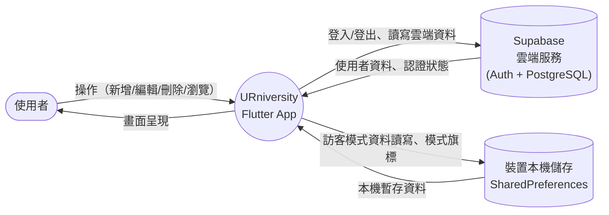
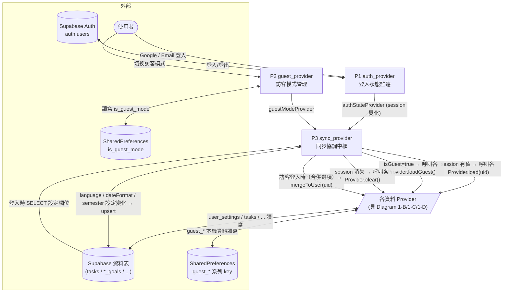
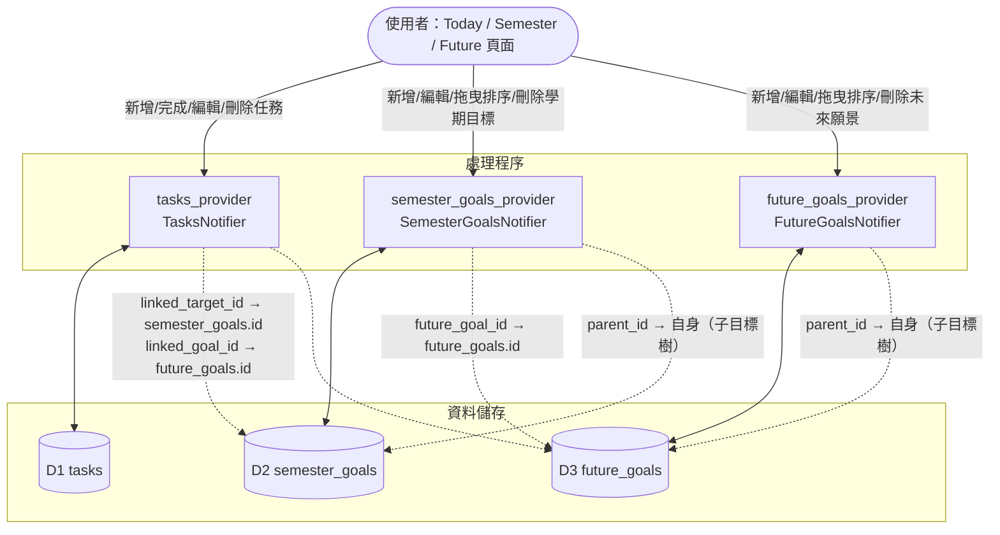
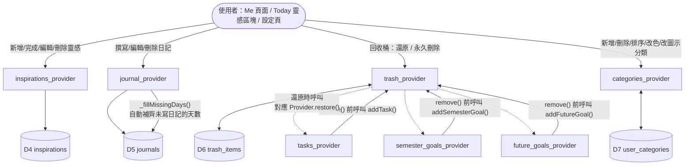
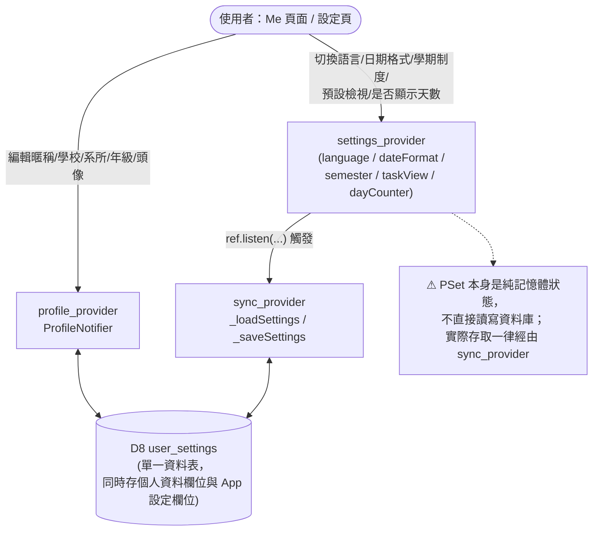
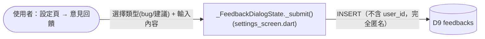

# 資料流程圖（Data Flow Diagram, DFD）

本文件描述 **URniversity** 前端（Flutter + Riverpod）與後端資料來源（Supabase／裝置本機儲存）之間的資料流動關係，
供開發者在新增功能或修改資料結構前快速掌握「資料從哪裡來、要更新到哪裡去」。

搭配閱讀：[資料字典 DD.md](./DD.md)（每個資料儲存的詳細欄位定義）。

> **維護規則**：任何新增／修改「讀取或寫入持久化資料」的程式碼（Provider、Model、Supabase 資料表欄位、
> SharedPreferences key）時，都必須同步更新本文件與 `DD.md`。詳見專案根目錄 `CLAUDE.md`。

---

## 圖例說明

本專案並非傳統的多層式後端架構，而是「Flutter 畫面 → Riverpod Provider（同時扮演處理程序與資料存取層）
→ 外部資料來源」的單層架構。因此本圖將傳統 DFD 符號對應如下：

| 傳統 DFD 符號 | 在本專案中對應 |
|---|---|
| 外部實體（方形） | 使用者、Supabase 雲端服務、裝置本機儲存（SharedPreferences） |
| 處理程序（圓角矩形／圓形） | 一個 Riverpod `Notifier`／`Provider`（對應 `src/lib/providers/*.dart` 內的一個檔案） |
| 資料儲存（開放矩形） | 一張 Supabase 資料表，或一組 SharedPreferences key |
| 資料流（箭頭） | 方法呼叫／狀態讀寫（例如 `load()`、`_upsert()`、`ref.watch()`） |

---

## Diagram 0：情境圖（Context Diagram）

- **登入模式**：資料完全存放在 Supabase（PostgreSQL 資料表），由 `user_id` 區分每位使用者。
- **訪客模式**：資料存放在裝置本機的 SharedPreferences，不需要註冊帳號；部分資料（回收桶、自訂分類、
  App 設定）在訪客模式下**不提供本機持久化**，只存在於當次執行的記憶體中（詳見 [DD.md](./DD.md) 附註）。
- 兩種模式的切換與資料搬遷由 `sync_provider.dart` 統一協調（見 Diagram 1-A）。

---

## Diagram 1-A：身份驗證與同步協調

**關鍵流程說明：**

1. **App 啟動**：`main.dart` 先呼叫 `preloadGuestMode()` 讀取 `is_guest_mode`，避免登入畫面閃爍；
   接著 `_AuthGate`（`main.dart`）依 `guestModeProvider` / `authStateProvider` 決定顯示登入頁或首頁。
2. **登入成功**：`sync_provider.dart` 監聽 `authStateProvider`，依序呼叫八個資料 Provider 的 `load(uid)`
   （tasks、future_goals、semester_goals、trash_items、user_categories、inspirations、journals、profile），
   並額外呼叫 `_loadSettings()` 讀取 `user_settings` 中的 App 設定欄位。
3. **訪客登入合併**（`_handleGuestLogin`）：若使用者在訪客模式下選擇登入，依 `shouldMergeGuestDataProvider`
   決定是否呼叫六個 `mergeToUser(uid)`（tasks / inspirations / journals / profile / semester_goals /
   future_goals，**不含** trash_items 與 user_categories，因為訪客模式本來就不保存這兩者），
   再呼叫 `guestModeProvider.notifier.disable()` 清除本機 guest_* key，最後重新以登入身分 `load(uid)`。
4. **登出／回收桶清空／訪客模式清除**：呼叫各 Provider 的 `clear()`，只清記憶體狀態，不刪除雲端資料。

---

## Diagram 1-B：核心三層資料（任務／學期目標／未來願景）

- 三張表彼此以「邏輯外鍵」（欄位存 ID 字串，資料庫層級**未**建立實體外鍵約束）串連，形成
  `任務 → 學期目標 → 未來願景` 的三層關聯，這也是 [關聯圖頁面](../src/lib/screens/overview_graph_screen.dart)
  視覺化的資料來源。
- 刪除學期目標／未來願景時（`remove()`）會遞迴刪除所有子孫節點；刪除前會先呼叫
  `trash_provider` 的 `addSemesterGoal()` / `addFutureGoal()` 做「軟刪除」備份（見 Diagram 1-C）。
- `reparent()` 會檢查 `isAncestor()` 避免把節點移到自己的子孫底下，形成循環。

---

## Diagram 1-C：輔助資料（靈感／日記／回收桶／分類）

- `journal_provider` 的 `_fillMissingDays()` 是唯一會「自動產生資料」的處理程序：每次載入日記後，
  會為「最早日記日期」到「今天」之間沒有記錄的每一天，自動補一筆 `content = "好像忘記什麼了……"`
  的日記（`id` 以 `auto_` 開頭），並寫回資料儲存。
- 回收桶（`trash_items`）與自訂分類（`user_categories`）**只在登入模式下持久化**；訪客模式下這兩者
  仍可在畫面上操作，但只存在記憶體中，重新整理或結束訪客模式後即消失。
- 分類管理有兩個入口都會操作同一個 `categories_provider`：願景頁「更多分類」對話框，以及
  設定頁「分類設定」（`CategorySettingsScreen`）。兩者共用 `src/lib/widgets/category_manager.dart`
  裡的同一份列表項目／顏色選擇器／圖示選擇器邏輯，避免分類管理規則寫兩份。

---

## Diagram 1-D：個人資料與 App 設定

- `user_settings` 是唯一「一表多用」的資料表：`profile_provider` 只操作其中的個人資料欄位
  （`username` / `school` / `department` / `grade` / `grade_set_year` / `avatar_index`），
  `sync_provider` 則操作其中的 App 設定欄位（`language` / `date_format` / `semester_count` /
  `semester_start_months` / `default_task_view` / `show_day_counter`）。兩者共用同一張表、
  以 `user_id` 為主鍵，upsert 時務必確認沒有意外覆蓋對方負責的欄位（目前作法是每次只夾帶
  自己負責的欄位做 upsert，不會整列覆寫，故安全）。
- **訪客模式下 App 設定不會被保存**：`sync_provider._saveSettings()` 一開頭就檢查
  `if (ref.read(guestModeProvider)) return;`，所以訪客模式的語言／日期格式等選擇只在當次
  執行有效，重新整理即還原預設值。個人資料（`profile_provider`）則例外，訪客模式下會寫入
  `guest_profile` 本機 key，可在同一裝置延續。

---

## Diagram 1-E：意見回饋（唯一的單向寫入流程）

- `feedbacks` 是全系統唯一「只寫不讀」的資料流：不論登入或訪客身分，送出的意見都不會附加
  `user_id`，App 內也沒有任何畫面會再讀回這張表。
- 送出間隔限制（5 分鐘冷卻）只存在於畫面的記憶體變數，不是持久化資料，因此不畫成獨立資料儲存。

---

## 靜態參考資料（唯讀，不經任何資料流）

| 資料 | 來源 | 說明 |
|---|---|---|
| 台灣大專院校與系所清單 | `src/lib/core/taiwan_universities.dart` | 編譯進 App 的常數清單，供 `universities_provider` 在「編輯個人資料」的學校／系所選擇器使用，不讀寫任何資料庫或本機儲存。 |
| 多語系字串 | `src/lib/l10n/*.dart` | 依 `languageProvider` 切換，本身不是使用者資料，不在本 DFD 範圍內。 |

---

## 處理程序對照表（Provider → 原始檔案）

| 處理程序代號 | Provider 名稱 | 原始檔案 |
|---|---|---|
| P1 | `authStateProvider` / `currentUserProvider` | `src/lib/providers/auth_provider.dart` |
| P2 | `guestModeProvider` | `src/lib/providers/guest_provider.dart` |
| P3 | `syncProvider` | `src/lib/providers/sync_provider.dart` |
| — | `tasksProvider` | `src/lib/providers/tasks_provider.dart` |
| — | `semesterGoalsProvider` | `src/lib/providers/semester_goals_provider.dart` |
| — | `futureGoalsProvider` | `src/lib/providers/future_goals_provider.dart` |
| — | `inspirationsProvider` | `src/lib/providers/inspirations_provider.dart` |
| — | `journalProvider` | `src/lib/providers/journal_provider.dart` |
| — | `trashProvider` | `src/lib/providers/trash_provider.dart` |
| — | `categoriesProvider` | `src/lib/providers/categories_provider.dart` |
| — | `profileProvider` | `src/lib/providers/profile_provider.dart` |
| — | `settingsProvider` / `languageProvider` / `semesterSettingsProvider` 等 | `src/lib/providers/settings_provider.dart` |
| — | `universitiesProvider` | `src/lib/providers/universities_provider.dart`（唯讀靜態資料） |
| — | `dateProvider` | `src/lib/providers/date_provider.dart`（純記憶體狀態，不持久化） |

> 補充：`src/lib/providers/custom_categories_provider.dart` 中的 `customCategoriesProvider`
> 目前未被任何畫面使用（死碼），與實際運作中的分類管理（`categories_provider.dart` /
> `user_categories` 資料表）無關，不納入本 DFD。

---

## 資料儲存清單（詳細欄位請見 [DD.md](./DD.md)）

| 代號 | 名稱 | 媒介 |
|---|---|---|
| D1 | `tasks` | Supabase 資料表 |
| D2 | `semester_goals` | Supabase 資料表 |
| D3 | `future_goals` | Supabase 資料表 |
| D4 | `inspirations` | Supabase 資料表 |
| D5 | `journals` | Supabase 資料表 |
| D6 | `trash_items` | Supabase 資料表 |
| D7 | `user_categories` | Supabase 資料表 |
| D8 | `user_settings` | Supabase 資料表（個人資料 + App 設定共用） |
| D9 | `feedbacks` | Supabase 資料表（匿名、只寫不讀） |
| D10 | `auth.users` | Supabase Auth（由 Supabase 管理，App 不直接寫入自訂欄位） |
| D11 | `guest_*` 系列 key | 裝置本機 SharedPreferences |
| D12 | `is_guest_mode` | 裝置本機 SharedPreferences |
