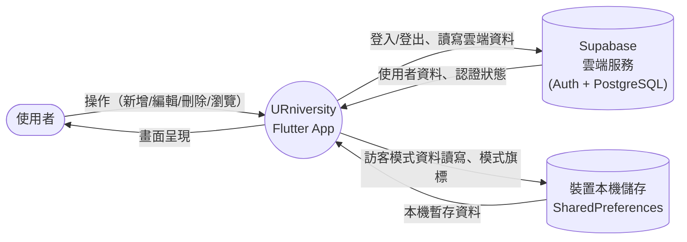
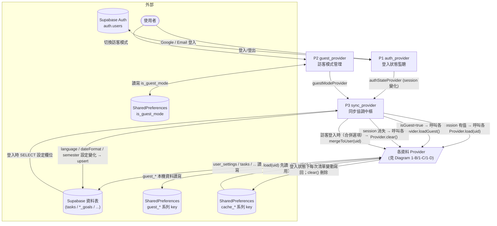
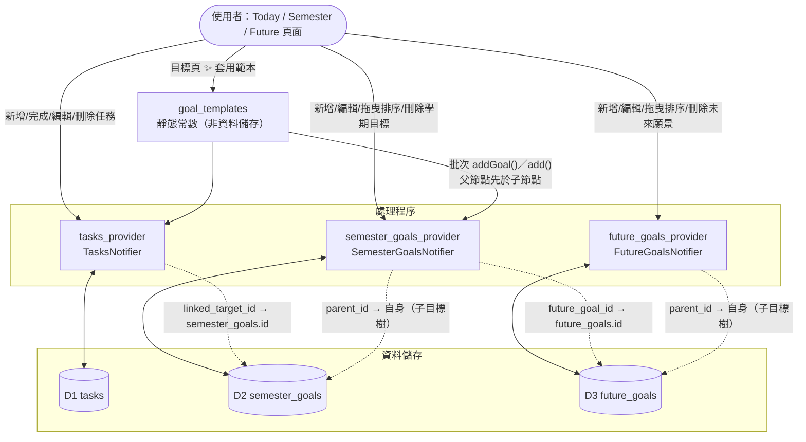
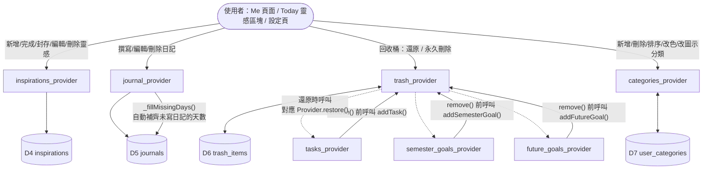
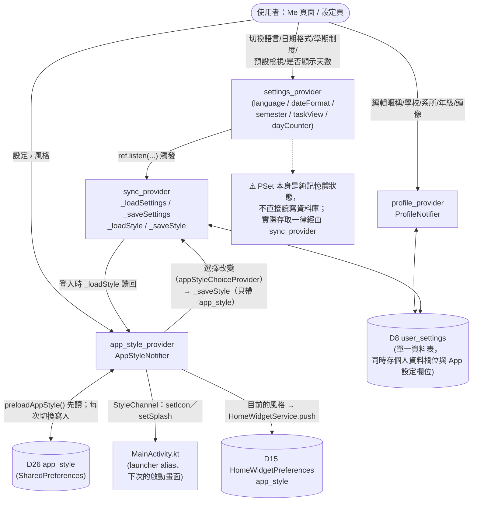
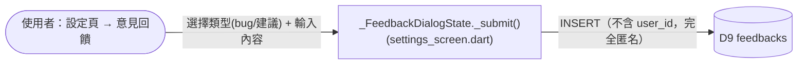
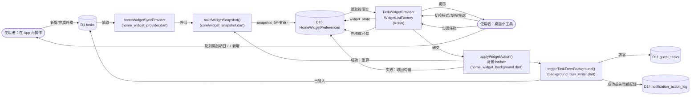
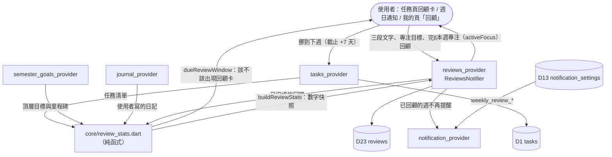
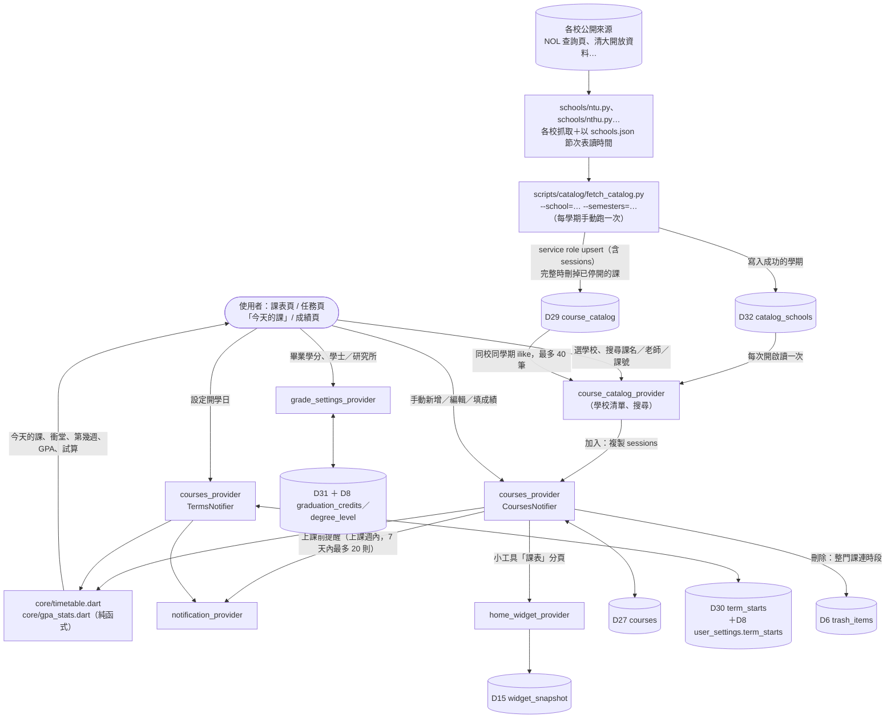

# 資料流程圖（Data Flow Diagram, DFD）

本文件描述 **URniversity** 前端（Flutter + Riverpod）與後端資料來源（Supabase／裝置本機儲存）之間的資料流動關係，
供開發者在新增功能或修改資料結構前快速掌握「資料從哪裡來、要更新到哪裡去」。

搭配閱讀：[資料字典 data_dictionary.md](./data_dictionary.md)（每個資料儲存的詳細欄位定義）。

> **維護規則**：任何新增／修改「讀取或寫入持久化資料」的程式碼（Provider、Model、Supabase 資料表欄位、
> SharedPreferences key）時，都必須同步更新本文件與 `data_dictionary.md`。詳見專案根目錄 `CLAUDE.md`。

---

## 圖例說明

本專案並非傳統的多層式後端架構，而是「Flutter 畫面 → Riverpod Provider（同時扮演處理程序與資料存取層）
→ 外部資料來源」的單層架構。因此本圖將傳統 DFD 符號對應如下：

| 傳統 DFD 符號 | 在本專案中對應 |
|---|---|
| 外部實體（方形） | 使用者、Supabase 雲端服務、裝置本機儲存（SharedPreferences） |
| 處理程序（圓角矩形／圓形） | 一個 Riverpod `Notifier`／`Provider`（對應 `src/lib/providers/*.dart` 內的一個檔案） |
| 資料儲存（開放矩形） | 一張 Supabase 資料表，或一組 SharedPreferences key |
| 資料流（箭頭） | 方法呼叫／狀態讀寫（例如 `load()`、`_upsert()`、`ref.watch()`） |

---

## Diagram 0：情境圖（Context Diagram）

- **登入模式**：資料完全存放在 Supabase（PostgreSQL 資料表），由 `user_id` 區分每位使用者。
- **訪客模式**：資料存放在裝置本機的 SharedPreferences，不需要註冊帳號；部分資料（回收桶、自訂分類、
  App 設定）在訪客模式下**不提供本機持久化**，只存在於當次執行的記憶體中（詳見 [data_dictionary.md](./data_dictionary.md) 附註）。
- 兩種模式的切換與資料搬遷由 `sync_provider.dart` 統一協調（見 Diagram 1-A）。

---

## Diagram 1-A：身份驗證與同步協調

**關鍵流程說明：**

1. **App 啟動**：`main.dart` 先呼叫 `preloadGuestMode()` 讀取 `is_guest_mode`，避免登入畫面閃爍；
   接著 `_AuthGate`（`main.dart`）依 `guestModeProvider` / `authStateProvider` 決定顯示登入頁或首頁。
2. **登入成功**：`sync_provider.dart` 監聽 `authStateProvider`，依序呼叫九個資料 Provider 的 `load(uid)`
   （tasks、future_goals、semester_goals、trash_items、user_categories、inspirations、journals、reviews、profile），
   並額外呼叫 `_loadSettings()` 讀取 `user_settings` 中的 App 設定欄位。
   繼承 `SyncedListNotifier` 的六個清單（tasks、semester_goals、future_goals、inspirations、journals、reviews）
   在查詢之前先讀 D24 `cache_*`：`cache_owner` 是同一個帳號、而且清單還是空的，就先把上次的資料畫出來；
   查詢回來再整份覆蓋。之後登入狀態下清單每次變動都寫回快取。
3. **訪客登入合併**（`_handleGuestLogin`）：若使用者在訪客模式下選擇登入，依 `shouldMergeGuestDataProvider`
   決定是否呼叫七個 `mergeToUser(uid)`（tasks / inspirations / journals / reviews / profile / semester_goals /
   future_goals，**不含** trash_items 與 user_categories，因為訪客模式本來就不保存這兩者），
   再呼叫 `guestModeProvider.notifier.disable()` 清除本機 guest_* key，最後重新以登入身分 `load(uid)`。
4. **登出／回收桶清空／訪客模式清除**：呼叫各 Provider 的 `clear()`，清記憶體狀態與該清單的 `cache_*`，
   `_clearAll` 再刪 `cache_owner`；不刪除雲端資料。

---

## Diagram 1-B：核心三層資料（任務／學期目標／未來願景）

- 三張表彼此以「邏輯外鍵」（欄位存 ID 字串，資料庫層級**未**建立實體外鍵約束）串連，形成
  `任務 → 學期目標 → 未來願景` 的三層關聯，這也是 [關聯圖頁面](../src/lib/screens/overview_graph_screen.dart)
  視覺化的資料來源。任務**只**連學期目標：`tasks.linked_goal_id`（任務直接連願景）已於 2026-09 移除，
  欄位保留但不再讀寫（見 data_dictionary.md D1）。
- 刪除學期目標／未來願景時（`remove()`）會遞迴刪除所有子孫節點；刪除前會先呼叫
  `trash_provider` 的 `addSemesterGoal()` / `addFutureGoal()` 做「軟刪除」備份（見 Diagram 1-C）。
- 目標範本（`core/goal_templates.dart`）**不是一個資料儲存**，是編進 App 的靜態常數；
  套用時走的完全是既有的 `addGoal()` / `add()` 寫入路徑，產生的列與手動建立的沒有任何差別
  （沒有「來自範本」的欄位）。寫入順序與 id 不碰撞的理由見 system_design.md §3-N。
- `reparent()` 會檢查 `isAncestor()` 避免把節點移到自己的子孫底下，形成循環。

---

## Diagram 1-C：輔助資料（靈感／日記／回收桶／分類）

- `journal_provider` 的 `_fillMissingDays()` 是唯一會「自動產生資料」的處理程序：每次載入日記後，
  會為「最早日記日期」到「今天」之間沒有記錄的每一天，自動補一筆 `content = "好像忘記什麼了……"`
  的日記（`id` 以 `auto_` 開頭），並寫回資料儲存。
- 回收桶（`trash_items`）與自訂分類（`user_categories`）**只在登入模式下持久化**；訪客模式下這兩者
  仍可在畫面上操作，但只存在記憶體中，重新整理或結束訪客模式後即消失。
- 靈感的「封存」（`is_archived`，見 data_dictionary.md D4）走的是與「完成」完全相同的寫入路徑
  （`toggleArchived()` → `update()` → `upsert()`），沒有另一條資料流；差別只在讀取端的過濾條件，
  Today 頁與「我的」頁的靈感區塊都排除已封存的筆數。
- 分類管理有兩個入口都會操作同一個 `categories_provider`：願景頁「更多分類」對話框，以及
  設定頁「分類設定」（`CategorySettingsScreen`）。兩者共用 `src/lib/widgets/category_manager.dart`
  裡的同一份列表項目／顏色選擇器／圖示選擇器邏輯，避免分類管理規則寫兩份。

---

## Diagram 1-D：個人資料與 App 設定

- `user_settings` 是唯一「一表多用」的資料表：`profile_provider` 只操作其中的個人資料欄位
  （`username` / `school` / `department` / `grade` / `grade_set_year` / `avatar_index`），
  `sync_provider` 則操作其中的 App 設定欄位（`language` / `date_format` / `semester_count` /
  `semester_start_months` / `default_task_view` / `show_day_counter`）。兩者共用同一張表、
  以 `user_id` 為主鍵，upsert 時務必確認沒有意外覆蓋對方負責的欄位（目前作法是每次只夾帶
  自己負責的欄位做 upsert，不會整列覆寫，故安全）。
- **訪客模式下 App 設定不會被保存**：`sync_provider._saveSettings()` 一開頭就檢查
  `if (ref.read(guestModeProvider)) return;`，所以訪客模式的語言／日期格式等選擇只在當次
  執行有效，重新整理即還原預設值。個人資料（`profile_provider`）則例外，訪客模式下會寫入
  `guest_profile` 本機 key，可在同一裝置延續。

---

## Diagram 1-E：意見回饋（唯一的單向寫入流程）

- `feedbacks` 是全系統唯一「只寫不讀」的資料流：不論登入或訪客身分，送出的意見都不會附加
  `user_id`，App 內也沒有任何畫面會再讀回這張表。
- 送出間隔限制（5 分鐘冷卻）只存在於畫面的記憶體變數，不是持久化資料，因此不畫成獨立資料儲存。

---

## Diagram 1-F：通知排程與通知動作

```mermaid
flowchart LR
    User(["使用者：設定 → 通知"])
    Shade(["使用者：通知欄的兩個按鈕"])
    P5["NotificationSettingsNotifier\n(notification_provider.dart)"]
    P6["buildNotificationSchedule()\n(core/notification_schedule.dart)"]
    P7["NotificationService.apply()\n(services/notification_service.dart)"]
    P8["applyDoneAction()\n背景 isolate\n(notification_background.dart)"]
    P9["drainNotificationActions()\n(notification_action_provider.dart)"]
    D1[("D1 tasks")]
    D11[("D11 guest_tasks")]
    D13[("D13 notification_settings")]
    D14[("D14 notification_action_log")]
    OS(["作業系統的待送通知佇列"])

    User -- "開關 / 提前時間 / 摘要時間 / 無時間重複任務的時刻" --> P5
    P5 -- "寫入 JSON" --> D13
    D13 -- "讀取設定" --> P6
    D1 -- "讀取（到期時間、循環規則、完成狀態）" --> P6
    P6 -- "ScheduledNotification 清單（含 payload）" --> P7
    P7 -- "cancelAll 後全部重新排入" --> OS
    OS -- "時間到時顯示" --> Shade

    Shade -- "標示為已完成" --> P8
    P8 -- "已登入：讀取後更新該列" --> D1
    P8 -- "訪客：改寫 JSON" --> D11
    P8 -- "成功或失敗都記錄" --> D14
    D14 -- "啟動與回到前景時讀走並清空" --> P9
    P9 -- "重載" --> D1
    P9 -- "失敗 → reportSyncError" --> User
```

- **P8 是全系統唯一不經過主 App 的寫入**。使用者在通知欄按「標示為已完成」時，
  Android 一律另開一個 FlutterEngine（`ActionBroadcastReceiver.java:83-89`），
  **不檢查主 App 是否還活著**。所以那裡沒有 Provider、沒有 Riverpod、**也沒有 UI**。
- **因此一定要有 D14**。背景寫入的失敗沒有地方可以當場顯示，就寫進 D14 等主 isolate 收，
  由 P9 走既有的 `reportSyncError()` 浮現——**延後顯示，不是吞掉**（CLAUDE.md §9 規則 2）。
- **P9 還負責重載**。P8 已經改過 D1／D11，主 isolate 的記憶體狀態必定過期；
  不重載的話畫面會一直顯示任務未完成。
- 「重新安排時間」那顆按鈕**不在這張圖裡**：它不寫任何資料，只是把 App 帶到前景並打開
  該任務的編輯 sheet，走的是一般的 UI 路徑。
- 排程本身**不產生持久化資料**，是從 D1 與 D2 推導出來的，沒有會過期的快取。
- P6 是**純函式**，所以「什麼時候該響」可以完全用單元測試涵蓋；
  P7 與 P8 是僅有的兩個碰平台的地方。
- 僅 Android 與 iOS 有這整條流程（`NotificationService.isSupported`）。

---

## Diagram 1-G：桌面小工具

- **P13 是第二條不經過主 App 的寫入**（第一條是通知的「標示為已完成」，Diagram 1-F）。
  兩者**共用同一個函式與同一份 D14**——問題完全相同：背景引擎沒有 UI 可以回報失敗。
- **D15 是推導資料，不是資料來源**。原生 Kotlin 查不到 Supabase，也不該懂業務規則，
  所以 Dart 把「該顯示什麼」算好放進 D15，Kotlin 只負責渲染。
- **切換分頁、期間、篩選完全不經過 Dart**：P11 已經把所有頁算好，原生端只寫 `widget_state`
  並重畫。Dart 背景引擎（P12）只剩勾選這一件真正要寫資料的事。
- **P11 同時服務兩邊**：App 在前景時由 P10 呼叫，App 關閉時由 P12 呼叫。
  因此小工具顯示的內容不會因為「剛才是哪個 isolate 在跑」而不一致。
- ⚠️ **沒有定時的雲端輪詢**。在另一台裝置改了資料、而這台的 App 完全沒開過也沒碰過小工具時，
  小工具會是舊的。要補得用 WorkManager 定時喚背景引擎，V1 刻意不做。

---

## Diagram 1-H：回顧（Phase 4）

- 回顧**讀**任務、目標、日記，但只**寫**兩個地方：`reviews` 一筆，以及使用者勾選「挪到下週」的任務的截止時間。
- 學期回顧另外讀 D27 `courses`，把該學期 GPA 存進 `stats.gpa`（Phase 6）。
- 數字在打開回顧時算一次並凍結成快照（`stats`），之後任務變動不影響已存的回顧。

---

## 靜態參考資料（唯讀，不經任何資料流）

| 資料 | 來源 | 說明 |
|---|---|---|
| 台灣大專院校與系所清單 | `src/lib/core/taiwan_universities.dart` | 編譯進 App 的常數清單，供 `universities_provider` 在「編輯個人資料」的學校／系所選擇器使用，不讀寫任何資料庫或本機儲存。 |
| 多語系字串 | `src/lib/l10n/*.dart` | 依 `languageProvider` 切換，本身不是使用者資料，不在本 DFD 範圍內。 |

---

## 處理程序對照表（Provider → 原始檔案）

| 處理程序代號 | Provider 名稱 | 原始檔案 |
|---|---|---|
| P1 | `authStateProvider` / `currentUserProvider` | `src/lib/providers/auth_provider.dart` |
| P2 | `guestModeProvider` | `src/lib/providers/guest_provider.dart` |
| P3 | `syncProvider` | `src/lib/providers/sync_provider.dart` |
| — | `tasksProvider` | `src/lib/providers/tasks_provider.dart` |
| — | `semesterGoalsProvider` | `src/lib/providers/semester_goals_provider.dart` |
| — | `futureGoalsProvider` | `src/lib/providers/future_goals_provider.dart` |
| — | `inspirationsProvider` | `src/lib/providers/inspirations_provider.dart` |
| — | `journalProvider` | `src/lib/providers/journal_provider.dart` |
| — | `trashProvider` | `src/lib/providers/trash_provider.dart` |
| — | `categoriesProvider` | `src/lib/providers/categories_provider.dart` |
| — | `profileProvider` | `src/lib/providers/profile_provider.dart` |
| — | `settingsProvider` / `languageProvider` / `semesterSettingsProvider` 等 | `src/lib/providers/settings_provider.dart` |
| — | `universitiesProvider` | `src/lib/providers/universities_provider.dart`（唯讀靜態資料） |
| — | `dateProvider` | `src/lib/providers/date_provider.dart`（純記憶體狀態，不持久化） |
| P5 | `notificationSettingsProvider` | `src/lib/providers/notification_provider.dart` |
| P6 | `notificationScheduleProvider` | `src/lib/providers/notification_provider.dart`（推導，不持久化） |
| P7 | `notificationSyncProvider` → `NotificationService` | `src/lib/services/notification_service.dart` |
| P8 | `applyDoneAction()`（**背景 isolate**，非 Provider） | `src/lib/services/notification_background.dart` |
| P9 | `notificationActionProvider` | `src/lib/providers/notification_action_provider.dart` |
| P10 | `homeWidgetSyncProvider` / `homeWidgetLaunchProvider` | `src/lib/providers/home_widget_provider.dart` |
| P11 | `buildWidgetSnapshot()`（純函式，非 Provider） | `src/lib/core/widget_snapshot.dart` |
| P12 | `applyWidgetAction()`（**背景 isolate**） | `src/lib/services/home_widget_background.dart` |
| P13 | `toggleTaskFromBackground()`（**背景 isolate**，通知與小工具共用） | `src/lib/services/background_task_writer.dart` |

> 補充：`src/lib/providers/custom_categories_provider.dart` 中的 `customCategoriesProvider`
> 目前未被任何畫面使用（死碼），與實際運作中的分類管理（`categories_provider.dart` /
> `user_categories` 資料表）無關，不納入本 DFD。

---

## 資料儲存清單（詳細欄位請見 [data_dictionary.md](./data_dictionary.md)）

| 代號 | 名稱 | 媒介 |
|---|---|---|
| D1 | `tasks` | Supabase 資料表 |
| D2 | `semester_goals` | Supabase 資料表 |
| D3 | `future_goals` | Supabase 資料表 |
| D4 | `inspirations` | Supabase 資料表 |
| D5 | `journals` | Supabase 資料表 |
| D6 | `trash_items` | Supabase 資料表 |
| D7 | `user_categories` | Supabase 資料表 |
| D8 | `user_settings` | Supabase 資料表（個人資料 + App 設定共用） |
| D9 | `feedbacks` | Supabase 資料表（匿名、只寫不讀） |
| D10 | `auth.users` | Supabase Auth（由 Supabase 管理，App 不直接寫入自訂欄位） |
| D11 | `guest_*` 系列 key | 裝置本機 SharedPreferences |
| D12 | `is_guest_mode` | 裝置本機 SharedPreferences |
| D13 | `notification_settings` | 裝置本機 SharedPreferences（每台裝置各自設定，不同步到雲端） |
| D14 | `notification_action_log` | 裝置本機 SharedPreferences（背景 isolate 留給主 isolate 的交接資料，讀完即清空；通知與小工具共用） |
| D15 | `HomeWidgetPreferences` | 裝置本機 SharedPreferences（`home_widget` 套件自己的檔案；小工具的 snapshot 與狀態，推導資料） |
| D16 | `recent_picks` | 裝置本機 SharedPreferences（任務表單的建議：最近用過的目標與時間，推導自使用者操作） |
| D17 | `task_completion_effect` | 裝置本機 SharedPreferences（完成動畫強度，每台裝置各自設定） |
| D18 | `fab_pos_*` | 裝置本機 SharedPreferences（兩顆浮動新增鈕被拖到哪裡，存 0–1 的比例） |
| D19 | `task_sort` | 裝置本機 SharedPreferences（任務清單的排序方式） |
| D20 | `target_sort` | 裝置本機 SharedPreferences（目標頁的排序方式；只影響顯示順序，不寫回 D2） |
| D21 | `vision_sort` | 裝置本機 SharedPreferences（願景頁的排序方式；只影響顯示順序，不寫回 D3） |
| D23 | `reviews` | Supabase 資料表（回顧：數字快照＋三段文字＋專注目標） |
| D25 | `haptics_enabled` | 裝置本機 SharedPreferences（觸覺回饋開關，每台裝置各自設定） |
| D27 | `courses` | Supabase 資料表（課程，時段在同一列的 jsonb；Phase 6 的成績也在這裡） |
| D29 | `course_catalog` | Supabase 資料表（各校課程目錄，時段已讀好；公開唯讀，由離線腳本寫入） |
| D32 | `catalog_schools` | Supabase 資料表（可搜尋的學校與學期；公開唯讀，由離線腳本寫入） |
| D30 | `term_starts` | 裝置本機 SharedPreferences（各學期開學日；登入帳號另同步到 D8 `user_settings.term_starts`） |
| D31 | `graduation_credits`、`degree_level` | 裝置本機 SharedPreferences（畢業學分與及格線；登入帳號另同步到 D8） |
| D26 | `app_style` | 裝置本機 SharedPreferences（使用者選的風格；登入帳號另同步到 D8 `user_settings.app_style`） |
| D24 | `cache_*` 系列 key＋`cache_owner` | 裝置本機 SharedPreferences（登入帳號的清單快取，開 App 先畫、查詢回來覆蓋；登出即刪） |
| D22 | `onboarding_done` | 裝置本機 SharedPreferences（新手導覽哪幾章跑過，StringList；不上雲、不進訪客資料清單） |

---

## Diagram 1-I：課表與成績（Phase 5／6）

- 課程目錄只有腳本寫、App 只讀；加入的課是**複製**進 D27，之後與目錄無關（`catalog_id` 只記來源）。
- 各校的時間字串只在腳本裡讀（`common.periods_to_sessions` 加各校節次表），App 拿到的就是時段；新增一所學校＝一個 Python 模組＋`schools.json` 一筆，App 從 D32 自動多出那所學校的搜尋入口。
- 一門課的時段在同一列，所以新增、修改、刪除、還原、訪客合併都是一次寫入。
- GPA、及格學分、目標試算都是由 D27 即時算出，不另外存；只有學期回顧把當時的 GPA 存進 D23 的 `stats`。
