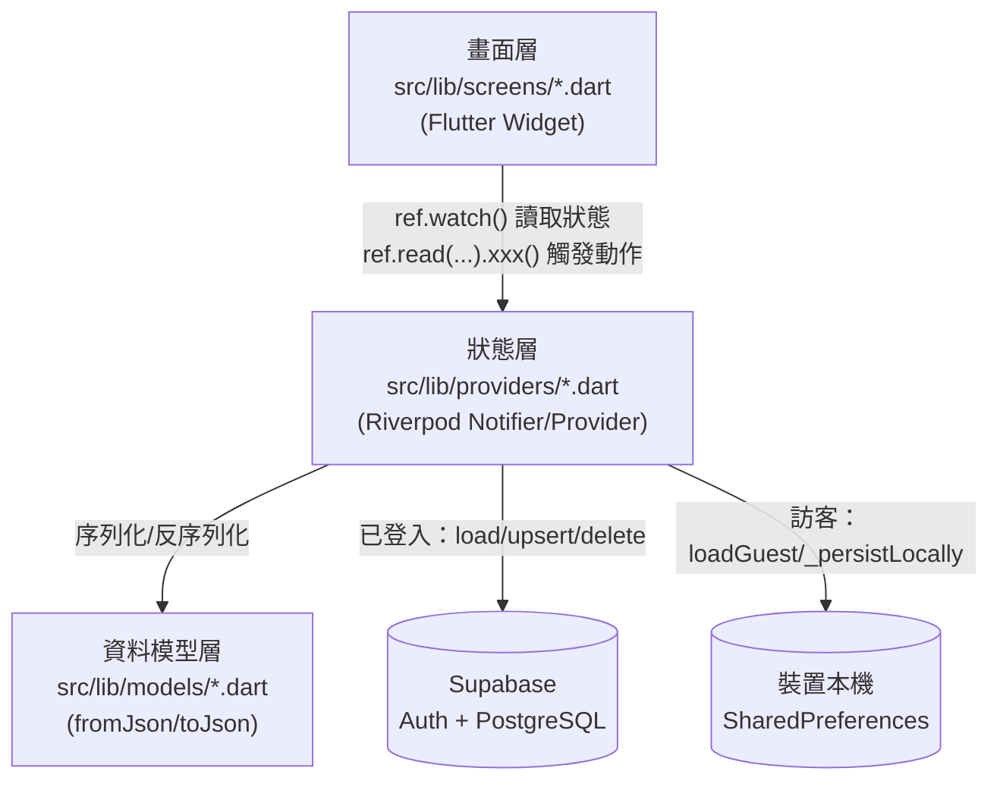
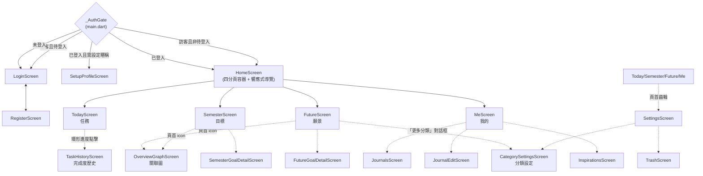
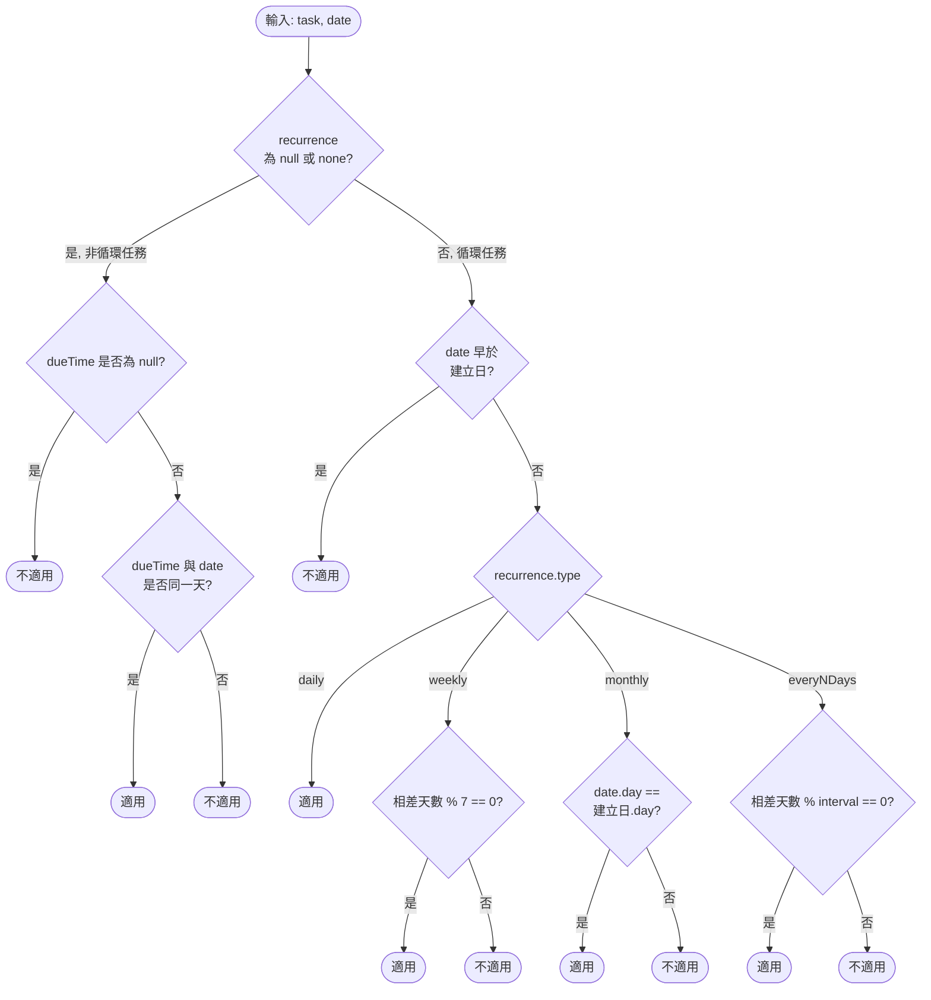
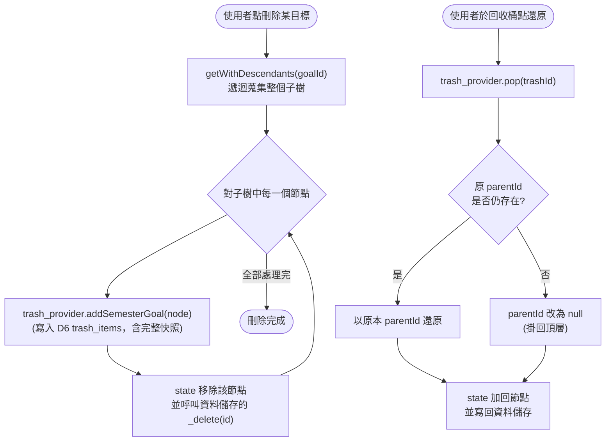
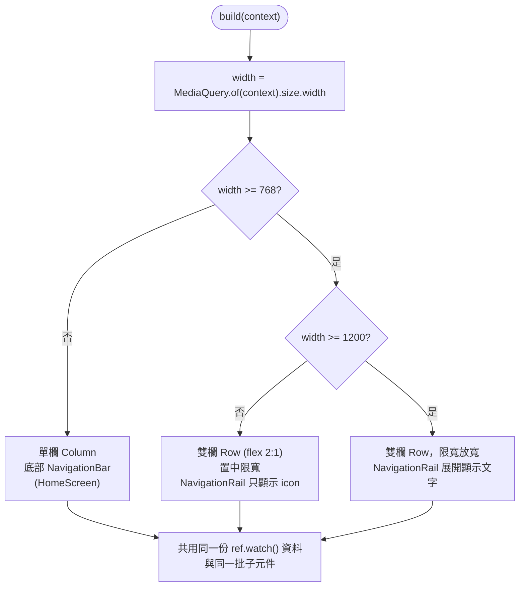
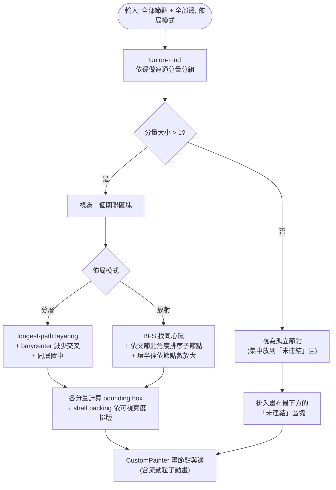

# 系統設計（System Design）

本文件描述 **URniversity** 的系統行為：畫面如何串接、每個功能的輸入／輸出格式、核心演算法的
處理過程、使用者操作步驟，以及關鍵邏輯的程式流程圖。

搭配閱讀：
- [DFD.md](./DFD.md) — 資料「從哪裡來、到哪裡去」（各 Provider 與資料儲存之間的流動）
- [DD.md](./DD.md) — 每個資料儲存的欄位定義

本文件回答的是「**系統怎麼運作**」，DFD／DD 回答的是「**系統存了什麼資料**」，三份文件互補，
請勿在本文件重複抄一份欄位定義，遇到欄位細節一律連結回 DD.md。

> **維護規則**：修改畫面流程、新增／調整核心演算法（任務判定、樹狀結構操作、學期計算、
> 響應式斷點、關聯圖佈局等）時，必須同步更新本文件，包含程式流程圖。詳見專案根目錄 `CLAUDE.md`。

---

## 1. 系統架構總覽

### 1-A 執行環境分層



- 沒有獨立後端服務層：Riverpod 的 `StateNotifier` 同時扮演「處理程序」與「資料存取物件」，
  細節見 [DFD.md](./DFD.md) 的圖例說明。
- 目前僅發行 Web 版本（`flutter run/build -d chrome`），行動裝置與桌面版尚未發行（見
  `README.md`「Next」小節）。

### 1-B 畫面導覽架構



- `Home` 為單一 `Scaffold`，用 `IndexedStack` 切換四個分頁，切換分頁不重建畫面（狀態保留）。
- 響應式判斷（詳見 §3-F）：寬度 < 768 用底部 `NavigationBar`；≥ 768 用左側 `NavigationRail`；
  ≥ 1200 時 `NavigationRail` 展開顯示文字。

---

## 2. 輸入與輸出格式

### 2-A 帳號與身分

| 功能 | 輸入 | 驗證規則 | 輸出／結果 |
|---|---|---|---|
| Email 登入 | Email（文字）、密碼（文字，遮蔽） | 兩欄皆非空才觸發登入 | 成功→依 `_AuthGate` 導向 Home／Setup；失敗→`SnackBar` 顯示 Supabase 錯誤訊息 |
| Google 登入 | 無（OAuth 彈出視窗） | 由 Google 端驗證 | 同上；Web 用 `Uri.base.origin` 作為 redirect，行動裝置用自訂 URL scheme |
| 註冊 | Email、密碼、確認密碼 | 密碼需與確認密碼相同；密碼長度 ≥ 6 | 成功且需信箱驗證→提示「請確認驗證信」；成功且免驗證→直接可登入 |
| 訪客模式 | 無 | 無 | 立即進入 `HomeScreen`，資料存本機（見 DD.md D11） |
| 首次登入設定暱稱 | 使用者名稱（文字，必填）、頭像（10 選 1 或不選） | 名稱非空才能按「完成」 | 寫入 `user_settings`，之後導向 Home |

### 2-B 任務（Today 頁）

| 欄位 | 輸入元件 | 格式 | 必填 |
|---|---|---|---|
| 標題 | 文字輸入框 | 任意字串，前端 `trim()` 後不可為空 | ✓ |
| 備註 | 文字輸入框（單行） | 任意字串 | ✗ |
| 優先度 | `SegmentedButton` | 低/中/高（對應 1/2/3） | ✓（預設低） |
| 截止時間 | 日期+時間選擇器 | `DateTime` | ✗ |
| 循環規則 | `ChoiceChip` + 數字輸入（僅「每 N 天」時出現） | 不循環/每日/每週/每月/每 N 天 | ✗ |
| 連結學期目標 | 清單選擇對話框 | 學期目標 id | ✗ |
| 連結未來願景 | 清單選擇對話框 | 未來願景 id | ✗ |

輸出：任務卡片（含優先度標籤、截止時間倒數上色、循環圖示、連結目標/願景的箭頭文字），依
§3-A 規則分組排序後呈現；環形進度卡顯示「已完成 / 總數」與百分比。

### 2-C 學期目標（Semester 頁）／未來願景（Future 頁）

| 欄位 | 輸入元件 | 格式 | 必填 |
|---|---|---|---|
| 標題 | 文字輸入框 | 任意字串 | ✓ |
| 分類 | 多選 `FilterChip` | 見 DD.md `FutureCategories` 列舉 + 使用者自訂分類（顏色/圖示可自訂，見 §2-I） | ✗（預設 `other`） |
| 備註 | 文字輸入框（多行） | 任意字串 | ✗ |
| 學期目標專屬：所屬學期 | 由目前檢視的學期分頁決定 | `"YYY-N"` 或假期 `"YYY-Bk"`（見 §3-D） | ✓ |
| 學期目標專屬：連結未來願景 | 清單選擇對話框 | 未來願景 id | ✗ |
| 未來願景專屬：起訖學期 | 兩個下拉選單 | `"YYY-N"` 或假期 `"YYY-Bk"`，結束學期不可早於起始學期 | ✗ |
| 父節點（子目標/子願景） | 由「新增子目標」入口決定，非表單欄位 | 目標/願景 id | ✗ |

輸出：樹狀縮排卡片列表（可拖曳排序／換父節點），左側有分類色條（寬度 7px），完成度以子節點
完成比例呈現進度條；桌面版側欄另有「進度總覽」環形圖（學期目標頁）與「篩選」面板（未來願景
頁）。學期/起訖學期的下拉選單與挑選對話框都會把假期 token 顯示成本地化名稱（例如「114 暑假」），
不會顯示原始 `"114-B3"` 字串。

### 2-D 篩選（Today 頁）

輸入：勾選學期目標／未來願景（樹狀複選對話框，勾選父節點會連動勾選所有子孫）。
輸出：任務清單依 `linkedTargetId` / `linkedGoalId` 是否落在勾選集合（含子孫展開後的集合）內
過濾；畫面上以主色膠囊 Chip 顯示「篩選 · N」，N 為已選數量，可一鍵清除。

### 2-E App 設定（設定頁）

| 欄位 | 輸入元件 | 格式 |
|---|---|---|
| 語言 | 單選清單 | 繁中／English／日本語 |
| 日期顯示格式 | 單選清單（附即時預覽） | 4 種格式，見 DD.md |
| 預設任務檢視 | 單選清單 | 全部／每日／每週 |
| 學期制度 | 數字選擇 + 每學期起始月 | 每年 2/3/4 學期，起始月 1–12 |
| 日記天數徽章開關 | `Switch` | 開／關 |
| 開發者模式時間覆寫 | 日期選擇器 | 覆寫「現在時間」，僅供測試用（見 §4-J） |

輸出：即時套用到對應畫面；非訪客模式會非同步寫回 `user_settings`（見 DFD.md Diagram 1-D）。

### 2-F 意見回饋（設定頁）

輸入：類型（bug／建議，`SegmentedButton`）、內容（文字，10～1000 字）。
輸出：成功→關閉對話框；失敗（低於 10 字／5 分鐘內重複送出／網路錯誤）→在輸入框下方顯示對應
錯誤訊息，不關閉對話框。完全匿名，無法在 App 內查看歷史紀錄（見 DD.md D9）。

### 2-G 關聯圖（OverviewGraphScreen）

輸入：無使用者資料輸入，僅有「分層／放射」佈局切換（`SegmentedButton`）與畫布縮放平移手勢。
輸出：以學期目標／未來願景為節點、三種關聯為邊的可互動圖（詳見 §3-G、§5-F）；點節點導向對應
詳細頁。

### 2-H 任務完成度歷史（TaskHistoryScreen）

輸入：日／週／月檢視切換（`SegmentedButton`）、點擊或滑鼠移到長條上選取該期間。
輸出：長條圖（0–100% 完成率）+ 期間平均完成率文字 + 選取期間的「N / M 完成（P%）」明細，
沒有任務的日期以底線刻度呈現而非 0% 長條（區分「沒事做」與「有事沒做」）。

### 2-I 分類設定（CategorySettingsScreen／「更多分類」對話框）

兩個入口（設定頁「分類設定」全螢幕頁、未來願景頁「更多分類」對話框）共用同一份列表元件
（`src/lib/widgets/category_manager.dart`）。

| 欄位 | 輸入元件 | 格式 |
|---|---|---|
| 新增分類 | 文字輸入框 + 送出鈕 | 任意字串，成為該分類的 id 與顯示名稱 |
| 排序 | 拖曳單線把手（`Icons.horizontal_rule`，圖一改版前是雙線 `Icons.drag_handle`） | 拖放調整順序 |
| 顏色 | 圓形色塊按鈕 → 彈出色票網格 | `categoryColorPresets`（12 色固定清單） |
| 圖示 | 圖示按鈕 → 彈出圖示網格 | `categoryIconPresets`（20 個固定圖示，見 §3 備註） |
| 刪除 | 垃圾桶 icon（僅自訂分類） | 內建 6 分類無法刪除 |

輸出：即時套用到所有顯示該分類的畫面（目標/願景卡片色條、關聯圖節點、任務左側連結色條等），
非訪客模式非同步寫回 `user_categories.styles`（見 DD.md D7；需要先手動執行一次資料庫 migration
才會生效）。

---

## 3. 處理過程（核心演算法）

### 3-A 循環任務是否屬於某一天（`tasks_provider.dart`）

`_taskAppliesTo(task, date)`：
- 非循環任務：`dueTime` 不為空，且與 `date` 同一天才算屬於當天。
- 循環任務：呼叫 `_recurringAppliesTo()`，依 `recurrence.type` 分流：
  - `daily`：只要不早於建立日就算。
  - `weekly`：與建立日相差天數需為 7 的倍數。
  - `monthly`：目標日的「日」需與建立日的「日」相同。
  - `everyNDays`：與建立日相差天數需為 `interval` 的倍數。
- 完成狀態判斷完全獨立於「是否屬於當天」：非循環看 `isCompleted`，循環看
  `completedDates` 是否包含該日期字串（`Task.isCompletedOn()`）。

### 3-B 任務完成度統計（`taskCompletionStatsOn()`）

以 3-A 的判定找出某天所有適用任務，回傳 `(done, total)`；若當天沒有任何適用任務回傳 `null`
（語意上與「有任務但都是 0%」不同）。`TaskHistoryScreen` 的週/月統計是把區間內每天的
`done`／`total` 直接加總再相除，**不是**先算每天比率再平均，理由是避免「某天完全沒任務」拉低
平均值。

### 3-C 目標／願景樹狀結構操作（`semester_goals_provider.dart` / `future_goals_provider.dart`）

兩份 Provider 各自獨立實作相同模式（未共用程式碼，修改一邊時記得檢查另一邊）：
- **新增**：`sortOrder` 取「同一層（同 `parentId`）現有最大值 + 1000」，讓新項目排在最後，
  同時預留插入空間。
- **搬移（`reparent`）**：先呼叫 `isAncestor(draggedId, newParentId)` 確認新父節點不是自己的
  子孫，避免產生循環參照；通過後更新 `parentId` 與 `sortOrder`。
- **刪除（`remove`）**：`getWithDescendants()` 先蒐集整個子樹，逐一呼叫資料層刪除；刪除前
  對每個節點呼叫 `trash_provider` 的 `addSemesterGoal()`/`addFutureGoal()` 做快照備份。
- **還原**：若原本的 `parentId` 已不存在，還原時自動改掛在頂層（`parentId = null`），避免
  出現斷鏈孤兒。

### 3-D 學期字串生成、比較與假期（`semester_goals_provider.dart` / `future_goal.dart` / `semester_helpers.dart`）

- `currentSemester(settings)`：以民國年為基礎，依 `SemesterSettings.startMonths`（各學期起始
  月份）找出「不晚於今天、且最接近今天」的學期起始點，組成 `"{民國年}-{學期序}"`。
  跨年度學期（例如第 2 學期在隔年開始）用 `yearOffset` 校正。只回傳一般學期，不會回傳假期
  （若「現在」落在假期期間，回傳的是最近一個已開始的學期，作為選單的合理預設起點）。
- `generateSemesters(settings)`：以目前學期為中心，往前 4 年、往後 3 年展開，**每個學期後面
  緊接著插入該學期的假期**（`"Y-1"`, `"Y-B1"`, `"Y-2"`, `"Y-B2"`, ...），供選單使用。
- **假期 token 格式**：`"{民國年}-B{k}"`，k = 1..該年學期數，代表「緊接在第 k 個學期後面的假期」；
  `k = 學期數`（最後一個）固定是暑假（下學年第 1 學期開學前的長假）。
- `compareSemesters(a, b)`：把 `"YYY-N"` 或 `"YYY-Bk"` 換算成同一套權重（一般學期 k → `2k-1`，
  假期 k → `2k`）後比較 `(年, 權重)`，讓假期正確排在對應學期之後、下一個學期之前。**禁止**直接
  用字串或轉數字比較。
- `breakName(k, count, s)` / `formatSemester(token, settings, s)`（`semester_helpers.dart`）：
  假期名稱依「目前配置的學期數 `count`」查表決定（例如 3 學期制的假期依序是寒假／春假／暑假，
  4 學期制是秋假／寒假／春假／暑假），**不是**存在 token 裡固定不變的——所有顯示學期字串的地方
  一律呼叫 `formatSemester()`，不要直接顯示原始 token（一般學期會原樣顯示 `"114-1"`，只有假期
  token 會被轉成「114 暑假」這種可讀名稱）。

### 3-E 年級自動推進（`settings_provider.dart`）

`computedGrade(baseGrade, gradeSetYear, effectiveNow, settings)`：以 `academicYear()`（依第 1
學期起始月判斷「現在屬於哪個學年」）與使用者上次設定年級時的學年度相減，得出經過幾個學年，
加回 `baseGrade` 並限制在 1～7 之間。使用者不需要每年手動改年級。

### 3-F 響應式版面決策（`app_breakpoints.dart` + 各 `screens/*.dart`）

兩個斷點常數：`desktop = 768`、`wide = 1200`。所有分頁在同一個 `build()` 內以
`MediaQuery.of(context).size.width` 判斷（不使用 `Platform` 判斷，因為 Web 版窄視窗也要走手機
版面），依寬度回傳不同 Widget 結構，但**共用同一份資料 watch 與同一批子元件**（不重複資料
邏輯，不另開 Widget class）。彈出視窗（bottom sheet／dialog）另外在 `app_theme.dart` 統一
限制最大寬度，避免超寬螢幕被拉伸。詳細流程圖見 §5-E。

### 3-G 關聯圖佈局演算法（`overview_graph_screen.dart`）

節點＝全部學期目標＋未來願景；邊＝三種關聯（目標樹／願景樹／目標→願景跨層連結）。共用前處理
（Union-Find 分連通分量、建立鄰接表），依使用者選擇的模式分流：

- **分層模式**：longest-path layering（願景根層為 0，子節點層 = `max(父節點層) + 1`）→
  barycenter 啟發式掃 3 趟減少交叉 → 同層置中排列。
- **放射模式**：BFS 找出以「連結數最多的願景根節點」為中心的距離環，同心圓半徑依節點數
  自動撐大，子節點依父節點角度排序讓分支保持同一扇區。

兩種模式都先各自計算「分量內」座標，再由 shelf packing 演算法把各連通分量的外框依可視寬度
排進畫布；孤立節點（無任何關聯）集中排在最後的「未連結」區。詳細流程圖見 §5-F。

### 3-H 日記自動補齊（`journal_provider.dart`）

`_fillMissingDays()`：載入日記後，找出「最早日記日期」到「今天」之間沒有記錄的每一天，各自
產生一筆 `id` 以 `"auto_"` 開頭、內容固定為「好像忘記什麼了……」的日記並寫回資料儲存。判斷
「是否為自動產生」一律檢查 `id.startsWith('auto_')`，訪客資料合併進帳號時只搬移非自動產生的
日記，登入後重新跑一次本函式補齊。

### 3-I 身分驗證與資料同步協調

由 `sync_provider.dart` 統籌，完整流程與時序見 [DFD.md](./DFD.md) Diagram 1-A，本文件不重複。

### 3-J 分類顏色／圖示解析與任務連結色條

- `resolveCatColor(cats, id)` / `resolveCatIcon(cats, id)`（`category_helpers.dart`）：在使用者
  目前的分類清單（`categoriesProvider` 狀態，`List<CategoryEntry>`）中找出對應 id 的顏色／圖示；
  找不到（分類被刪除、或訪客模式尚未載入）時退回 `defaultCatColor()`/`defaultCatIcon()` 的
  內建預設值。所有畫面一律透過這兩個函式取色/取圖示，不再各自寫死 switch。
- 圖示只能是 `categoryIconPresets`（固定 const 清單）裡的其中一個：因為 Flutter 的圖示
  tree-shaking 只認得「原始碼裡出現過的字面 `Icons.xxx`」，這份清單本身就會被圖示選擇器的
  網格 UI 字面引用，才能保證使用者選到的任何圖示都不會在正式建置時被砍掉。
- 任務左側連結色條（`_linkColorBar()`，`today_screen.dart`）：依任務是否連結學期目標／未來願景
  決定顯示內容——只連結一邊就顯示該分類的實心色條；兩邊都連結且分類顏色相同也顯示單一實心色；
  兩邊都連結但分類顏色不同，色條上半用目標顏色、下半用願景顏色（`Column` + 兩個 `Expanded`）；
  都沒連結則不顯示色條（寬度 0）。

---

## 4. 系統操作步驟（主要使用案例）

### UC1　以訪客身分開始使用
1. 開啟 App，`_AuthGate` 讀取 `is_guest_mode`（`false`）→ 顯示 `LoginScreen`。
2. 點擊「以訪客身份體驗」→ `guestModeProvider.notifier.enable()` 寫入本機旗標。
3. `_AuthGate` 重新判斷 → 直接進入 `HomeScreen`（今日頁）。

### UC2　註冊帳號並登入
1. `LoginScreen` 點擊「註冊」→ 進入 `RegisterScreen`。
2. 輸入 Email／密碼／確認密碼 → 前端檢查兩次密碼相同、長度 ≥ 6。
3. 送出 → Supabase `signUp()`；若需信箱驗證，提示後返回登入頁；否則可直接登入。
4. 返回 `LoginScreen` 輸入帳密登入 → `authStateProvider` 偵測到 session → `sync_provider` 依
   序載入 8 種資料（見 DFD.md Diagram 1-A）。
5. 若為 Email 帳號且尚未設定暱稱 → 導向 `SetupProfileScreen`，輸入暱稱與頭像後才進首頁。

### UC3　新增一筆每週循環任務並完成當週那次
1. 今日頁按浮動新增鈕（amber 色）→ 開啟新增任務表單。
2. 輸入標題，選擇循環規則「每週」，可選擇連結學期目標／未來願景 → 送出。
3. 該任務依 §3-A 規則，只在「與建立日同星期幾」的日子出現在清單。
4. 勾選完成 → `toggleOnDate()` 把當天日期字串加進 `completedDates`（循環任務不影響
   `isCompleted`）。

### UC4　建立學期目標並連結未來願景
1. 目標頁選擇學期分頁 → 按浮動新增鈕（紫色）。
2. 輸入標題、選擇分類、可選擇連結未來願景 → 送出，`sortOrder` 自動排在同層最後。
3. 之後可在關聯圖看到這個目標與所連結願景之間的虛線箭頭（見 §3-G）。

### UC5　拖曳調整目標順序／搬移到不同父節點
1. 長按（行動裝置）或直接拖曳（Web）目標卡片。
2. 拖到另一張卡片上緣→視為「插入該卡片之前」；拖到卡片主體→視為「變成該卡片的子節點」。
3. 放開時觸發 `reparent()`，若目標父節點是自己的子孫則操作被忽略（無提示，直接不生效）。

### UC6　刪除項目與從回收桶還原
1. 於任務／學期目標／未來願景列表點刪除 → 對非循環刪除即時生效前，先寫入回收桶快照。
2. 設定頁 →「回收桶」→ 看到已刪除項目列表（含刪除時間）。
3. 點「還原」→ 呼叫對應 Provider 的 `restore()`；若父節點已不存在則自動掛回頂層。
4. 也可「清空回收桶」→ 全部永久刪除，無法復原。

### UC7　篩選今日任務
1. 今日頁點篩選 icon → 開啟樹狀複選對話框（分「學期目標」「未來願景」兩個分頁）。
2. 勾選項目（勾選父節點自動連動子孫）→ 關閉對話框。
3. 三種檢視（全部／每日／每週）皆套用同一份篩選狀態，畫面出現「篩選 · N」提示 Chip。
4. 點 Chip 上的 ✕ 一鍵清空篩選。

### UC8　查看關聯圖並切換佈局
1. 目標頁或願景頁點頁首的關聯圖 icon → 進入全螢幕 `OverviewGraphScreen`。
2. 預設「分層模式」；點右上角切換鈕改為「放射模式」，畫面即時重新計算座標（見 §3-G）。
3. 用手勢縮放／平移畫布；點任一節點導向該目標／願景的詳細頁。

### UC9　查看任務完成度歷史
1. 今日頁點摘要卡的環形進度 → 進入 `TaskHistoryScreen`。
2. 預設顯示「每日」（近 30 天）長條圖；切換「每週」（近 12 週）／「每月」（近 6 個月）。
3. 點擊或滑鼠移到長條上 → 下方顯示該期間「N / M 完成（P%）」；無資料的期間點擊顯示「無資料」。

### UC10　訪客資料合併進帳號
1. 訪客模式下點「登入 / 建立帳號」→ 彈出選擇：「捨棄資料」或「整合進帳號」。
2. 選擇後導向 `LoginScreen` 完成登入。
3. `sync_provider._handleGuestLogin()`：若選擇整合，依序把六種本機資料 `mergeToUser()` 寫入
   雲端（**不含**回收桶與自訂分類，訪客模式本來就沒有這兩者）。
4. 清除本機 `guest_*` key 並關閉訪客模式，重新以登入身分載入全部資料。

### UC11　自訂分類的顏色與圖示
1. 設定頁點「分類設定」（或願景頁點「更多分類」）→ 開啟分類管理列表。
2. 點任一分類列的色塊 → 跳出色票網格（`categoryColorPresets`）→ 選一色 → 立即套用並關閉。
3. 點圖示按鈕 → 跳出圖示網格（`categoryIconPresets`）→ 選一個 → 立即套用並關閉。
4. 變更會立刻反映在所有顯示該分類的地方（目標/願景卡片色條、任務連結色條、關聯圖節點等），
   並非同步寫回 `user_categories.styles`（訪客模式僅存於記憶體）。

---

## 5. 程式流程圖

### 5-A App 啟動與登入守門（`main.dart` `_AuthGate`）

```mermaid
flowchart TD
    Start(["App 啟動"]) --> Preload["preloadGuestMode()\n讀取 is_guest_mode"]
    Preload --> Gate{"guestModeProvider\n= true?"}
    Gate -->|是| Pending{"pendingGuestLoginProvider\n= true?"}
    Pending -->|是| Login1["顯示 LoginScreen"]
    Pending -->|否| Home1["顯示 HomeScreen"]
    Gate -->|否| Auth{"authStateProvider\n是否有 session?"}
    Auth -->|載入中且有舊 session| Home2["顯示 HomeScreen\n(避免閃爍)"]
    Auth -->|載入中且無舊 session| Login2["顯示 LoginScreen"]
    Auth -->|錯誤| Login3["顯示 LoginScreen"]
    Auth -->|無 session| Login4["顯示 LoginScreen"]
    Auth -->|有 session| ProfileCheck{"profile\n是否已載入?"}
    ProfileCheck -->|尚未(null)| Home3["顯示 HomeScreen\n(避免閃爍，稍後自動刷新)"]
    ProfileCheck -->|已載入| ProviderCheck{"provider = google\n或已有暱稱?"}
    ProviderCheck -->|否| Setup["顯示 SetupProfileScreen"]
    ProviderCheck -->|是| Home4["顯示 HomeScreen"]
```

### 5-B 循環任務適用判斷（`_taskAppliesTo`）



### 5-C 目標／願景搬移防循環（`reparent` + `isAncestor`）


### 5-D 刪除與回收桶備份流程（以學期目標為例，未來願景／任務同構）



### 5-E 響應式版面決策（各分頁共用模式）



### 5-F 關聯圖佈局管線（`_layoutGraph`）



---

## 6. 畫面 → Provider → 資料儲存 對照表

| 畫面 | 主要 Provider | 對應資料儲存（見 DD.md） |
|---|---|---|
| `TodayScreen` / `TaskHistoryScreen` | `tasksProvider` | D1 `tasks` |
| `SemesterScreen` / `SemesterGoalDetailScreen` | `semesterGoalsProvider` | D2 `semester_goals` |
| `FutureScreen` / `FutureGoalDetailScreen` | `futureGoalsProvider` | D3 `future_goals` |
| `InspirationsScreen` / Today 靈感區塊 | `inspirationsProvider` | D4 `inspirations` |
| `JournalsScreen` / `JournalEditScreen` | `journalProvider` | D5 `journals` |
| `TrashScreen` | `trashProvider` | D6 `trash_items` |
| Future 頁「更多分類」 / `CategorySettingsScreen` | `categoriesProvider` | D7 `user_categories` |
| `MeScreen`（個人資料卡） | `profileProvider` | D8-A `user_settings` |
| `SettingsScreen` | `settingsProvider` 家族 | D8-B `user_settings` |
| `SettingsScreen` 意見回饋對話框 | 無獨立 Provider，直接呼叫 Supabase | D9 `feedbacks` |
| `OverviewGraphScreen` | `futureGoalsProvider` + `semesterGoalsProvider` + `tasksProvider`（唯讀彙整） | D1／D2／D3 |
| `LoginScreen` / `RegisterScreen` | `authStateProvider` / `guestModeProvider` | D10 `auth.users` / D12 `is_guest_mode` |
| 個人資料學校／系所選擇器 | `universitiesProvider` | 靜態常數，非持久化資料儲存 |
