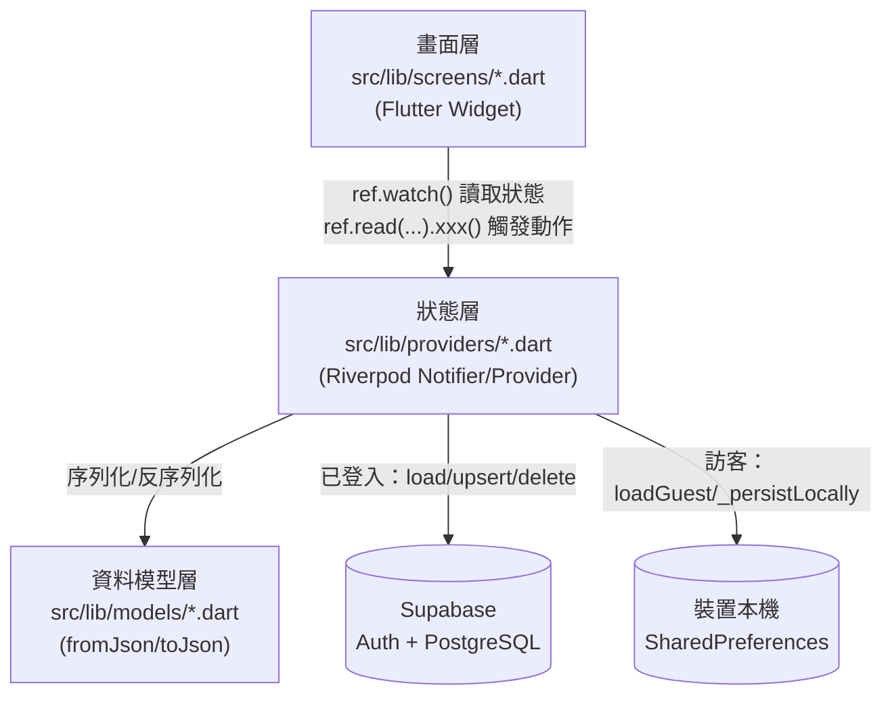
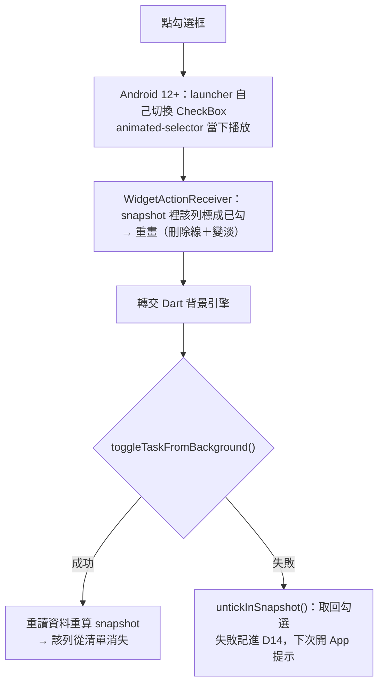
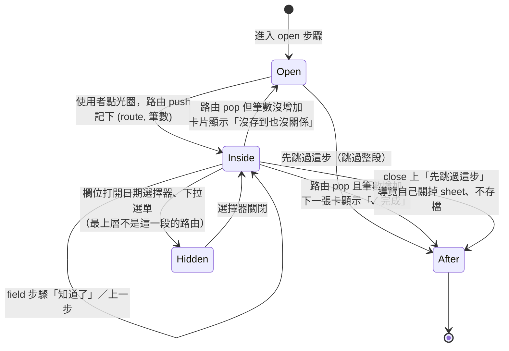

# 系統設計（System Design）

本文件描述 **URniversity** 的系統行為：畫面如何串接、每個功能的輸入／輸出格式、核心演算法的
處理過程、使用者操作步驟，以及關鍵邏輯的程式流程圖。

搭配閱讀：
- [data_flow_diagram.md](./data_flow_diagram.md) — 資料「從哪裡來、到哪裡去」（各 Provider 與資料儲存之間的流動）
- [data_dictionary.md](./data_dictionary.md) — 每個資料儲存的欄位定義

本文件回答的是「**系統怎麼運作**」，DFD／DD 回答的是「**系統存了什麼資料**」，三份文件互補，
請勿在本文件重複抄一份欄位定義，遇到欄位細節一律連結回 data_dictionary.md。

> **維護規則**：修改畫面流程、新增／調整核心演算法（任務判定、樹狀結構操作、學期計算、
> 響應式斷點、關聯圖佈局等）時，必須同步更新本文件，包含程式流程圖。詳見專案根目錄 `CLAUDE.md`。

---

## 1. 系統架構總覽

### 1-A 執行環境分層



- 沒有獨立後端服務層：Riverpod 的 `StateNotifier` 同時扮演「處理程序」與「資料存取物件」，
  細節見 [data_flow_diagram.md](./data_flow_diagram.md) 的圖例說明。
- 目前僅發行 Web 版本（`flutter run/build -d chrome`），行動裝置與桌面版尚未發行（見
  `README.md`「Next」小節）。

### 1-B 畫面導覽架構


- `Home` 為單一 `Scaffold`，用 `IndexedStack` 切換四個分頁，切換分頁不重建畫面（狀態保留）。
- 響應式判斷（詳見 §3-F）：寬度 < 768 用底部 `NavigationBar`；≥ 768 用左側 `NavigationRail`；
  ≥ 1200 時 `NavigationRail` 展開顯示文字。

---

## 2. 輸入與輸出格式

### 2-A 帳號與身分

| 功能 | 輸入 | 驗證規則 | 輸出／結果 |
|---|---|---|---|
| Email 登入 | Email（文字）、密碼（文字，遮蔽） | 兩欄皆非空才觸發登入 | 成功→依 `_AuthGate` 導向 Home／Setup；失敗→`SnackBar` 顯示 Supabase 錯誤訊息 |
| Google 登入 | 無（OAuth 彈出視窗） | 由 Google 端驗證 | 同上；Web 用 `Uri.base.origin` 作為 redirect，行動裝置用自訂 URL scheme |
| 註冊 | Email、密碼、確認密碼 | 密碼需與確認密碼相同；密碼長度 ≥ 6 | 成功且需信箱驗證→提示「請確認驗證信」；成功且免驗證→直接可登入 |
| 訪客模式 | 無 | 無 | 立即進入 `HomeScreen`，資料存本機（見 data_dictionary.md D11） |
| 首次登入設定暱稱 | 使用者名稱（文字，必填）、頭像（10 選 1 或不選） | 名稱非空才能按「完成」 | 寫入 `user_settings`，之後導向 Home |

**登入與註冊的版面（2026-09-23，設計稿 A）**：兩頁共用 `screens/auth/auth_layout.dart`——
手機是 250px 的暖色品牌區（漸層、幾顆分類色圓點、**App 圖示**、標題與一句話），
表單白卡片壓在它下緣上；桌面（≥768）左半邊是同一塊品牌區並多出三行說明，右半邊置中一張
420 寬的卡片。**這兩頁不再用 `ResponsiveBody`**，因為它們的寬版是雙欄而不是置中限寬。
訪客入口放在卡片下方——它是一條出路，不是入口。

**登入失敗怎麼說（2026-09-23）**：錯誤顯示在**登入按鈕正上方的一行**（錯誤色的圖示＋一句話），
不是 SnackBar——會自己滑走的東西不適合用來說「密碼錯了」；重新送出或改動輸入就清掉。
分類在 `core/sign_in_failure.dart`（純函式，可測）：

| 情況 | 說法 |
|---|---|
| `invalid_credentials`（帳號不存在**或**密碼錯誤） | 帳號或密碼錯誤，請再確認一次 |
| `email_not_confirmed` | 這個信箱還沒完成驗證 |
| `over_request_rate_limit` / 429 | 嘗試太多次了，請等幾分鐘 |
| `SocketException` / host lookup 失敗 | 連不上伺服器 |
| 其他 | 登入沒有成功，請稍後再試 |

⚠️ **「帳號不存在」與「密碼錯誤」不能分開講**。Supabase 兩者都回同一個碼是刻意的：分得出來，
任何人就能拿這個 App 逐一測試某個 email 有沒有註冊。要分辨得自己加一支查詢 email 是否存在的
API，等於把那份名單公開出去。

### 2-B 任務（Today 頁）

| 欄位 | 輸入元件 | 格式 | 必填 |
|---|---|---|---|
| 標題 | `SheetTextField`（Material 浮動標籤） | 任意字串，前端 `trim()` 後不可為空 | ✓ |
| 備註 | `SheetTextField`（空白時一行，隨內容長到最多三行） | 任意字串 | ✗ |
| 截止時間的建議 | **5 分鐘後／30 分鐘後／1 小時後**，後面接最多 3 個最近用過的時間 | 相對時間直接由現在加上去；最近用過的時間套用到今天，**該時刻已過則改成明天** | ✗ |
| 連結目標的建議 | 最多 3 個 `ActionChip`（最近用過的目標） | 學期目標 id，已刪除的不顯示 | ✗ |
| 截止時間 | 日期+時間選擇器 | `DateTime` | ✗ |
| 循環規則 | `ChoiceChip` + 數字輸入（僅「每 N 天」時出現）+ 星期複選 `FilterChip`（僅「每週」時出現） | 不循環/每日/每週/每月/每 N 天 | ✗ |
| 循環星期 | 7 個 `FilterChip`（一～日，可複選） | ISO 星期 1–7；不選＝沿用「與建立日同星期幾」 | ✗ |
| 連結學期目標 | 依學期分組的清單選擇對話框（見 §3-C） | 學期目標 id | ✗ |

輸出：任務卡片（含截止時間倒數上色、循環圖示、連結目標的箭頭文字），依
§3-A 規則分組排序後呈現；環形進度卡顯示「已完成 / 總數」與百分比，**整張卡片都可以點**進完成度歷史（2026-09-20：先前只有 72px 的圓環可點）。

**目標頁的進度總覽卡**（2026-09-18 改版，設計稿 A 版）：大字百分比 + 「已完成 / 總數」+ 一條
整體進度條，下方每個分類一個小膠囊（分類色圓點 + 該分類的完成數／總數）。取代原本「每個目標
一條進度條」的列表——目標一多就變成一整面長條。

任務卡片版面：左緣 6px 色條顯示連結目標的分類色（詳見 §3-J）；**沒有連結時色條仍保留
寬度但為透明**，確保有連結與沒連結的任務左緣對齊。色條由 `widgets/link_color_bar.dart` 的
`LinkColorBar` 統一畫：兩個連結顏色不同時上下分色、相同時合併成一條，**目標卡片共用同一個元件**
（上半為目標自己的分類色，下半為連結願景的分類色）。卡片本身用 `ListTile` 但設
`minTileHeight: 0` 解除 Material 預設的 72dp 兩行下限；色條改用 **`Stack` + `Positioned`**
畫在左緣，**不可以**用 `IntrinsicHeight` + `Row` 把色條撐高——`ListTile` 是用**整個寬度**去量
自己的 intrinsic height，標題在真實寬度下才換行時它仍回報一行的高度，副標就會被切掉。
標題**全文顯示、不截斷**（2026-09 第十一批；先前是 `maxLines: 2` 加刪節號），
搭配 `titleAlignment: ListTileTitleAlignment.titleHeight` **頂端對齊**——置中會讓多行標題把勾選框
與刪除鈕推離第一行（2026-09-19 回報的「兩行時排版跑掉」）。目標／願景卡片與其中的子項同樣全文顯示，
卡片高度隨內容長。標題長度由輸入端的字數上限控制（見 §2-K）。拖曳時的浮動卡、選擇器、
小工具仍維持單行。分隔線縮排由
`_taskTitleIndent` 常數（62.0 = 色條 6 + 內距 8 + 核取方塊 40 + 間隙 8）統一控制，
調整版面時必須同步更新這個常數。

**每週檢視**（`_WeeklyGrid` / `_DayRow` / `_WeekTaskTile`，2026-09-15 改版，設計稿方向 B）：
一整張卡片由上到下七列（週一到週日），每列**左側固定寬度日期欄**（手機 60、桌面 84）與右側
該日任務以細線隔開；卡片最寬 760，寬螢幕置中。今天的日期欄底色 `primaryLight`、日期為主色實心；
選取中但不是今天的日期加主色外框；沒有任務的日子只顯示「–」。任務列：3px 色條（連結目標的分類色，
見 §3-J）、勾選框、標題（已完成加刪除線變淡，**留在原位**）、循環規則或截止時間。
點日期欄設為選取日並捲動到該列；點任務開編輯 sheet；篩選與其他檢視共用。

**已完成區塊**：標題可點，`AnimatedSize` 展開／收合，**預設收合**，狀態只存在記憶體。

**完成動畫（`widgets/completion_effect.dart`，今日頁與週檢視共用）**：設定 D17 決定強度——
`off` 沒有動畫；`basic` 勾選框放大**再回到原大小**（`TweenSequence`；單向的 tween 會讓框停在放大後的尺寸，
那就是 2026-09-17 回報的「畫面上留下一個大框框」）；`celebrate` 再加上自繪彩帶，且**只在當天最後一筆
未完成任務被勾掉時**放（每筆都放太吵）。動畫純粹是外觀，寫入照舊發生。

⚠️ **動畫要畫在 `Overlay` 上**（`showCompletionPop()`）。勾選當下就寫入，那一列在下一個
frame 就離開清單（進入已完成區或被篩掉），長在列身上的動畫等於沒播——這是 2026-09-19
回報的「完成動畫消失了」。改成在原位置丟一個獨立的圓圈＋打勾疊層（約 420ms 後自行移除），
列消失也照播完。

**拖曳排序**：任務列表與兩個目標頁共用同一套命中判定（`widgets/drag_reorder.dart`
的 `dropZoneFor()`）——詳見 §3-C，但任務是**單層清單**，呼叫時帶 `canNest: false`，只認
「插入到某列之前」。**子任務功能已於 2026-09-19 移除**（沒有人用；`tasks.parent_task_id`
欄位保留但不再讀寫，見 data_dictionary.md D1）。

**欄位元件（`widgets/sheet_fields.dart`，2026-09-20 設計稿）**：四張 sheet（任務／目標／願景／
靈感）都用同一組欄位，不再各自拼 Material 元件——
`SheetTextField`（Material 浮動標籤。2026-09-20 曾改成「標籤印在框內上方」，隔天就被要求改回；
元件留著，所以四張 sheet 仍然只有一種欄位可以呼叫）、
`SheetPickerBox`（同樣的框，值由對話框挑，右側一個 `expand_more`）、
`SheetCategoryChips`（每個分類帶自己的顏色圓點，選中＝主色邊框＋`primaryLight` 底）。
加一種欄位只要做一次，四張 sheet 都拿得到。

⚠️ **下拉可以關閉 sheet**（`SheetBody`）。拖曳把手在捲動區之外，所以**只有**把手關得掉；
鍵盤升起時 sheet 幾乎滿版，那條 36px 的把手離拇指很遠。現在捲動區用
`AlwaysScrollableScrollPhysics`，並監聽 `OverscrollNotification`：往下拉超過 90px 就先收鍵盤
再 `maybePop()`。

新增與編輯共用同一個 `showTaskSheet(context, ref, {Task? existing})`
（`existing == null` 即新增）。編輯走 `copyWith`，不手動重建 `Task(...)`——model 的每個欄位
都有預設值，手動重建會讓漏帶的欄位靜默重設。目標與願景同樣各自收斂成
`showSemesterGoalSheet` / `showFutureGoalSheet`。

⚠️ **表單狀態必須宣告在 `showAppSheet` 的 `builder:` 之外**。Flutter 只要 MediaQuery
變動就會重跑該 `builder`（SDK
`bottom_sheet.dart` 的 `buildPage` 透過 `MediaQuery.removePadding` 建立依賴），而表單標題欄
`autofocus: true` 會讓「開啟選擇器對話框 → 鍵盤收起 → `viewInsets` 改變」必然觸發重跑。若把
`dueTime` / `recurrence` / `linkedTargetId` 宣告在閉包內，選擇器
的 callback 會寫進已失效的舊閉包變數，症狀是「點了沒反應、要按好幾次才成功」。

### 2-C 學期目標（Semester 頁）／未來願景（Future 頁）

> **分類可以不選**（2026-09-20）。送出時不再把空的分類補成「其他」——那是一個使用者可能
> 另有用途的真實分類。**沒有分類就什麼都不畫**：色條保留寬度但沒有顏色、圖示方塊留著（還是能
> 點著切換完成）但裡面空的。若這個目標連結了某個有分類的願景，整張卡片改用**那個願景的顏色**
> （見 §3-J）。
> 學期改用 `SheetPickerBox`，**新增時也看得到**（先前只有編輯頂層目標才出現）。

| 欄位 | 輸入元件 | 格式 | 必填 |
|---|---|---|---|
| 標題 | 文字輸入框 | 任意字串 | ✓ |
| 分類 | 多選 `FilterChip` | 見 data_dictionary.md `FutureCategories` 列舉 + 使用者自訂分類（顏色/圖示可自訂，見 §2-I） | ✗（預設 `other`） |
| 備註 | 文字輸入框（多行） | 任意字串 | ✗ |
| 學期目標專屬：所屬學期 | **新增時**由目前檢視的學期分頁決定；**編輯時**為下拉選單（僅頂層目標，子目標繼承父節點學期） | `"YYY-N"` 或假期 `"YYY-Bk"`（見 §3-D） | ✓ |
| 學期目標專屬：連結未來願景 | 清單選擇對話框 | 未來願景 id | ✗ |
| 未來願景專屬：起訖學期 | 兩個下拉選單 | `"YYY-N"` 或假期 `"YYY-Bk"`，結束學期不可早於起始學期 | ✗ |
| 父節點（子目標/子願景） | 由「新增子目標」入口決定，非表單欄位 | 目標/願景 id | ✗ |

輸出：樹狀縮排卡片列表（可拖曳排序／換父節點），左側有分類色條（寬度 6px），完成度以子節點
完成比例呈現進度條；桌面版側欄另有「進度總覽」環形圖（學期目標頁）與「篩選」面板（未來願景
頁）。學期/起訖學期的下拉選單與挑選對話框都會把假期 token 顯示成本地化名稱（例如「114 暑假」），
不會顯示原始 `"114-B3"` 字串。學期目標卡片若有連結未來願景，標題下方會多一行「⭐ 願景標題」。

**標示完成**：點卡片或詳細頁頁首**左側的分類圖示方塊**即切換 `isDone`（圖示換成 `Icons.check`、
底色透明度 0.15→0.25、標題加刪除線）。頂層與子層、列表與詳細頁四處行為一致。
⚠️ 卡片上的進度條／學期總覽環形圖統計的是**子節點**完成比例，與節點自身的 `isDone` 互相獨立，
因此一個已標完成的父節點，其進度條仍可能顯示未滿（例如 2/5），這是目前刻意保留的語意。

**目標卡／願景卡（2026-09-21 套用 2026-09-16 畫布的 A 卡片稿）**：
左緣 6px 色條（`LinkColorBar`，畫在 `Stack` 上而不是 `IntrinsicHeight` 的 Row 裡）、
38×38 圓角 12 的圖示方塊（兼「切換完成」的按鈕；完成畫打勾）、標題 700、
目標卡的「⭐ 連結願景」用**願景自己的顏色**、備註、「N/M 完成」＋4px 進度條。
**子項（里程碑／子願景）是卡片內的輕量勾選列**：縮排到與標題對齊、18px 方框、完成加刪除線，
右側一個小的刪除鈕（稿上沒有，但拿掉就再也無法從清單刪掉子項）。
頁首副標帶這一頁的總量：目標頁「115-1 · N 個目標，X/Y 個里程碑完成」、
願景頁「N 個願景，X/Y 個子願景完成」。
**卡片只有標題時**（沒有連結願景／備註／子項進度），圖示方塊與標題**垂直置中**；
有其他內容時才頂端對齊。

**目標／願景頁的排序（2026-09 第十一批）**：頁首右側與任務頁同款的排序鈕，開同一張
`showSortSheet()`。目標頁：**手動／A–Z／依願景／未完成優先**（D20）；願景頁：
**手動／A–Z／依開始學期／依結束學期**（D21）。目標與願景沒有 `created_at`，所以沒有「新增時間」。
規則見 §3-C 的「排序」。手動以外停用拖曳；「調整順序」模式同 §2-B。

**願景頁的兩排篩選（2026-09-22，設計稿的樣子）**：**分類在上、學期在下**，
兩排都是同一種膠囊（選中＝主色外框＋`primaryLight` 底），各自右邊有「更多」開完整清單。
學期那排的「全部」寫成**不限學期**——兩排疊在一起時，兩個「全部」分不出是哪一種。
桌面版側欄的順序與手機一致。

**學期清單（`widgets/semester_list_dialog.dart`，2026-09-23）**：目標頁、目標 sheet、願景頁的
學期篩選共用同一個對話框，**開啟時捲到當前學期**（固定 48px 行高＋算好的 `initialScrollOffset`），
更早的學期往上捲得到。清單是由早到晚，從頭開始等於每次都要滑過已經念完的年份。

**學期切換（2026-09-22，設計稿的樣子）**：`‹ 115-1 ›` 一列——左右各一個箭頭走一個學期
（到頭就變灰），中間的膠囊點下去開完整的學期清單，不是本學期時右邊出現「回到本學期」。
卡片區左右快滑同樣換學期（`_stepSemester`）。

**排序（2026-09-22）**：任務區標頭的篩選鈕旁邊有一顆排序鈕（`Icons.arrow_downward`），開一張 sheet 選
**手動（可拖曳）／新增時間／A–Z／依目標／依截止時間**，記在裝置本機（D19）。
手動以外的排序會**停用拖曳**——拖曳寫的是 `sort_order`，在別種排序下看不出效果。
規則見 §3-A。sheet 由 `widgets/sort_sheet.dart` 的 `showSortSheet()` 畫，**三個頁面共用**（目標與願景頁見 §2-C）。

**調整順序模式（2026-09 第十一批）**：排序 sheet 最下面一列「調整順序」→ 先把排序切回**手動**
（把手寫的是手動順序，畫面上必須就是那個順序）→ 每一列右側出現拖曳把手（`Icons.drag_handle`，
`DragHandle`）。**按住把手直接拖，不用長按**；列的其他部分仍可上下捲動清單——
這就是把手而不是「整列直接可拖」的原因，整列都能直接拖的話清單就捲不動了。模式中：
- 把手取代該列的刪除（目標／願景卡則取代編輯＋刪除＋箭頭），**點列不會打開**，避免誤觸離開模式；
- `SwipeSwitcher` 的左右快滑停用（兩個方向都傳 `null` 時它不掛水平手勢辨識器），以免橫向拖把手變成換頁；
- 排序鈕換成「完成」文字鈕，按下離開。
- 放下時的判定完全沿用原本的 `DragTarget`（§3-C），只換掉拖曳的起點。
- 模式旗標只存在記憶體（`taskSortModeProvider` 等），不持久化。
不在模式中時，原本的長按拖曳照舊可用。

### 2-D 篩選（Today 頁）

輸入：勾選學期目標（`SemesterGroupedFilterDialog`，與「任務連結目標」的挑選器共用
`groupBySemester()` / `startGroupIndex()`：上方一排學期 chip、開啟時停在當前學期、項目為
可複選的勾選列；勾選父節點會連動勾選所有子孫，取消子節點則一併取消其祖先，否則祖先仍會
把它的任務拉進來）。**沒有願景分頁**——任務不再直接連結願景（見 §UC3-B）。
輸出：任務清單依 `linkedTargetId` 是否落在勾選集合（含子孫展開後的集合）內
過濾；畫面上以主色膠囊 Chip 顯示「篩選 · N」，N 為已選數量，可一鍵清除。

### 2-E App 設定（設定頁）

| 欄位 | 輸入元件 | 格式 |
|---|---|---|
| 語言 | 單選清單 | 繁中／English／日本語 |
| 日期顯示格式 | 單選清單（附即時預覽） | 4 種格式，見 data_dictionary.md |
| 預設任務檢視 | 單選清單 | 全部／每日／每週 |
| 學期制度 | 數字選擇 + 每學期起始月 | 每年 2/3/4 學期，起始月 1–12 |
| 日記天數徽章開關 | `Switch` | 開／關 |
| 開發者模式時間覆寫 | 日期選擇器 | 覆寫「現在時間」，僅供測試用（見 §4-J） |

輸出：即時套用到對應畫面；非訪客模式會非同步寫回 `user_settings`（見 data_flow_diagram.md Diagram 1-D）。

### 2-F 意見回饋（設定頁）

輸入：類型（bug／建議，`SegmentedButton`）、內容（文字，10～1000 字）。
輸出：成功→關閉對話框；失敗（低於 10 字／5 分鐘內重複送出／網路錯誤）→在輸入框下方顯示對應
錯誤訊息，不關閉對話框。完全匿名，無法在 App 內查看歷史紀錄（見 data_dictionary.md D9）。

### 2-G 關聯圖（OverviewGraphScreen）

輸入：無使用者資料輸入，僅有「分層／放射」佈局切換（`SegmentedButton`）與畫布縮放平移手勢。
輸出：以學期目標／未來願景為節點、三種關聯為邊的可互動圖（詳見 §3-G、§5-F）；點節點導向對應
詳細頁。

> **2026-09-20 改版（設計稿 A）**：畫布上方多一排**篩選 chip**（全部／本學期／未完成／未連結），
> 右上角一張常駐**圖例**卡（願景／目標的樣子、數字代表底下的任務、淡色代表其他學期）。
> **點節點不再直接離開頁面**——改成在下方開一張摘要卡：進度（子項完成數）、未完成任務數、
> 最近截止日，以及兩顆按鈕「打開」（進詳情頁）與「看 N 個任務」（把今日頁的目標篩選設成這一支，
> 再回到首頁並切到任務分頁，見 `providers/home_tab_provider.dart`）。
> 篩選只縮小**學期目標**；願景只要還有目標掛在上面就留著，樹才不會失去根。

### 2-H 任務完成度歷史（TaskHistoryScreen）

輸入：日／週／月檢視切換（`SegmentedButton`）、點擊或滑鼠移到長條上選取該期間。
輸出（**2026-09-20 改版，設計稿 A**）：四張卡片，由上到下

| 卡片 | 內容 | 來源 |
|---|---|---|
| 摘要 | 大字平均完成率 + **較上一期 ±X%** + 三個數字：連續達成天數、期間完成任務數、最強的星期幾 | `core/history_stats.dart` |
| 長條圖 | 原本的圖（0–100%），沒有任務的日期以底線刻度呈現而非 0% 長條（區分「沒事做」與「有事沒做」）；下方是選取期間的「N / M 完成（P%）」明細 | — |
| 各分類完成率 | 每個分類一條進度條，**沒做完的最多的排最前面**，最後一行點名落後最多的那個 | `categoryTotals()` |
| 拖最久的任務 | 最多 3 筆，依逾期天數排序，帶連結目標的顏色 | `stalestTasks()` |

⚠️ 三個版面前提：長條下的日期**以長條為中心、不給 maxWidth**（限制在長條寬度內會被折成兩行，
第二行落在畫布外被裁掉）；圖表寬度要多留 `_labelOverhang`（20px），否則**最後一根**的標籤
有一半在畫布外；整頁的下內距要加上 `MediaQuery.viewPaddingOf(context).bottom`，
否則最後一張卡片會被 Android 的導覽列蓋住（關聯圖的摘要卡同理）。

**`core/history_stats.dart` 的規則**（純函式，全部有單元測試）：

- `totalsBetween()` / `rateBetween()`：把區間內每天的 `taskCompletionStatsOn()` 相加，
  沒有任務的日子不計入（與 §3-B 的理由相同）
- `allDoneStreak()`：從今天往回數「當天的任務全部完成」的連續天數。
  **今天還沒做完不算中斷**（這天還沒結束），昨天沒做完就中斷；沒有任務的日子既不延續也不中斷
- `bestWeekday()`：區間內平均完成率最高的星期幾（不是最忙的那天）
- `categoryTotals()`：任務的分類＝**它連結目標的分類**（§3-J）；沒有連結、或目標沒有分類的任務
  不列入——這張表是要指出哪個分類落後，「沒有分類」不是一個分類
- `stalestTasks()`：`currentOccurrence()` 在今天之前且還沒完成的任務，依逾期天數排序

### 2-I 分類設定（CategorySettingsScreen／「更多分類」對話框）

**入口只有一個**：設定頁的「分類設定」全螢幕頁（`src/lib/widgets/category_manager.dart`）。
願景頁的「更多分類」自 2026-09-23 起只是**挑選要篩選哪一個分類**——只有圖示、顏色圓點與名稱，
沒有刪除／換色／換圖示／排序／新增。那個對話框是在瀏覽清單時順手點開的，把刪除鈕放在名字旁邊
只是等著被誤觸。

| 欄位 | 輸入元件 | 格式 |
|---|---|---|
| 新增分類 | 文字輸入框 + 送出鈕 | 任意字串，成為該分類的 id 與顯示名稱 |
| 排序 | 拖曳單線把手（`Icons.horizontal_rule`，圖一改版前是雙線 `Icons.drag_handle`） | 拖放調整順序 |
| 顏色 | 圓形色塊按鈕 → 彈出色票網格 | `categoryColorPresets`（24 色固定清單，可捲動） |
| 圖示 | 圖示按鈕 → 彈出圖示網格 | `categoryIconPresets`（20 個固定圖示，見 §3 備註） |
| 刪除 | 垃圾桶 icon（僅自訂分類） | 內建 6 分類無法刪除 |

輸出：即時套用到所有顯示該分類的畫面（目標/願景卡片色條、關聯圖節點、任務左側連結色條等），
非訪客模式非同步寫回 `user_categories.styles`（見 data_dictionary.md D7；需要先手動執行一次資料庫 migration
才會生效）。

### 2-J 我的頁（MeScreen）

輸入：個人資料卡（暱稱／學校／系所／年級／頭像，寫回 D8-A）、靈感與日記兩區的入口。
頭像可從 `AppAvatars.presets`（**24 個**內建圖示頭像）挑選，索引存進 `avatar_index`——
**presets 的順序就是這個索引的意義，既有項目只能往後追加，不能調換或刪除**，否則所有人的
頭像都會被換掉。

輸出：個人資料卡下方三張**摘要卡**（`_SummaryTiles`，2026-09-19 改版，設計稿 A 的分區 +
B 的數字卡）：

| 數字 | 來源 | 備註 |
|---|---|---|
| 任務 | `tasksProvider` 中今天**尚未完成**的筆數 | 只算還開著的：一個永遠往上加的總數說不出這學期過得如何 |
| 目標 | `semesterGoalsProvider` 中目前學期、**頂層、未完成**的筆數 | 不含里程碑；跟著目標頁目前選的學期走 |
| 願景 | `futureGoalsProvider` 中**頂層、未完成**的筆數 | 不含子願景 |
| 靈感 | `inspirationsProvider` 中**尚未完成且未封存**的筆數 | 已完成的、已封存的都不算 |

連續寫日記天數（`journalStreak()`，`core/me_stats.dart`）**移到日記區塊的標題旁**（`_StreakChip`，
只在大於 0 時出現）：那個數字只有在日記旁邊才說得通。計算方式不變——從今天往回數，
**自動補齊的那天不算**（`JournalNotifier.isWrittenByUser`，見 §3-H），今天還沒寫則從昨天起算。

手機版摘要卡接在個人資料卡下方，桌面雙欄版放在右側個人資料欄內（見 §3-F）。

---

### 2-K 字數上限（2026-09 第十一批）

**所有使用者輸入都有上限**，數字集中在 `core/input_limits.dart` 的 `InputLimits`：

| 輸入 | 上限 | 超過時 |
|---|---|---|
| 任務／目標／願景／靈感的標題 | 100 | 輸入被擋，接近上限時出現計數器 |
| 任務內容、目標／願景備註、靈感內容 | 500 | 同上 |
| 日記內容 | 5000 | 同上 |
| 分類名稱 | 20 | 同上 |
| 使用者名稱 | 30 | 同上 |
| 自訂學校／系所 | 50 | 同上 |
| 意見回饋 | 1000 | 同上（計數器常駐，沿用原設計） |
| 搜尋框 | 50 | 靜默擋下（`LengthLimitingTextInputFormatter`） |
| Email | 254 | 靜默擋下（RFC 5321 上限） |
| 密碼 | 72 | 靜默擋下（Supabase Auth 用 bcrypt，超過 72 bytes 的部分會被忽略） |
| 重複間隔 | 3 位數 | 靜默擋下 |
| Hex 色碼 | 7 | 靜默擋下 |

**計數器只在達到上限 80% 時出現**（`nearLimitCounter`，`widgets/sheet_fields.dart`）：常駐會讓每張
sheet 的每個欄位下都多一行「0/100」；接近上限時出現，才說得出「為什麼打不進去」。`SheetTextField`
的 `maxLength` 是**必填**，新增 sheet 欄位時不會忘了設。
會存進資料庫的欄位**資料庫端也有同樣的 CHECK**（`supabase/input_length_limits.sql`，見 data_dictionary.md D0）。

---

### 2-L 靈感封存（Phase 3）

`InspirationsScreen` 把清單分成**三段**，依序排列：

| 區塊 | 條件 | 預設狀態 |
|---|---|---|
| 進行中 | `!isCompleted && !isArchived` | 展開 |
| 已完成 | `isCompleted && !isArchived` | 展開 |
| 已封存 | `isArchived`（不論完成與否） | **收合**，點標題展開 |

**輸入**：每張靈感卡片的封存鈕（`Icons.archive_outlined`／已封存時 `Icons.unarchive_outlined`）
呼叫 `InspirationsNotifier.toggleArchived(id)`。**沒有確認對話框**——封存是可逆的，
確認框只留給刪除（`confirmDelete`）。

**為什麼是獨立的一軸而不是第三種完成狀態**：一個還沒動手、也不打算動手的點子需要一個去處，
但把它標成「已完成」是謊話。所以 `is_archived` 與 `is_completed` 互不影響，取消封存後回到
原本該在的區塊。

**連帶影響**：Today 頁靈感區塊、「我的」頁靈感區塊與 §2-J 的靈感計數都排除已封存的筆數；
否則封存等於什麼都沒發生。

## 3. 處理過程（核心演算法）

### 3-A 循環任務是否屬於某一天（`tasks_provider.dart`）

`_taskAppliesTo(task, date)`：
- 非循環任務：`dueTime` 不為空，且與 `date` 同一天才算屬於當天。
- 循環任務：呼叫 `_recurringAppliesTo()`，依 `recurrence.type` 分流：
  - `daily`：只要不早於建立日就算。
  - `weekly`：若 `recurrence.weekdays` 有值，判斷 `targetDay.weekday` 是否在該清單內（可複選
    多天）；若為空則退回舊行為「與建立日相差天數為 7 的倍數」，確保這個選項出現之前建立的
    任務行為不變。
  - `monthly`：若 `recurrence.monthDays` 有值，比對目標日的「日」是否在清單中；
    哨兵值 `32`（`kLastDayOfMonth`）換算成該月最後一天（`DateTime(y, m + 1, 0).day`）。
    **選了該月沒有的日期就不出現**（例如選 31 號，2 月整月都不會出現）——這是刻意的語意，
    需要「每月月底」請改選「最後一天」。若為空則退回舊行為「與建立日同一個號數」。
  - `everyNDays`：與建立日相差天數需為 `interval` 的倍數。
- 完成狀態判斷完全獨立於「是否屬於當天」：非循環看 `isCompleted`，循環看
  `completedDates` 是否包含該日期字串（`Task.isCompletedOn()`）。

**「全部任務」檢視裡，一個循環任務代表哪一次（`currentOccurrence(task, now)`）**：
「全部任務」不綁日期，所以每一列要自己決定它講的是哪一天，否則每月 20 號的任務在 21 號
也會以「今天」的身分出現、勾了也記錯日子（2026-09-19 回報）。規則：

1. 今天符合循環規則 → 今天；
2. 否則往前找**最近一次**符合規則的日子（最多回溯 366 天）——那一次還沒做完，就該一直留著；
3. 都沒有（規則還沒開始）→ 往後找最近一次（最多 366 天）；
4. 非循環任務 → `dueTime` 那天；兩者皆無 → `null`（沒有可歸屬的日期）。

`taskRowDateProvider`（`Provider.family<DateTime, Task>`）把這個日期餵給每一列：只有
「全部任務」用 `currentOccurrence()`，每日／每週檢視仍用選取日。勾選框因此是對**那一次**
打勾——勾完該列進「已完成」區，直到下一個循環日到來才回到未完成。

**「今天」什麼時候更新**：`effectiveNowProvider` 是 `StateNotifier`（`EffectiveNowNotifier`），
內建一個跨午夜的 `Timer`（`untilNextDay()`），並在 App 回到前景（`AppLifecycleState.resumed`）
時 `refresh()`。⚠️ 它**不能是 `Provider`**——`Provider` 只算一次 `DateTime.now()` 就快取，
App 開著過午夜就整天停在昨天（2026-09-19 回報的「當天的日期有機會是錯的」）。
換日時 `dateProvider.rollOverTo()` 只在「目前選的正是舊的今天」時把選取日跟著移過去，
使用者自己翻到的日期不會被搶走。測試環境用 `EffectiveNowNotifier.autoRollOver = false`
關掉計時器（未關會留下 pending timer 讓 widget 測試失敗），`untilNextDay()` 另有單元測試。

**任務排序（`applyTaskSort()`，`tasks_provider.dart`，2026-09-22）**：先照下面的自動規則排好，
再依 `taskSortProvider` 套上使用者選的順序——
`manual` 走 `_applyManualOrder()`（原本的行為）、`created` 新到舊、`title` 不分大小寫的 A–Z、
`target` 依連結目標的名稱分群（**沒有連結、或目標已被刪除的排最後**）、
`due` 由近到遠（**沒有截止時間的排最後**）。
排序鍵相同時**退回自動順序**，所以每次重建的結果都一樣。

**手動排序（`_applyManualOrder()`）**：先照原本的自動規則分組排序
（循環 → 有截止時間 → 無截止時間），再以 `sortOrder` 為主鍵重新排序，自動順序當作同分時的
次鍵。因為既有資料的 `sortOrder` 全是 `0`，在使用者第一次拖曳之前畫面順序完全不變；一旦拖曳，
手動順序就會蓋過自動分組。⚠️ 這個排序必須放在 Provider（`filteredTasksProvider` 與
`tasksForDateProvider`）而不是 widget 層，否則拖曳結果會在下次 rebuild 被自動排序蓋掉。

### 3-B 任務完成度統計（`taskCompletionStatsOn()`）

以 3-A 的判定找出某天所有適用任務，回傳 `(done, total)`；若當天沒有任何適用任務回傳 `null`
（語意上與「有任務但都是 0%」不同）。`TaskHistoryScreen` 的週/月統計是把區間內每天的
`done`／`total` 直接加總再相除，**不是**先算每天比率再平均，理由是避免「某天完全沒任務」拉低
平均值。

### 3-C 目標／願景樹狀結構操作（`semester_goals_provider.dart` / `future_goals_provider.dart`）

兩份 Provider 各自獨立實作相同模式（未共用程式碼，修改一邊時記得檢查另一邊）：
- **新增**：`sortOrder` 取「同一層（同 `parentId`；學期目標另加同 `semester`；任務只有
  一層）現有**最小值 − 1000**」（同層沒有項目時為 −1000），讓**新項目排在最上面**，
  同時預留插入空間。拖曳過的項目保留 `orderBetween()` 算出的值，新增不會移動它們；
  2026-09-15 以前的資料不回溯重排。
- **連結選擇器（`widgets/semester_grouped_picker.dart`）**：任務→學期目標、學期目標→願景
  兩個對話框，以及今日頁的**目標篩選**（`SemesterGroupedFilterDialog`，複選版）共用。`groupBySemester()` 依學期（願景用 `startSemester`）
  **由早到晚**分組、未設定學期的一組放最後；組內依 `sortOrder`（新的在上）並把子項縮排在父項下，
  父項在別的學期時子項在自己的組內當根。上方一排學期 chip（預設「全部」）可只看某學期。
  開啟時捲到 `startGroupIndex()`：當前學期 → 沒有則之後最近的學期 → 都在過去則最晚的學期。
  清單用非 lazy 的 `Column`，否則捲動目標還沒被建出來無法定位。
- **搬移（`reparent`）**：先呼叫 `isAncestor(draggedId, newParentId)` 確認新父節點不是自己的
  子孫，避免產生循環參照；通過後更新 `parentId` 與 `sortOrder`。
- **拖曳命中判定（三個列表共用，`widgets/drag_reorder.dart`）**：一列由上而下切成
  **上 1/4 =「插入這列之前」、中 1/2 =「成為這列的子項」、下 1/4 =「插入這列之後」**；
  當該列不能收子項時（`canNest: false`，例如單層的任務清單），中間那半平分給前後兩區，
  讓整列都有作用。
  排序值一律走 `orderBetween(prev, next)`（取中點；一端為空則 ±1000）與
  `orderAfterLast()`（最大值 +1000）。
  ⚠️ **`DragTargetDetails.offset` 不是指標位置**，而是拖曳回饋 widget 的左上角；直接拿來
  換算會依「抓在該列哪個位置」整體偏移，判定區因此感覺又小又不準。三個列表的 `Draggable`
  都必須設 `dragAnchorStrategy: pointerDragAnchorStrategy`，讓兩者重合。
- **刪除（`remove`）**：`getWithDescendants()` 先蒐集整個子樹，逐一呼叫資料層刪除；刪除前
  對每個節點呼叫 `trash_provider` 的 `addSemesterGoal()`/`addFutureGoal()` 做快照備份。
- **還原**：若原本的 `parentId` 已不存在，還原時自動改掛在頂層（`parentId = null`），避免
  出現斷鏈孤兒。
- **變更學期（僅學期目標，`updateGoal`）**：只有頂層目標可改。因為 `sortOrder` 的作用域是
  「同一個 (`parentId`, `semester`) 群組」，換學期時必須：
  1. 重新計算 `sortOrder` 為「目標學期同層最大值 + 1000」（排到新學期的最後）
  2. 用 `getWithDescendants()` 把**整棵子樹的 `semester` 一起改掉**——否則子目標會留在舊學期，
     之後新增同層節點時 `sortOrder` 會依錯誤的群組計算而互相衝突
  3. 逐一 `_upsert()` 整棵子樹
  未變更學期時則原樣保留既有 `sortOrder`。⚠️ 這個方法是手動重建 `SemesterGoal(...)`（而非
  `copyWith`），因為 `copyWith` 的 sentinel 無法把 `futureGoalId`／`notes` 清成 null，而
  「解除連結／清空備註」需要這個能力；代價是**新增欄位到 model 時必須記得在這裡補上**，
  否則該欄位會靜默重設為預設值（`sortOrder` 曾因此被重設為 0，導致目標每次編輯後跳到最上面）。

**排序（`applyTargetSort()` / `applyVisionSort()`，2026-09 第十一批）**：純函式，一次排**樹的一層**
（某學期的頂層目標，或某個父節點底下的子項），頁面在建樹時逐層呼叫，所以子項跟著父節點走、只在
同層內重排。先依 `sortOrder`（手動順序）排好，再套使用者選的鍵；**鍵相同時退回手動順序**，
每次重建結果一致。
- 目標：`title` 不分大小寫；`vision` 依連結願景的名稱分群，**沒連結的排最後**（子目標不帶願景，
  所以子項層等於手動順序）；`undoneFirst` 未完成在前。
- 願景：`title`；`startSemester`／`endSemester` 用 `compareSemesters()`，**沒設學期的排最後**。
排序只影響顯示，**不寫回 `sort_order`**；只有手動時能拖曳。

### 3-D 學期字串生成、比較與假期（`semester_goals_provider.dart` / `future_goal.dart` / `semester_helpers.dart`）

- `currentSemester(settings)`：以民國年為基礎，依 `SemesterSettings.startMonths`（各學期起始
  月份）找出「不晚於今天、且最接近今天」的學期起始點，組成 `"{民國年}-{學期序}"`。
  跨年度學期（例如第 2 學期在隔年開始）用 `yearOffset` 校正。只回傳一般學期，不會回傳假期
  （若「現在」落在假期期間，回傳的是最近一個已開始的學期，作為選單的合理預設起點）。
- `generateSemesters(settings)`：以目前學期為中心，往前 4 年、往後 3 年展開，**每個學期後面
  緊接著插入該學期的假期**（`"Y-1"`, `"Y-B1"`, `"Y-2"`, `"Y-B2"`, ...），供選單使用。
- **假期 token 格式**：`"{民國年}-B{k}"`，k = 1..該年學期數，代表「緊接在第 k 個學期後面的假期」；
  `k = 學期數`（最後一個）固定是暑假（下學年第 1 學期開學前的長假）。
- `compareSemesters(a, b)`：把 `"YYY-N"` 或 `"YYY-Bk"` 換算成同一套權重（一般學期 k → `2k-1`，
  假期 k → `2k`）後比較 `(年, 權重)`，讓假期正確排在對應學期之後、下一個學期之前。**禁止**直接
  用字串或轉數字比較。
- `semesterStart(token, settings)`（`semester_helpers.dart`）：把 token 換算成該學期的
  **起始日期**。`currentSemester()` 現在也是呼叫它來取得起始點，避免兩處各算一次而漂移。
  假期 token 沒有自己可推導的起始日（`SemesterSettings` 只有起始月份，沒有「哪天停課」），
  所以它回傳的是所屬學期的起始日。
- `semesterEnd(token, settings)`（`semester_helpers.dart`）：該學期的**最後一天**，定義為
  **下一個學期起始日的前一天**（最後一個學期則接到下學年第 1 學期）。⚠️ 這表示學期的範圍
  **涵蓋它後面那段假期**——資料裡沒有任何欄位能區分「學期結束」與「假期開始」，
  而對「目標截止提醒」而言，算到下學期開始正是想要的語意。
- `breakName(k, count, s)` / `formatSemester(token, settings, s)`（`semester_helpers.dart`）：
  假期名稱依「目前配置的學期數 `count`」查表決定（例如 3 學期制的假期依序是寒假／春假／暑假，
  4 學期制是秋假／寒假／春假／暑假），**不是**存在 token 裡固定不變的——所有顯示學期字串的地方
  一律呼叫 `formatSemester()`，不要直接顯示原始 token（一般學期會原樣顯示 `"114-1"`，只有假期
  token 會被轉成「114 暑假」這種可讀名稱）。

### 3-E 年級自動推進（`settings_provider.dart`）

`computedGrade(baseGrade, gradeSetYear, effectiveNow, settings)`：以 `academicYear()`（依第 1
學期起始月判斷「現在屬於哪個學年」）與使用者上次設定年級時的學年度相減，得出經過幾個學年，
加回 `baseGrade` 並限制在 1～7 之間。使用者不需要每年手動改年級。

### 3-E-B 四個主頁面的頁首（`widgets/page_header.dart`）

今日／目標／願景／我的各自拼自己的頁首，於是它們慢慢長歪——目標頁的三條線按鈕比其他三頁高。
現在四頁都用 `PageHeader(title:, subtitle:, actions:)`：**固定 44px 高的標題列**（放得下
IconButton 的觸控範圍，也放得下 headlineSmall），三條線在左、動作按鈕在右，
`AppSpacing.pageTop` 的上內距只寫一份。今日頁的「問候語＋日期狀態」走 `subtitle`。
桌面（≥ `AppBreakpoints.desktop`）有常駐的 NavigationRail，所以不畫三條線——這個判斷也在
元件裡，頁面不必各自重算。

### 3-F 響應式版面決策（`app_breakpoints.dart` + 各 `screens/*.dart`）

兩個斷點常數：`desktop = 768`、`wide = 1200`。所有分頁在同一個 `build()` 內以
`MediaQuery.of(context).size.width` 判斷（不使用 `Platform` 判斷，因為 Web 版窄視窗也要走手機
版面），依寬度回傳不同 Widget 結構，但**共用同一份資料 watch 與同一批子元件**（不重複資料
邏輯，不另開 Widget class）。彈出視窗（bottom sheet／dialog）另外在 `app_theme.dart` 統一
限制最大寬度，避免超寬螢幕被拉伸。詳細流程圖見 §5-E。

單欄表單／列表類畫面不套用 §5-E 的雙欄＋NavigationRail 模式（這些畫面沒有底部導覽／側邊欄），
改用較簡單的版本，統一由 `widgets/responsive_body.dart` 的 **`ResponsiveBody`** 實作：
寬度 < 768 直接回傳原本鋪滿寬度的內容；≥ 768 時用 `Center` + `ConstrainedBox` 把**同一份**
內容限制在固定最大寬度並置中，避免欄位／清單在超寬螢幕被拉伸到不合理的寬度。

兩個寬度常數定義在該檔內：`ResponsiveBody.formWidth = 420`（登入類表單，行寬窄一點好讀）、
`ResponsiveBody.contentWidth = 640`（其餘，也是預設值）。

套用 `ResponsiveBody` 的 12 個畫面：

| maxWidth | 畫面 |
|---|---|
| 420（`formWidth`） | `ResetPasswordScreen`、`SetupProfileScreen` |
| 640（`contentWidth`） | `SettingsScreen`、`SemesterGoalDetailScreen`、`FutureGoalDetailScreen`、`CategorySettingsScreen`、`JournalsScreen`、`JournalEditScreen`、`TaskHistoryScreen`、`TrashScreen`、`InspirationsScreen` |

`TodayScreen`、`SemesterScreen`、`FutureScreen`、`MeScreen` 走 §5-E 的雙欄模式，
用 `isWide ? 1100 : 900`，**不使用** `ResponsiveBody`。

> 兩個詳細頁刻意用 640 而非分頁列表的 `isWide ? 1100 : 900`——後者是為「主內容 + 側欄」雙欄
> 版面設計的，套用在單欄長文字內容上會產生過長、難以閱讀的行寬。
>
> 兩個詳細頁內各對話框的 `SizedBox(width: 400)` **不需要**改成響應式：`AlertDialog` 本身已由
> `app_theme.dart` 限制最大寬度，並在窄螢幕上把 content 的約束夾到可用寬度，`SizedBox` 在此
> 實際扮演的是「桌面上的最大寬度」，不會在手機上溢出。

### 3-G 關聯圖佈局演算法（`overview_graph_screen.dart`）

節點＝全部學期目標＋未來願景；邊＝三種關聯（目標樹／願景樹／目標→願景跨層連結）。共用前處理
（Union-Find 分連通分量、建立鄰接表），依使用者選擇的模式分流：

- **分層模式**：longest-path layering（願景根層為 0，子節點層 = `max(父節點層) + 1`）→
  barycenter 啟發式掃 3 趟減少交叉 → 同層置中排列。
- **放射模式**：BFS 找出以「連結數最多的願景根節點」為中心的距離環，同心圓半徑依節點數
  自動撐大，子節點依父節點角度排序讓分支保持同一扇區。

兩種模式都先各自計算「分量內」座標，再由 shelf packing 演算法把各連通分量的外框依可視寬度
排進畫布；孤立節點（無任何關聯）集中排在最後的「未連結」區。詳細流程圖見 §5-F。

### 3-H 日記自動補齊（`journal_provider.dart`）

`_fillMissingDays()`：載入日記後，找出「最早日記日期」到「今天」之間沒有記錄的每一天，各自
產生一筆 `id` 以 `"auto_"` 開頭、內容固定為「好像忘記什麼了……」的日記並寫回資料儲存。判斷
「是否為自動產生」一律檢查 `id.startsWith('auto_')`，訪客資料合併進帳號時只搬移非自動產生的
日記，登入後重新跑一次本函式補齊。

### 3-I 身分驗證與資料同步協調

由 `sync_provider.dart` 統籌，完整流程與時序見 [data_flow_diagram.md](./data_flow_diagram.md) Diagram 1-A，本文件不重複。

**寫入失敗的處理**（`synced_list_notifier.dart`）：本 App 的寫入是「本地樂觀更新 +
雲端 fire-and-forget」，一旦推送失敗就不會再回頭補，本地與雲端會永久分歧。因此
`load()`／`upsert()`／`deleteRow()` 三個出口統一走 `runWithRetry()`：

| 錯誤 | 判定 | 理由 |
|---|---|---|
| `PGRST303`（JWT issued at future）、`PGRST301`（JWT expired） | 重試 | PostgREST 上游 bug 會拒絕剛簽發的 token，隔數百毫秒即可成功 |
| `SocketException`／`TimeoutException`／`ClientException` | 重試 | 連線問題，下一次可能就通了 |
| `AuthRetryableFetchException` | 重試 | **App 在背景超過 1 小時、回前景的第一筆寫入**：access token 已過期，client 在送出前先 `refreshSession()`，但網路剛從休眠醒來、refresh 在 gotrue 內重試約 10 秒仍失敗就丟這個例外。2026-09 第十一批「開著 App 一段時間後再點開偶爾同步失敗」的主因——先前不在重試名單，一次就放棄 |
| `23502` NOT NULL、`23503` 外鍵、`42P10` onConflict、`42703` 缺欄位、`42501` RLS、`23514` CHECK（字數上限） | **一次放棄** | schema／policy 問題，重試只會延後錯誤回報 |

退避 `400ms × 2^(n−1)` 加上 0–200ms jitter，**寫入預設 5 次、合計約 6 秒**；`load()` 6 次。
（2026-09 第十一批之前是 3 次、合計約 1 秒——網路剛醒來時 1 秒內就用完了。）
`load()` 失敗會把 `_userId` 設回 null，讓之後的 `load()` 能重試；但**`reload()`（回前景時
處理通知背景寫入用）失敗時會把 `_userId` 還原**——那裡之後沒有別的 `load()` 會來，
不還原的話該 session 後續**所有寫入都被靜默丟掉**（`upsert()` 開頭 `if (_userId == null) return;`）。

**佐證方式**：release 版 SnackBar 不顯示細節，但 `reportSyncError()` 會 `debugPrint('[sync] …')`，
release 也會輸出到 logcat。出現時 `adb logcat -s flutter` 找 `[sync]` 那一行。

用盡重試才呼叫 `reportSyncError()`，經 `syncErrorProvider` 由 `HomeScreen` 顯示
SnackBar；debug 建置會一併顯示 PostgREST 的 `code`／`details`／`hint`。

### 3-J 分類顏色／圖示解析與任務連結色條

- `resolveCatColor(cats, id)` / `resolveCatIcon(cats, id)`（`category_helpers.dart`）：在使用者
  目前的分類清單（`categoriesProvider` 狀態，`List<CategoryEntry>`）中找出對應 id 的顏色／圖示；
  找不到（分類被刪除、或訪客模式尚未載入）時退回 `defaultCatColor()`/`defaultCatIcon()` 的
  內建預設值。所有畫面一律透過這兩個函式取色/取圖示，不再各自寫死 switch。
- 圖示只能是 `categoryIconPresets`（固定 const 清單）裡的其中一個：因為 Flutter 的圖示
  tree-shaking 只認得「原始碼裡出現過的字面 `Icons.xxx`」，這份清單本身就會被圖示選擇器的
  網格 UI 字面引用，才能保證使用者選到的任何圖示都不會在正式建置時被砍掉。
- **沒有分類**（2026-09-20）：`primaryCategoryOf(categories)` 回 `null`，
  `categoryColorOrNull()`／`categoryIconOrNull()` 回 `null`，呼叫端就**什麼都不畫**
  （2026-09-21：先前給的中性色與 `label_outline` 被讀成「某個你認不出來的分類」）。
  **不可以退回 `'other'`**——那是一個使用者可能另有用途的真實分類。
  需要一個一定有顏色的地方（詳情頁頁首、關聯圖的摘要卡）自己寫 `?? AppColors.primary`。
- **目標的顏色可以繼承所連的願景**：`goalEffectiveColor(cats, categories, linkedVision:)`
  依序取「自己的分類 → 連結願景的分類 → 沒有」。
- **任務的顏色一律來自它連結的目標**：`taskLinkColor(cats, linkedTarget, targetVision:)`
  是唯一的來源（內部走 `goalEffectiveColor()`，所以掛在「無分類但連了願景」的目標底下的任務
  也會拿到那個願景的顏色），
  今日頁任務列、每週檢視的 3px 色條、新增/編輯 sheet 的連結列都走它；小工具那邊
  （`_taskCategories()` → `_colorForCategories()`）算的是同一件事，只是要把顏色轉成 ARGB 整數
  交給原生端。
- 連結色條（`widgets/link_color_bar.dart` 的 `LinkColorBar`）：任務列只有一個連結對象
  （學期目標），所以傳 `top:` 一種顏色，畫成單一實心色條；沒連結時色條透明但**保留寬度**，
  讓有無連結的列左緣對齊。目標卡片仍是兩段：上半為目標自己的分類色、下半為它所連結願景的
  分類色（顏色相同則合併成一條）。

### 3-K 通知排程計算（`core/notification_schedule.dart`）

`buildNotificationSchedule()` 是**純函式**：吃任務、學期目標、通知設定與「現在」，
吐出一份 `ScheduledNotification` 清單。不碰任何平台 API，所以整條規則都能用單元測試涵蓋；
唯一碰 platform channel 的是 `NotificationService.apply()`。

**產生規則**（三種各自獨立開關，總開關由 `NotificationSettings.isOn()` 統一折入）：

| 種類 | 何時產生 | 刻意排除的情況 |
|---|---|---|
| 任務到期 | 有 `dueTime` 的任務，於 `dueTime − taskLeadMinutes` | **沒有 `dueTime` 的單次任務**（沒有可提醒的時刻，交給每日摘要）；已完成的 |
| ↑ 沒設時間的重複任務（2026-09 第十一批） | 它落到的每一天的 `recurringMinuteOfDay`（預設 08:00，設定頁可調）；payload 帶當天日期，所以通知上的兩顆按鈕照常可用 | **不套用 `taskLeadMinutes`**（那是「截止前多久」，這種任務沒有截止時刻）；`isCompletedOn(那天)` 為真的日子；與有時間的任務共用「任務到期」開關 |
| ↑ 內容 | **只有標題（任務名稱），沒有內文**——下方的空間留給兩顆動作按鈕 | — |
| 每日摘要 | 每天 `summaryMinuteOfDay`，內容是當天適用且未完成的任務數 | **當天沒有任何任務時整則跳過**——每天都說「今天沒安排」會訓練使用者把整個頻道關掉 |
| 學期目標截止 | `semesterEnd(學期) − goalLeadDays`，於摘要時間 | **子目標**（會與父目標重複計算同一件事）；已完成的；整學期都完成的則完全不發 |

**循環任務**：`dueTime` 的**日期部分無意義、時間部分才是提醒時刻**（哪幾天由 `recurrence`
決定，見 3-A）。因此排程對每一天呼叫 `taskAppliesTo()`（與今日頁同一個函式，不另寫一份），
命中的那天再用 `dueTime` 的時／分組出當天的提醒時刻，並跳過 `isCompletedOn(那天)` 為真的日子。

**為什麼要有上限**：`scheduleHorizonDays`（14 天）與 `maxScheduled`（48 則）都在
`NotificationConstants`。一個每日循環任務會產生無限多則，而 iOS 本身只保留 64 則待送通知；
排程在資料一有變動就整批重算，所以短的視野不會漏掉東西。

**id 配置**：排序後才依序發號（`taskIdBase + i` 等）。不從資料列 id 雜湊而來，因為
`apply()` 每次都會把**還沒觸發**的排程整批取消再重排，順序發號必不碰撞，雜湊則有機會碰撞。
也因此 payload 才是「這則通知屬於哪個任務」的唯一依據（id 是位置性的，事後算不回來）。

**通知要留到任務完成為止**（2026-09-19 回報「點進 App 通知就不見了」）。三件事一起：

| 行為 | 作法 |
|---|---|
| 重算排程不動已經跳出來的通知 | `apply()` 只取消 `pendingNotificationRequests()`，**不呼叫 `cancelAll()`**——`cancelAll()` 連通知欄裡的也一起掃掉，等於「勾掉任一筆不相干的任務」就讓使用者眼前的提醒消失 |
| 點一下不自動關掉 | `AndroidNotificationDetails(autoCancel: false)`；「重新安排時間」動作也帶 `cancelNotification: false`（改時間不等於做完） |
| 完成時才收掉 | `toggleOnDate()` 完成該任務後呼叫 `NotificationService.cancelForTask(taskId)`，掃 `getActiveNotifications()` 比對 payload 的 taskId 再 `cancel(id:)`；「標示為已完成」動作維持 `cancelNotification: true` |
| 小工具勾掉也要收 | 小工具的勾選走**背景 isolate**（`background_task_writer.dart`），那裡沒有 `NotificationService`，所以寫入成功且**該次變成已完成**時自己呼叫 `cancelShownReminder()`。比對規則只有一份：`core/notification_cancel.dart` 的 `notificationIdsForTask()`，兩個 isolate 共用 |

`notification_service.dart` 碰 platform channel，`flutter test` 裡沒有通道可用，所以這三項
由 `test/notification_persistence_source_test.dart` **讀原始碼**把關（與 `row_id_source_test`
同一套做法）。

**payload**：只有任務提醒帶，格式 `"{taskId}|{yyyy-MM-dd}"`
（`core/notification_payload.dart`）。**日期是必要的**——循環任務的提醒是針對「那一天那一次」，
沒有日期就分不出要勾掉哪一天。解析失敗回傳 `null` 而非拋例外，因為它會在**背景 isolate**
被解析，那裡的例外沒有地方可去。

### 3-L 通知動作的處理（`services/notification_background.dart`）

兩顆按鈕走的是**完全不同的兩條路**：

| 按鈕 | `showsUserInterface` | 跑在哪 | 做什麼 |
|---|---|---|---|
| 標示為已完成 | `false` | **背景 isolate** | 直接寫入資料，App 不會跳出來 |
| 重新安排時間 | `true` | 主 isolate | 把 App 帶到前景，打開該任務的編輯 sheet |

**為什麼「已完成」一定要在背景 isolate 做完**：Android 的 `ActionBroadcastReceiver`
在 `showsUserInterface: false` 時**一律**另開一個 FlutterEngine，**不檢查主 App 是否活著**。
所以不能寄望主 isolate 來處理。

**流程**：

```
1. DartPluginRegistrant.ensureInitialized()   ← 背景引擎預設沒有註冊任何外掛
2. 解析 payload → taskId + 日期
3. prefs.reload() ← 這個 isolate 的快取是舊的
4. 訪客 → 改寫 guest_tasks 的 JSON
   已登入 → Supabase.initialize() → 重讀磁碟上的 session 並 recoverSession()
           → select 該列 → Task.toggledOn() → update
   ⚠️ 背景引擎是靜態、跨點擊重用的，initialize() 只在第一次讀 session，
      所以每次都要重讀，否則引擎若在登入前啟動會永遠停在未登入
5. 不論成功或失敗，把結果寫進 D14
```

**第 5 步是符合硬規則 2 的關鍵**。背景沒有 UI 可以報錯，所以錯誤被寫進磁碟；
主 isolate 在啟動與每次回到前景時（`drainNotificationActions()`）讀走，
重載資料並用 `reportSyncError()` 把失敗浮現出來。**延後顯示，不是靜默吞掉。**

**完成邏輯只有一份**：`Task.toggledOn()`（`models/task.dart`）。UI 的
`TasksNotifier.toggleOnDate()` 與背景 isolate 用的是同一個函式——否則那條沒人看得到的
路徑會慢慢跟 UI 漂開。它是 `isCompletedOn()` 的反函式，兩者必須一直維持這個關係。

**要等資料載入**：冷啟動時通知早在任何一列資料抵達之前就被處理了。
`pendingOpenProvider` 會一直保留 `(kind, id)`，直到該項目出現在對應的 provider 裡才導航。
同一個機制也服務桌面小工具的「點列開啟」（§3-M）。

### 3-M 桌面小工具的內容計算（`core/widget_snapshot.dart`）

`buildWidgetSnapshot()` 是**純函式**：吃任務、學期目標、未來願景、分類與「現在」，
吐出一份 `WidgetSnapshot`。

**所有頁面一次算好**：snapshot 的 `views` 同時裝著 `tasks_day` / `tasks_week` /
`tasks_month` / `targets` / `goals` / `filter_picker` 六份清單。**目前停在哪一頁
（`widget_state`）由原生端自己記**，切換分頁、期間、篩選時只是換一份清單重畫，
**不啟動 Flutter 引擎、不連網**。改版前每次切換都要經過 WorkManager → 背景引擎 →
查 5 張表，一次要一秒多。

**為什麼要這樣切**：小工具的畫面必須用原生 Kotlin 的 `RemoteViews` 寫，而那裡查不到
Supabase、也不該懂業務規則。所以 Dart 把「該顯示哪些列」算好，原生端只認得
`WidgetRow { title, subtitle, color, check, tap, check_action, header }`，
**完全不知道「任務」「目標」「篩選」是什麼**。新增一種列不需要改 Kotlin。

**四種畫面共用同一個 `ListView`**（`WidgetMode`）：

| 模式 | 內容 | 點一列 |
|---|---|---|
| `tasks` | 依期間與篩選選出的任務 | 勾選框 → 背景標記完成；列 → 開 App 進編輯 |
| `targets` | 頂層學期目標 + 直屬子目標完成數 | 開 App 進詳情 |
| `goals` | 頂層未來願景 + 直屬子願景完成數 | 開 App 進詳情 |
| `filterPicker` | 清除篩選 ／ 目標（**依學期分組**） | 設定篩選並回到 `tasks` |

**期間語意**（用既有的 `taskAppliesTo()` 逐日展開，與今日頁同一個函式）：

- `day`：今天
- `all`：**所有還沒完成的頂層任務**，包含沒有截止時間、也不循環的那些。其他三個期間都靠
  `taskAppliesTo()` 逐日展開，永遠碰不到「沒有日期」的任務，所以只有這一頁看得到它們；
  有日期的排前面、沒日期的排後面，沒日期的列勾選時記在**今天**
- `week`：**今天起算七天**，不是日曆週——週六看到的日曆週幾乎是空的
- `month`：到當月最後一天

⚠️ **一個任務一列，不是一天一列**。每日循環的任務在「本月」會展開成三十次，
中等尺寸的小工具放不下。副標顯示的是**最近一次仍未完成**的日期。

**篩選**：每個任務列帶一份 `filters`＝它連結的目標**加上所有祖先**的 id
（`_withAncestors()`，遇到循環的 parent 會停）。原生端只做「`filters` 含不含選中的 id」
這一個比對，規則仍只存在 Dart。選一個目標等於連它的子孫目標也算進去，
否則掛在子目標下的工作會被靜默藏起來。

**動作 URI**：`urniversity://{host}?...`。
⚠️ **host 一律小寫**——`Uri.host` 會強制小寫，camelCase 的 host 解析回來永遠不會命中。

| host | 開 App？ | 誰處理 | 意義 |
|---|---|---|---|
| `toggle` | ❌ | 原生先畫、Dart 背景寫入 | 勾選／取消該任務的那一天 |
| `mode` / `period` / `filter` | ❌ | **只有原生**（`WidgetActionReceiver`） | 改變小工具的狀態 |
| `open` | ✅ | App（`pendingOpenProvider`） | 開 App 進該項目 |
| `new` | ✅ | App（`pendingOpenProvider`） | + 按鈕：`kind=task` / `semesterGoal` / `futureGoal`，依目前分頁 |

**勾選的順序**（完成動畫）：



- 取回勾選**直接改存著的 snapshot**，不重算：寫入失敗多半是沒網路，那時也查不到資料。
- Android 11 以下 `RemoteViews` 不允許可互動的 `CheckBox`，退回 `ImageView`，沒有框的動畫，
  但刪除線仍會立刻出現。兩份版面在 `layout/` 與 `layout-v31/` 的 `widget_row.xml`。
- `RemoteViews` 不能跑自訂動畫，所以做不到「整列滑出去」；可以做到的只有框的轉場與重畫。

**外觀**：依設計稿（Claude Design canvas），**跟隨系統深淺色**——色票在
`values/widget_colors.xml` 與 `values-night/widget_colors.xml`。Android 12+ 的顏色用
`RemoteViews.setColor()` 交給 launcher 解析，切換深淺色不需重畫。字型用系統
`sans-serif-medium`（`RemoteViews` 讀不到 App 用 `google_fonts` 下載的 Nunito）。

**原生端的兩個限制**（都寫在 Kotlin 的註解裡）：

1. **一個 collection 只有一個 PendingIntent 模板**，但一列同時要有「靜默勾選」與
   「開 App」兩種行為。解法是模板指向自己的 `WidgetActionReceiver`，由它依 host 分流。
2. `home_widget` 自己的 `HomeWidgetBackgroundIntent` 用 `FLAG_IMMUTABLE` 建 PendingIntent，
   那會讓列的 fill-in intent **靜默失效**。模板必須是 `FLAG_MUTABLE`，所以自己建。
3. **清單怎麼送到 launcher**：Android 12+ 用 `RemoteCollectionItems`，列包在同一次
   `updateAppWidget` 裡；Android 11 以下才用 `RemoteViewsService`（`WidgetListService`）。
   ⚠️ 用 service 餵清單時，系統只會通知 launcher「更新延後、自己來拿」，API 37 的 Pixel launcher
   從來不去拿，小工具會**凍結在第一次畫的樣子**（測試計畫 2026-09-14 F-5）。兩條路共用
   `WidgetRowViews.build()` 畫每一列。

---

### 3-N 目標範本的批次建立（`widgets/goal_template_sheet.dart`）

範本本身是**純資料**（`core/goal_templates.dart`）：`GoalTemplate` → `TemplateGoal` →
`TemplateMilestone` → 任務字串。每個文字欄位都是 `String Function(AppStrings)`，
所以範本內容跟著 App 語言走，而不是寫死的中文。

`applyGoalTemplate(ref, template, s, semester)` 的寫入順序：

```
for 每個 TemplateGoal:
    goalId ← addGoal(title, semester, categories)          // 頂層目標
    for 每個 TemplateMilestone:
        msId ← addGoal(title, semester, parentId: goalId,  // 里程碑
                       categories: 該目標的 categories)     // 分類跟著父目標
        for 每個任務字串:
            add(title, linkedTargetId: msId)               // 任務掛在里程碑上
```

三件事是刻意的：

1. **父節點先於子節點**。`parent_id` 是真的外鍵，先送子節點會被拒絕——與
   `mergeOrder()`（§3-I）擋的是同一個坑。
2. **里程碑帶走父目標的分類**，與手動新增里程碑的行為一致（`semester_goal_detail_screen.dart`
   也是這樣傳 `categories`）。
3. **沒有任何一列帶 `future_goal_id`**。只有手動連結的頂層目標才有（§9 rule 7 / UC4）。

`goalCount`（頂層＋里程碑）與 `taskCount` 由範本自己算出來，sheet 的預覽數字與 SnackBar
的回報數字都讀同一個來源，不會與實際建立的筆數不一致。

**id 不會碰撞**：每次 `addGoal()` / `add()` 都各自呼叫一次 `newRowId()`，而它每次重新取亂數
（見 D0 與 `test/row_id_test.dart`）。這正是 Phase 0 修掉的那個問題最容易復發的場景，
所以 `test/goal_template_test.dart` 直接斷言「連續套用全部範本兩次，所有 id 互不相同」。

---

### 3-O 新手導覽：分頁章節與親手操作（`widgets/coach_mark.dart`、`screens/home_tour.dart`）

**章節**：四個分頁各一章（`kTourChapters = today / semester / future / me`），內容寫在
`tourChapter(id, ref, s)`。`HomeScreen` 在「第一次顯示該分頁」時播放該章（見 UC16），
章節不會自己切分頁——最後一步是「點下一個分頁」，點下去就落到下一章的起點。

**光圈是真的洞**：遮罩只在光圈**四周**放四塊擋板，光圈本身是空的，點擊直接落到底下的真元件；
使用者是親手點＋、親手在 sheet 裡打字、親手按「新增」。畫遮罩的 `CustomPaint` 必須包
`IgnorePointer`——有 painter 的 `CustomPaint` 預設算「有點到」，會把應該穿透的點擊吃掉
（`custom_paint.dart` 的 `hitTestSelf`）。**點遮罩不再前進**：動作步驟上，誤點不能算完成。

**錨點**：`TourAnchor(id: 'task.title', child: …)` 標在要指的元件上，登記進一個靜態表；
同一個 id 可以同時存在多份（上一個 sheet 還在退場、新的已經打開；手機的篩選 chip 列與桌面的
側欄），量測時取**最後登記且已排版**的那一份。用字串 id 而不是 `GlobalKey`：sheet builder
內的欄位不需要把狀態搬到 builder 外（CLAUDE.md 規則 3），也不會撞 duplicate key。

**步驟種類**（`TourStepKind`）決定光圈放行什麼、什麼讓它前進：

| 種類 | 光圈內可操作 | 前進的條件 | 卡片按鈕 |
|---|---|---|---|
| `info` | 否（只是標示） | 按「知道了」 | 知道了／完成 |
| `field` | 是（打字、點開選擇器） | 按「知道了」 | 知道了 |
| `tap` | 是 | 光圈內有 pointer up | 先跳過這步 |
| `open` | 是 | **有路由被 push**（sheet 或頁面打開了） | 先跳過這步 |
| `close`（有 `count`） | 是 | 該路由 pop，且**筆數有增加** | 先跳過這步 |
| `close`（沒有 `count`，逛頁面） | 否 | 該路由 pop | 回去 |



**路由感知**：`tourRouteObserver`（`NavigatorObserver`，註冊在 `MaterialApp.navigatorObservers`）
回報最上層路由與 push／pop。每一步屬於某一層路由（`_routes` 堆疊：起點是 HomeScreen，
每個完成的 `open` 推一層）；**最上層不是當前步驟的路由時，導覽整個不畫**（連 hit-test 都不參與），
所以欄位打開的日期選擇器、重複設定對話框、下拉選單都能正常操作，關掉後卡片自動回來。
這個判斷之所以必要，是因為 `Navigator` 每次 push 都會 `overlay.rearrange()`，把非路由的
overlay entry（導覽）**留在最上層**（`navigator.dart` 的 `_flushHistoryUpdates`、
`overlay.dart` 的 `rearrange`）——不隱藏的話，對話框會被遮罩壓住。

**怎麼知道使用者「真的存了」**：`open` 步驟在路由 push 的當下讀一次 `count()`
（例如 `tasksProvider.length`），路由 pop 時再讀一次。每個新增函式都是**先同步改 state、
再 `Navigator.pop`**，所以 pop 的當下筆數已經增加。日記的計數只算 `isWrittenByUser`
的筆數，避開自動補齊的列。

**上一步**只在前一步是 `info`／`field` 而且在同一層路由時出現（`_backFloor`）：
絕不跨越已完成的動作——不會把 sheet 退回去、也不會刪掉剛存的資料。

**`when`**：進入步驟時為 false 就跳過；`open` 會連整段一起跳過。例如使用者沒建學期目標，
「打開目標 → 新增里程碑」整段自動略過；沒有願景時，「連到願景」那一格不介紹。

**量測**：進入步驟先 `Scrollable.ensureVisible`（把「我的」頁下方的日記區、被鍵盤擋住的欄位
捲進畫面），再**每一幀量一次，直到連續 2 幀不動**（上限 40 幀），涵蓋路由滑入、捲動與鍵盤升起。
量不到時：`tap`／`open` 自動跳過（點不到不存在的東西）；其他步驟照常顯示卡片、不挖洞。
轉向、改視窗大小（`didChangeMetrics`）與每次 pointer up（例如拖動新增鈕）都會重新量。

**光圈的樣子**（參考 Intro.js、Driver.js 與 Flutter 的 showcaseview／tutorial_coach_mark）：

- **目標以原本的亮度露出來**：遮罩用 even-odd 填色——整個畫面的矩形裡再加一個圓角矩形，
  重疊的部分不上色。第一版用 `Path.combine(difference)` 挖洞，實機上目標跟四周一樣暗，
  只剩一圈外框看得出被選到（2026-09-25 回報）。`coach_mark_test.dart` 把 painter 畫成點陣圖
  讀像素，確認目標中央完全沒被蓋到。
- **換步驟時光圈滑過去**（280 ms，easeOutCubic），不是閃掉再出現；量到新位置之前保留舊的光圈。
- **要使用者點的步驟**（`tap`、`open`、要按「新增」的 `close`）光圈外會**擴散出一圈主色的脈動**，
  每步三次後停下，不會一直閃。只是看的步驟（`info`、`field`、逛頁面）沒有脈動。
- 光圈邊緣一圈白色細框；遮罩透明度 0.6。

**卡片**：放在光圈上方或下方空間較大的一側，以「畫面高 − 鍵盤高」計算，最高佔 40%、
內容可捲動；朝光圈那一邊有一個**小三角指向目標中心**。上方一列是「第幾站 / 共幾站」
（一整個 open…close 段落算一站），段落內再加「· 2 / 5」；右上 ✕「略過這章」（視同看過）。

**導覽必須跟著 `HomeScreen` 一起下台**：`OverlayEntry` 的壽命比插入它的 widget 長，所以
`CoachMarkOverlay.show()` 回傳 dismiss 函式，由 `HomeScreen.dispose()` 呼叫；這條路徑
**不**標記完成——使用者根本沒看完，下次還是要放。

---

## 4. 系統操作步驟（主要使用案例）

### UC1　以訪客身分開始使用
1. 開啟 App，`_AuthGate` 讀取 `is_guest_mode`（`false`）→ 顯示 `LoginScreen`。
2. 點擊「以訪客身份體驗」→ `guestModeProvider.notifier.enable()` 寫入本機旗標。
3. `_AuthGate` 重新判斷 → 直接進入 `HomeScreen`（今日頁）。

### UC2　註冊帳號並登入
1. `LoginScreen` 點擊「註冊」→ 進入 `RegisterScreen`。
2. 輸入 Email／密碼／確認密碼 → 前端檢查兩次密碼相同、長度 ≥ 6。
3. 送出 → Supabase `signUp()`；若需信箱驗證，提示後返回登入頁；否則可直接登入。
4. 返回 `LoginScreen` 輸入帳密登入 → `authStateProvider` 偵測到 session → `sync_provider` 依
   序載入 8 種資料（見 data_flow_diagram.md Diagram 1-A）。
5. 若為 Email 帳號且尚未設定暱稱 → 導向 `SetupProfileScreen`，輸入暱稱與頭像後才進首頁。

**驗證信的寄送機制：**
⚠️ 原本走 Auth「Send Email」Hook（`supabase/functions/send-auth-email/index.ts`）呼叫 Resend，
**但那條路解不開 Supabase 每小時 2 封的寄信上限**——hook 不會繞過它，超過額度時 Supabase 會
靜默跳過 hook 並照樣回 200。改用 **Resend 的 custom SMTP**，上限才變成可調。
完整設定步驟見 [auth-email-setup.md](./auth-email-setup.md)，信件範本存在
`supabase/email-templates/`（Dashboard 的範本欄位不進版控，改動要以 repo 的檔案為準）。

### UC2-B　忘記密碼與重設

1. `LoginScreen` 點「忘記密碼？」→ 跳出對話框，預填登入欄已輸入的 Email。
2. 送出 → `auth.resetPasswordForEmail(email, redirectTo:)`。
   `redirectTo` 與 Google 登入共用同一組：Web 用 `Uri.base.origin`，
   Android 用 `com.octofield.urniversity://login-callback`（`AndroidManifest.xml` 已註冊）。
3. 使用者點信中的連結回到 App。⚠️ **Supabase 會直接發給一組真正的 session**，
   所以 `_AuthGate` 若不特別處理就會把人直接丟進首頁、永遠沒機會改密碼。
4. `App.build()` 以 `ref.listen(authStateProvider)` 攔截 `AuthChangeEvent.passwordRecovery`，
   把 `passwordRecoveryProvider` 設為 true。
5. `_AuthGate` **在檢查訪客模式之前**先看這個旗標 → 導向 `ResetPasswordScreen`
   （順序很重要：訪客瀏覽時點開重設連結也要能進到設定密碼的畫面）。
6. 輸入新密碼（前端檢查兩次相同、長度 ≥ 6）→ `auth.updateUser()` → 旗標設回 false，
   `_AuthGate` 這時看到的就是一般的已登入 session，進入首頁。
7. 若中途放棄（按右上角關閉）→ `signOut()` 後才清旗標——**不能只清旗標**，
   否則那條連結會在裝置上留下一個已登入的帳號。

維護時的已知陷阱（都實際踩過）：
- 部署務必帶 `--no-verify-jwt`：Auth Hook 呼叫不帶使用者 JWT，靠簽章驗證身分，預設的 JWT 閘道
  會把請求擋在 function 之外。
- Dashboard 顯示的 Hook secret 格式是 `v1,whsec_<base64>`，`standardwebhooks` 只接受
  `whsec_<base64>`，前面的 `v1,` 必須自行去掉，否則會噴 `Base64Coder: incorrect characters`。
- Hook 內部任何失敗，GoTrue 對外一律回報成 `Hook requires authorization token`，這個訊息會誤導
  排查方向，實際原因要看 Edge Function 的 Invocations／Logs。
- Authentication → Rate Limits 的「Rate limit for sending emails」預設極低（2 封/小時，整個專案
  共用）。超過額度時 Supabase 直接跳過呼叫 Hook，API 仍回 200，但 Invocations 不會有任何紀錄。
- 對「已存在且已驗證」的信箱呼叫 `signUp()`，Supabase 為防帳號探測會回一個 `identities: []`
  且每次 user id 都不同的假成功回應，同樣不寄信、不呼叫 Hook。以 Google 登入建立的帳號天生就是
  已驗證狀態，用同一個信箱測試註冊信會永遠收不到——這不是 bug。
- ⚠️ 寄件人目前仍是 Resend 沙盒位址 `onboarding@resend.dev`，**只能寄達 Resend 帳號本人的信箱**，
  寄給其他任何收件者一律 403。正式對外使用前必須在 resend.com/domains 驗證自有網域，並把
  function 裡的 `from` 改成該網域下的地址。

### UC3　新增一筆每週循環任務並完成當週那次
1. 今日頁按浮動新增鈕（amber 色）→ 開啟新增任務表單。
2. 輸入標題，選擇循環規則「每週」→ 下方出現一～日七個星期 chip，**可複選多天**（例如一、三、五）；
   選「每月」則出現 1–31 加上「最後一天」的 chip，同樣可複選；
   可選擇連結學期目標（依學期分組的挑選器）→ 送出。
3. 該任務依 §3-A 規則，只在所選的日子出現。**若一個都沒選，標籤會直接把退回的那一天寫出來**
   （顯示成「每週四」「每月20號」），與有選擇時的寫法完全一致——使用者不需要理解「退回規則」
   這個概念，看到的就是實際會發生的行為。
4. 勾選完成 → `toggleOnDate()` 把當天日期字串加進 `completedDates`（循環任務不影響
   `isCompleted`）。

### UC3-B　調整任務順序
0. （2026-09 第十一批）或者：排序鈕 →「調整順序」→ 每列右側出現把手，**按住把手直接拖**，
   不用長按；調完按頁首的「完成」。模式中點列不會打開、左右快滑不換檢視（見 §2-B）。
1. 長按（行動裝置）或直接拖曳（Web）任務列。
2. 拖到某列的**上緣**即插入該列之前——任務是單層清單，**拖到列身上不會變成子任務**
   （`dropZoneFor(canNest: false)`）。
3. 放開時寫入 `sortOrder`（`orderBetween()` 取前後兩列的中間值）。

> 子任務功能與「任務連結未來願景」都在 2026-09-19 移除：前者沒有人用，後者與
> `任務 → 學期目標 → 未來願景` 的路徑重複，同一件事有兩條連法反而讓關聯圖說不清楚。
> 兩個資料庫欄位（`parent_task_id` / `linked_goal_id`）保留不動，只是不再讀寫。

### UC4　建立學期目標並連結未來願景
1. 目標頁選擇學期分頁 → 按浮動新增鈕（紫色）。
2. 輸入標題、選擇分類（含使用者自訂分類）、可選擇連結未來願景（依開始學期分組，見 §3-C）
   → 送出，`sortOrder` 自動排在同層最上面。
3. 卡片標題下方立即出現「⭐ 願景標題」，關聯圖也會畫出該目標與願景之間的虛線箭頭（見 §3-G）。
4. **分類自動帶入**（2026-09 第十一批）：
   - 在表單裡選了願景、而目前**還沒選任何分類**時，願景的分類會立刻被勾上（可以再改）；
     已經選了分類就不動。
   - 從目標詳情頁或願景詳情頁建立連結（`linkFutureGoal()`）時同一條規則：目標沒有分類才複製願景的分類。
     取消連結不會清掉分類。
   - 新增**子目標**時，表單一打開就預先勾好父目標的分類。子願景不在此規則內。

> **只有頂層目標能連結願景**，子目標（里程碑）從父節點取得脈絡。這條規則在四個地方一致：
> 新增／編輯表單只對頂層顯示連結列、學期目標詳情頁的「連結的願景」區塊只對頂層顯示、
> 願景詳情頁的「新增連結目標」選單只列頂層目標，並由
> `semesterGoalsProvider.linkFutureGoal()` 在 Provider 層擋下對子目標的連結請求。

### UC4-B　標示目標／願景完成
1. 在列表卡片或詳細頁頁首，點**左側的分類圖示方塊**。
2. `toggleDone()` 反轉 `isDone` 並寫回資料層；圖示立即換成打勾、標題出現刪除線。
3. 再點一次即取消完成。父節點自身的完成狀態不影響其進度條（進度條算的是子節點，見 §2-C）。

### UC4-C　變更學期目標所屬學期
1. 於目標卡片或詳細頁點編輯 → 表單中的「學期」下拉選單（僅頂層目標顯示）。
2. 選擇新學期 → 儲存。整棵子樹一起搬到新學期，並排在該學期同層的最後（見 §3-C）。
3. 目標會從目前檢視的學期分頁消失（因為列表依 `selectedSemesterProvider` 過濾），需切到新學期
   分頁才看得到——這是預期行為，不是刪除。

### UC5　拖曳調整目標順序／搬移到不同父節點
1. 長按（行動裝置）或直接拖曳（Web）目標卡片。
2. 拖到另一張卡片上緣→視為「插入該卡片之前」；拖到卡片主體→視為「變成該卡片的子節點」。
3. 放開時觸發 `reparent()`，若目標父節點是自己的子孫則操作被忽略（無提示，直接不生效）。
4. ⚠️ 學期目標從頂層被拖成**子目標**時，`reparent()` 會一併清掉它的 `future_goal_id`——
   只有頂層目標能連結願景（見 UC4），留著會變成 UI 再也改不掉的孤兒連結。

### UC5-B　排序目標／願景（2026-09 第十一批）
1. 頁首右側的排序鈕（下箭頭；非手動時上色）→ sheet 選排序方式（見 §2-C），記在本機（D20／D21）。
2. 非手動時拖曳停用；卡片與子項都依選的方式排（子項只在同一個父節點內排）。
3. 「調整順序」→ 切回手動並顯示把手，**按住把手直接拖**，放下規則同 UC5（上緣插入、主體變子節點）；
   模式中目標頁左右快滑不換學期。按「完成」離開。

### UC6　刪除項目與從回收桶還原
1. 於任務／學期目標／未來願景列表點刪除 → 對非循環刪除即時生效前，先寫入回收桶快照。
2. 設定頁 →「回收桶」→ 看到已刪除項目列表（含刪除時間）。
3. 點「還原」→ 呼叫對應 Provider 的 `restore()`；若父節點已不存在則自動掛回頂層
   （`SyncedListNotifier.reattachIfOrphaned()`，由三個樹狀 Provider 覆寫）。
   ⚠️ 這一步是**必要的**而非保險。回收桶裡的快照保留著它被刪除當下的所有 id，而那些
   被指向的列可能之後才被刪掉——`ON DELETE SET NULL` 只會改寫**當下還存在**的列，
   碰不到回收桶。還原時就會插入失效的參照，被真實外鍵擋下（23503），項目雖然出現在
   畫面上卻永遠同步不上去。`sanitizeForRestore()` 會清掉三類失效參照：

   | 欄位 | 外鍵 |
   |---|---|
   | `semester_goals.parent_id`／`future_goals.parent_id` | `*_parent_id_fkey ... ON DELETE CASCADE` |
   | `semester_goals.future_goal_id` | `... ON DELETE SET NULL` |
   | `tasks.linked_target_id` | `... ON DELETE SET NULL` |

   （`tasks.linked_goal_id` 雖然也是真實外鍵，但 App 已不再寫入，`sanitizeForRestore()`
   因此只清 `linked_target_id`。）
4. 也可「清空回收桶」→ 全部永久刪除，無法復原。

### UC6-B　左右滑動切換、拖曳新增鈕
1. 今日頁的內容區左右**快滑**切換「全部／當日／當週」；目標頁的卡片區左右快滑切換學期
   （上方那條學期 strip 會跟著捲過去，因為它 `ref.listen` 著 `selectedSemesterProvider`）。
   判定在 `widgets/swipe_switcher.dart`：`onHorizontalDragEnd` 的速度要超過 250 px/s，
   否則只是捲動時手歪掉；到頭了就不動（不繞回）。
   **例外**：今日頁在「全部任務」（最左邊的檢視）往右滑沒有上一頁，那一滑改成**打開左側選單**
   （`Scaffold.of(context).openDrawer()`，與從螢幕左緣往右拖同一個方向）。
2. 兩顆浮動新增鈕（主鈕、靈感鈕）可以**拖到畫面上任何位置**（`widgets/draggable_fab.dart`）。
   放開時把位置存成 0–1 的比例（D18），重開 App 還在原處。
   ⚠️ 因此主鈕**不再放在 `Scaffold.floatingActionButton`**，兩顆都在頁面的 `Stack` 裡。

### UC7　篩選今日任務
1. 今日頁點篩選 icon → 開啟**依學期分組**的複選對話框（只有學期目標，見 §2-D）。
2. 勾選項目（勾選父節點自動連動子孫）→ 按「確定」關閉；也可按「重置」一次清空。
3. 三種檢視（全部／每日／每週）皆套用同一份篩選狀態，畫面出現「篩選 · N」提示 Chip。
4. 點 Chip 上的 ✕ 一鍵清空篩選。

### UC8　查看關聯圖並切換佈局
1. 目標頁或願景頁點頁首的關聯圖 icon → 進入全螢幕 `OverviewGraphScreen`。
2. 預設「分層模式」；點右上角切換鈕改為「放射模式」，畫面即時重新計算座標（見 §3-G）。
3. 用手勢縮放／平移畫布。
4. 上方 chip 可切成「本學期／未完成／未連結」只看其中一部分（見 §2-G）。
5. 點任一節點 → **下方開出摘要卡**（進度、未完成任務數、最近截止）；
   按「打開」才進詳細頁，按「看 N 個任務」會把今日頁篩選設成這一支並跳到任務分頁。
   再點一次同一個節點或按 ✕ 收起摘要卡。

### UC9　查看任務完成度歷史
1. 今日頁點**摘要卡**（整張都可以點，不只中間的環形進度）→ 進入 `TaskHistoryScreen`。
2. 預設顯示「每日」（近 30 天）長條圖；切換「每週」（近 12 週）／「每月」（近 6 個月）。
3. 點擊或滑鼠移到長條上 → 下方顯示該期間「N / M 完成（P%）」；無資料的期間點擊顯示「無資料」。
4. 圖表上方是摘要卡（平均、較上一期、連續達成、完成數、最強的星期幾），
   下方是各分類完成率與拖最久的任務（見 §2-H）。

### UC10　訪客資料合併進帳號

1. 訪客模式累積資料 → 在「我的」頁點「登入 / 建立帳號」。
2. 選「整合進帳號」或「捨棄資料」→ 設定 `shouldMergeGuestDataProvider`。
3. 登入成功後 `sync_provider` 的 `_handleGuestLogin()` 執行合併。

⚠️ **合併順序由外鍵決定，不能任意調換**（2026-09-05 修正，先前順序是反的）：

```
future_goals  →  semester_goals  →  tasks  →  inspirations / journals / profile
```

理由是這些都是**真實外鍵**，不是邏輯關聯：

| 參照 | 被參照 |
|---|---|
| `tasks.linked_target_id` | `semester_goals.id` |
| `semester_goals.future_goal_id` | `future_goals.id` |

被參照的表沒先寫進去，參照它的那一列會被 23503 擋下**並且永久遺失**——
合併是逐列 upsert，失敗的那一列不會重試。

4. 同一張表內也要**父先於子**（`parent_id` 同樣是真實外鍵）。
   `SyncedListNotifier.mergeOrder()` 做拓撲排序：根節點先、逐層往下；
   父節點不在集合裡的（懸空 id）視為根節點照樣送出，交給資料庫判斷。
5. 合併完成 → `guestModeProvider.disable()` 清掉 `SharedPreferences` 並切換為已登入。

> **列 id 的產生**：`newRowId()`（`synced_list_notifier.dart`）＝ 毫秒時間戳 + 隨機後綴。
> 先前只用毫秒時間戳，**同一毫秒內建立的多列會共用同一個 id**，而 id 是主鍵，
> 第二筆 upsert 會直接覆蓋第一筆。手動點擊碰不到，但任何「一次建立多列」的功能
> （例如模板套用）都會踩到。


### UC11　自訂分類的顏色與圖示
1. 設定頁點「分類設定」（或願景頁點「更多分類」）→ 開啟分類管理列表。
2. 點任一分類列的色塊 → 跳出色票網格（`categoryColorPresets`）→ 選一色 → 立即套用並關閉。
3. 點圖示按鈕 → 跳出圖示網格（`categoryIconPresets`）→ 選一個 → 立即套用並關閉。
4. 變更會立刻反映在所有顯示該分類的地方（目標/願景卡片色條、任務連結色條、關聯圖節點等），
   並非同步寫回 `user_categories.styles`（訪客模式僅存於記憶體）。

### UC12　刪除帳號
1. 設定頁點「刪除帳號」→ 彈出 `_DeleteAccountDialog`。
2. 身分確認方式依登入方式而定（見下方 2026-09-23 的說明）。
3. 確認通過 → `profileProvider.deleteAllData(uid)` 清除該使用者全部資料 → `auth.signOut()`。
4. 關閉對話框後呼叫 `Navigator.popUntil((route) => route.isFirst)`（沿用 UC 登出的既有作法）
   跳回堆疊最底層，讓 `_AuthGate` 依新的 session 狀態顯示 `LoginScreen`；若不做這一步，畫面會
   卡在已經失去 session 的設定頁而非自動導回登入頁。

> **2026-09-23**：刪除前一律先看到**這個帳號有多少資料**（任務／目標／願景／靈感／日記各幾筆），
> 再依帳號類型驗證身分：
> - **密碼帳號**：輸入密碼（`signInWithPassword` 成功才算數）。帳號同時連結了 Google 也走這條——
>   有密碼可以打就不必再跑一趟 Google（判斷在 `needsGoogleReauth()`）
> - **只用 Google 的帳號**（身分裡沒有 `email`）：按「用 Google 重新驗證」→ 跳回 Google 登入 →
>   回到 App 後才跳**最後一次確認**，
>   按下去才真的刪。只打得出自己的 email 不再算數——那串字通常是鍵盤自動填的。
>   待刪除的旗標（`pendingAccountDeletionProvider`）**只存在記憶體**：App 若在中途被系統收掉，
>   回來時不該還記得「要刪帳號」。

### UC13　設定通知提醒
1. 設定頁點「通知」→ `NotificationSettingsScreen`。
2. 打開總開關 → 向作業系統請求通知權限（`NotificationService.requestPermission()`）。
   - **被拒絕時開關自動彈回關閉**並顯示提示。若不這樣做，畫面會宣稱提醒已開啟，
     但系統永遠不會送出任何一則。
3. 三種提醒（任務到期／每日摘要／學期目標截止）各自有獨立開關；總開關關閉時三者一律變灰不可動。
4. 每種提醒可調整的數值：任務到期有兩個——提前幾分鐘，以及**沒設時間的重複任務的提醒時刻**
   （`showTimePicker`，2026-09 第十一批）；每日摘要是摘要時間；學期目標是提前幾天。
5. 任何一項變更 → 寫入 D13 → `notificationScheduleProvider` 重算 → `NotificationService.apply()`
   先 `cancelAll()` 再整批重新排入作業系統。
6. 之後只要任務或學期目標有任何變動（新增、完成、刪除），同一條路徑會再跑一次，
   不需要使用者做任何事。
7. Web 與桌面版讀得到設定也算得出排程，但沒有可用的送出管道，畫面會顯示不支援並鎖住總開關。

### UC13-B　從通知直接處理任務
1. 任務提醒跳出來，下方有兩顆按鈕：「標示為已完成」與「重新安排時間」。
   通知**沒有內文**——原本顯示到期時間的位置讓給按鈕。
2. 按「標示為已完成」→ **App 不會打開**。背景 isolate 直接寫入（已登入寫 Supabase，
   訪客寫本機），通知消失。
3. 若那次寫入失敗（例如沒有網路）→ 失敗被記進 D14 → **下次開 App 時跳出同步失敗提示**。
   這是硬規則 2 在沒有 UI 的情境下的作法，失敗不會無聲無息。
4. 下次開 App（或回到前景）時，資料會重載一次，畫面才會反映背景那次寫入。
5. 按「重新安排時間」→ App 開啟 → 直接跳出**該任務**的編輯 sheet，使用者自己改時間。
6. 循環任務的提醒只針對**那一天那一次**：勾掉今天不會影響明天的提醒。
7. 每日摘要與學期目標提醒**沒有按鈕**——它們不對應單一任務。

### UC14　使用桌面小工具
1. 長按桌面 → 小工具 → URniversity，加入一個中等尺寸（約 4×2）的小工具。
   可以拉大，也可以**縮到 3 欄**（`minResizeWidth` 180dp，2026-09 第十一批）。寬度低於 250dp 時
   `TaskWidgetProvider` 換成 `widget_task_list_compact.xml`：內距、字級、+ 鈕都縮小，篩選只留箭頭；
   兩個 layout 的 view id 完全相同，綁定程式只有一份。調整大小時 `onAppWidgetOptionsChanged` 會重畫。
2. 第一排左側三個標籤切換「任務／目標／願景」，**點下去立刻切換**（原生端處理，不經 Dart）。
   第一排右側的 **+** 依目前分頁開 App 進「新增任務／學期目標／願景」的 sheet。
3. 第二排（只在任務分頁出現）：左側「本日／本週／本月」；最右顯示目前的篩選名稱
   （沒有篩選時顯示「篩選」）。點篩選 → 清單換成挑選器：
   第一列固定是「全部」，接著是**依學期分組**的頂層目標，再接著是願景（不分組，
   因為願景跨學期、沒有單一歸屬）。選一個就回到任務清單並套用。
4. 勾選任務的勾選框 → **該列當下就從清單消失**（和 App 裡一樣，不等寫入回來；2026-09 第十一批，
   先前是先加刪除線、等寫完才消失）→ **App 不會打開**，背景引擎直接寫入（已登入寫 Supabase、訪客寫本機）。
   原生端先把該列標成已勾（`WidgetData.setCheck()`），畫的時候跳過**任務檢視裡已勾的列**
   （`visibleRows()`）——Dart 的 snapshot 只會放未完成的任務，所以已勾的列必定就是剛剛點的那一列。
   目標／願景檢視不套這條：完成的目標要留在清單上打勾。
5. 若那次寫入失敗 → 勾選被取回（`untickInSnapshot()`，該列重新出現）→ 記進 D14 →
   **下次開 App 時跳出同步失敗提示**（與通知同一條路徑）。
6. 點一列的本體 → 開啟 App 並跳到該任務的編輯 sheet，或該目標／願景的詳情頁。
7. App 在前景時的任何資料變動都會即時推給小工具。
   ⚠️ **但沒有定時的雲端輪詢**：在另一台裝置改了資料，而這台的 App 完全沒開過、
   小工具也沒被點過，小工具會是舊的。
8. 僅 Android。iOS 需要另外寫 WidgetKit extension，不在此範圍。

---

### UC15　套用目標範本（Phase 3）

1. 目標頁頁首點 ✨（`Icons.auto_awesome_outlined`，常駐，不只在清單空的時候出現）→
   開啟「目標範本」sheet。
2. sheet 列出 `kGoalTemplates` 的每個範本：名稱、一句說明、以及**會建立幾個目標與幾個任務**
   （`templateContents()`，數字由 `GoalTemplate.goalCount` / `taskCount` 當場算出，不是手寫的）。
3. 點「套用範本」→ `applyGoalTemplate()` 依序寫入（見 §3-N）→ sheet 關閉 →
   SnackBar 回報「已建立 N 個目標、M 個任務」。
4. 建立出來的目標／里程碑／任務是**完全普通的資料**：沒有任何「來自範本」的旗標，
   編輯、拖曳排序、連結願景、刪除進回收桶的行為與手動建立的完全一樣。
5. 範本寫進的是**目標頁目前選取的那個學期**（`selectedSemesterProvider`），不是當前學期——
   使用者先切到下學期再套用，資料就落在下學期。

---

### UC16　新手導覽（Phase 3，2026-09-25 改為分頁章節＋親手操作）

1. **第一次切到某個分頁**時，`HomeScreen` 播放那一頁的章節（D22 `onboarding_done` 還沒有它、
   沒有其他章節在跑、`HomeScreen` 是最上層路由）。第一次開 App 就是「任務」章。
   冷啟動時若通知直接打開了任務 sheet，章節會等 sheet 關掉才開始。
2. **任務章**：
   1. 光圈打在右下角的＋，請使用者**自己點**；
   2. 任務 sheet 打開，光圈依序標出「名稱」「截止時間（含下方快捷鍵）」「重複」「連結目標」，
      每格一句說明與「知道了」；
   3. 光圈落在「新增」上，使用者按下去才前進，下一張卡顯示「✓ 完成」；
      若關掉 sheet 沒存，回到＋並說「沒存到也沒關係」；
   4. 完成度卡：點它打開完成度頁，光圈標出日／週／月切換，按「回去」；
   5. 檢視切換：點一下切換看看；
   6. 靈感：點雲朵鈕、寫標題、按新增；
   7. 「下一站：目標」——光圈落在導覽列的「目標」，點下去就進入下一章。
3. **學期目標章**：✨ 範本（只標示）→ 新增目標（名稱、分類、學期、連到願景〔有願景時〕、新增）
   → 點剛建好的目標卡進詳情頁 → 點「新增里程碑」→ 寫下第一個小步驟並新增 → 標出里程碑清單、
   按「回去」→ 學期切換 →「下一站：願景」。沒建目標就自動跳過里程碑那一段。
4. **未來願景章**：新增願景（名稱、分類、開始／結束學期、新增）→ 打開願景，標出「連結的學期目標」
   區塊並說明怎麼從目標連過來 → 篩選（手機是 chip 列、桌面是側欄）→「下一站：我的」。
5. **我的章**：你的累積 → 寫一篇日記（內容、新增）→ 打開所有靈感、標出清單 → 所有日記 →
   「設定 › 新手指南」可以重看。
6. 任何一步都能「先跳過這步」；右上 ✕「略過這章」直接結束並視同看過。
7. **設定 › 新手指南**（一般可見，不在開發者模式）：四章各一列，顯示「已完成／還沒看」與
   「重看／開始」；按下去會回到首頁、切到該分頁並重播。**重播時新增的內容會真的存下來**，
   sheet 底部有註明。
8. 導覽只跟**這台裝置**有關：訪客轉正式帳號、換一台裝置登入同一個帳號，都依各自裝置的 D22 判斷。

---

## 5. 程式流程圖

### 5-A App 啟動與登入守門（`main.dart` `_AuthGate`）

```mermaid
flowchart TD
    Start(["App 啟動"]) --> Preload["preloadGuestMode()\n讀取 is_guest_mode"]
    Preload --> Gate{"guestModeProvider\n= true?"}
    Gate -->|是| Pending{"pendingGuestLoginProvider\n= true?"}
    Pending -->|是| Login1["顯示 LoginScreen"]
    Pending -->|否| Home1["顯示 HomeScreen"]
    Gate -->|否| Auth{"authStateProvider\n是否有 session?"}
    Auth -->|載入中且有舊 session| Home2["顯示 HomeScreen\n(避免閃爍)"]
    Auth -->|載入中且無舊 session| Login2["顯示 LoginScreen"]
    Auth -->|錯誤| Login3["顯示 LoginScreen"]
    Auth -->|無 session| Login4["顯示 LoginScreen"]
    Auth -->|有 session| ProfileCheck{"profile\n是否已載入?"}
    ProfileCheck -->|尚未(null)| Home3["顯示 HomeScreen\n(避免閃爍，稍後自動刷新)"]
    ProfileCheck -->|已載入| ProviderCheck{"provider = google\n或已有暱稱?"}
    ProviderCheck -->|否| Setup["顯示 SetupProfileScreen"]
    ProviderCheck -->|是| Home4["顯示 HomeScreen"]
```

### 5-B 循環任務適用判斷（`_taskAppliesTo`）


### 5-C 目標／願景搬移防循環（`reparent` + `isAncestor`）


### 5-D 刪除與回收桶備份流程（以學期目標為例，未來願景／任務同構）


### 5-E 響應式版面決策（各分頁共用模式）


單欄畫面（12 個，見 §3-F 表格）走的是另一條較短的路徑，由 `ResponsiveBody` 統一實作：


### 5-F 關聯圖佈局管線（`_layoutGraph`）


---

## 5-Z 版本號

`lib/core/app_version.dart` 的 `kAppVersion` 是唯一來源（設定頁的「版本」列讀它），
`pubspec.yaml` 的 `version:` 帶同樣的數字加建置號。格式 `alpha-X.Y.Z`，目前 **alpha-1.0.0**。

| 位數 | 什麼時候加 |
|---|---|
| Z（修補） | 一批只有修 bug、文案或版面微調的改動 |
| Y（次版） | 一批新增或移除了功能 |
| X（主版） | 資料儲存方式或核心流程改變 |

`alpha-` 前綴**只有使用者說了才拿掉**，不會因為做完一批功能就自己升成正式版。
`test/app_version_test.dart` 釘住格式與兩個檔案的一致性。

---

## 6. 畫面 → Provider → 資料儲存 對照表

| 畫面 | 主要 Provider | 對應資料儲存（見 data_dictionary.md） |
|---|---|---|
| `TodayScreen` / `TaskHistoryScreen` | `tasksProvider` | D1 `tasks` |
| `SemesterScreen` / `SemesterGoalDetailScreen` | `semesterGoalsProvider` | D2 `semester_goals` |
| `FutureScreen` / `FutureGoalDetailScreen` | `futureGoalsProvider` | D3 `future_goals` |
| `InspirationsScreen` / Today 靈感區塊 | `inspirationsProvider` | D4 `inspirations` |
| `JournalsScreen` / `JournalEditScreen` | `journalProvider` | D5 `journals` |
| `TrashScreen` | `trashProvider` | D6 `trash_items` |
| Future 頁「更多分類」 / `CategorySettingsScreen` | `categoriesProvider` | D7 `user_categories` |
| `MeScreen`（個人資料卡） | `profileProvider` | D8-A `user_settings` |
| `SettingsScreen` | `settingsProvider` 家族 | D8-B `user_settings` |
| `SettingsScreen` 意見回饋對話框 | 無獨立 Provider，直接呼叫 Supabase | D9 `feedbacks` |
| `OverviewGraphScreen` | `futureGoalsProvider` + `semesterGoalsProvider` + `tasksProvider`（唯讀彙整） | D1／D2／D3 |
| `LoginScreen` / `RegisterScreen` | `authStateProvider` / `guestModeProvider` | D10 `auth.users` / D12 `is_guest_mode` |
| 個人資料學校／系所選擇器 | `universitiesProvider` | 靜態常數，非持久化資料儲存 |
| 目標頁「目標範本」sheet | `semesterGoalsProvider` + `tasksProvider`（只寫，見 §3-N） | D1 `tasks`／D2 `semester_goals`；範本本身是靜態常數 |
| 新手導覽章節（`HomeScreen` 上的 overlay，見 §3-O）／設定頁「新手指南」 | `onboardingProvider`、`tourReplayProvider` | D22 `onboarding_done` |
