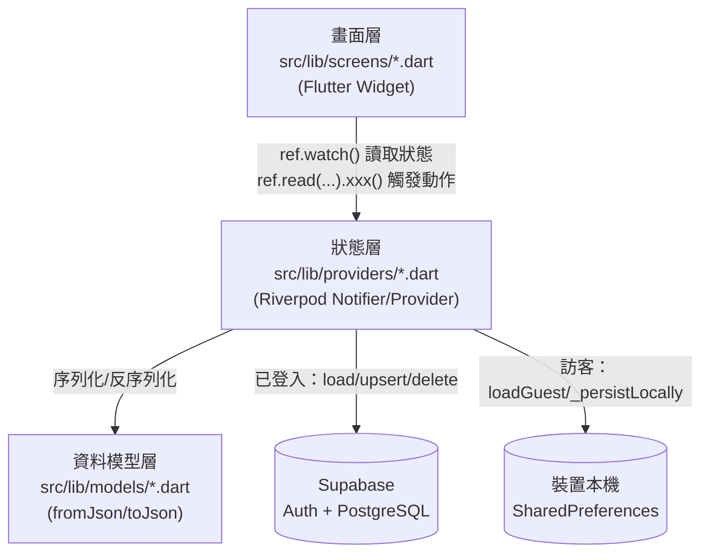
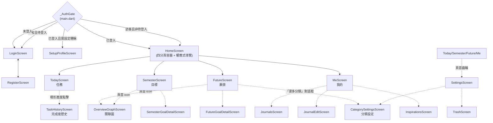
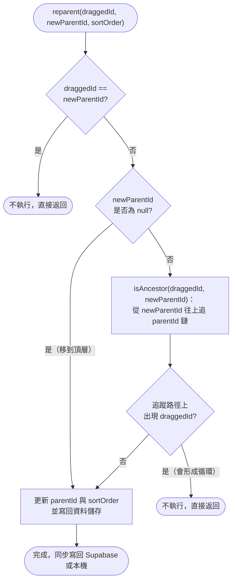
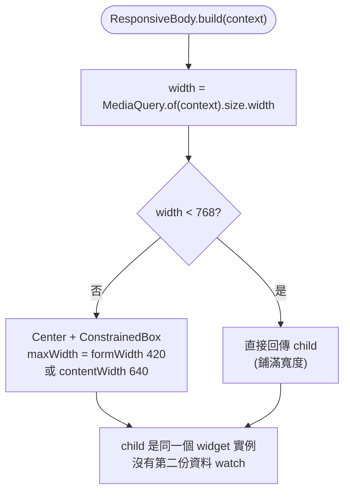

# 系統設計（System Design）

本文件描述 **URniversity** 的系統行為：畫面如何串接、每個功能的輸入／輸出格式、核心演算法的
處理過程、使用者操作步驟，以及關鍵邏輯的程式流程圖。

搭配閱讀：
- [DFD.md](./DFD.md) — 資料「從哪裡來、到哪裡去」（各 Provider 與資料儲存之間的流動）
- [DD.md](./DD.md) — 每個資料儲存的欄位定義

本文件回答的是「**系統怎麼運作**」，DFD／DD 回答的是「**系統存了什麼資料**」，三份文件互補，
請勿在本文件重複抄一份欄位定義，遇到欄位細節一律連結回 DD.md。

> **維護規則**：修改畫面流程、新增／調整核心演算法（任務判定、樹狀結構操作、學期計算、
> 響應式斷點、關聯圖佈局等）時，必須同步更新本文件，包含程式流程圖。詳見專案根目錄 `CLAUDE.md`。

---

## 1. 系統架構總覽

### 1-A 執行環境分層



- 沒有獨立後端服務層：Riverpod 的 `StateNotifier` 同時扮演「處理程序」與「資料存取物件」，
  細節見 [DFD.md](./DFD.md) 的圖例說明。
- 目前僅發行 Web 版本（`flutter run/build -d chrome`），行動裝置與桌面版尚未發行（見
  `README.md`「Next」小節）。

### 1-B 畫面導覽架構



- `Home` 為單一 `Scaffold`，用 `IndexedStack` 切換四個分頁，切換分頁不重建畫面（狀態保留）。
- 響應式判斷（詳見 §3-F）：寬度 < 768 用底部 `NavigationBar`；≥ 768 用左側 `NavigationRail`；
  ≥ 1200 時 `NavigationRail` 展開顯示文字。

---

## 2. 輸入與輸出格式

### 2-A 帳號與身分

| 功能 | 輸入 | 驗證規則 | 輸出／結果 |
|---|---|---|---|
| Email 登入 | Email（文字）、密碼（文字，遮蔽） | 兩欄皆非空才觸發登入 | 成功→依 `_AuthGate` 導向 Home／Setup；失敗→`SnackBar` 顯示 Supabase 錯誤訊息 |
| Google 登入 | 無（OAuth 彈出視窗） | 由 Google 端驗證 | 同上；Web 用 `Uri.base.origin` 作為 redirect，行動裝置用自訂 URL scheme |
| 註冊 | Email、密碼、確認密碼 | 密碼需與確認密碼相同；密碼長度 ≥ 6 | 成功且需信箱驗證→提示「請確認驗證信」；成功且免驗證→直接可登入 |
| 訪客模式 | 無 | 無 | 立即進入 `HomeScreen`，資料存本機（見 DD.md D11） |
| 首次登入設定暱稱 | 使用者名稱（文字，必填）、頭像（10 選 1 或不選） | 名稱非空才能按「完成」 | 寫入 `user_settings`，之後導向 Home |

### 2-B 任務（Today 頁）

| 欄位 | 輸入元件 | 格式 | 必填 |
|---|---|---|---|
| 標題 | 文字輸入框 | 任意字串，前端 `trim()` 後不可為空 | ✓ |
| 備註 | 文字輸入框（單行） | 任意字串 | ✗ |
| 優先度 | `SegmentedButton` | 低/中/高（對應 1/2/3） | ✓（預設低） |
| 截止時間 | 日期+時間選擇器 | `DateTime` | ✗ |
| 循環規則 | `ChoiceChip` + 數字輸入（僅「每 N 天」時出現）+ 星期複選 `FilterChip`（僅「每週」時出現） | 不循環/每日/每週/每月/每 N 天 | ✗ |
| 循環星期 | 7 個 `FilterChip`（一～日，可複選） | ISO 星期 1–7；不選＝沿用「與建立日同星期幾」 | ✗ |
| 連結學期目標 | 清單選擇對話框 | 學期目標 id | ✗ |
| 連結未來願景 | 清單選擇對話框 | 未來願景 id | ✗ |
| 父任務 | 由「新增子任務」入口或拖曳決定，非表單欄位 | 任務 id（**限一層**） | ✗ |

輸出：任務卡片（含優先度標籤、截止時間倒數上色、循環圖示、連結目標/願景的箭頭文字），依
§3-A 規則分組排序後呈現；環形進度卡顯示「已完成 / 總數」與百分比。

任務卡片版面：左緣 6px 色條顯示連結目標/願景的分類色（詳見 §3-J）；**沒有連結時色條仍保留
寬度但為透明**，確保有連結與沒連結的任務左緣對齊。卡片本身用 `ListTile` 但設
`minTileHeight: 0` 解除 Material 預設的 72dp 兩行下限，並以
`titleAlignment: ListTileTitleAlignment.center` 讓內容較少的任務垂直置中；分隔線縮排由
`_taskTitleIndent` 常數（62.0 = 色條 6 + 內距 8 + 核取方塊 40 + 間隙 8）統一控制，
調整版面時必須同步更新這個常數。

**拖曳排序與子任務**：任務列表與兩個目標頁共用同一套命中判定（`widgets/drag_reorder.dart`
的 `dropZoneFor()`）——詳見 §3-C。子任務**限一層**：子任務不能再有子任務，已經有子任務的任務
也不能被拖成別人的子任務（`reorderTask()` 與 UI 命中判斷兩邊都有擋）。
刪除父任務會連帶刪除其子任務，且**父任務與所有子任務都會各自寫入回收桶快照**
（`remove()` 回傳被刪除的清單供呼叫端逐一快照）。

新增與編輯共用同一個 `showTaskSheet(context, ref, {Task? existing, String? parentTaskId})`
（`existing == null` 即新增）。編輯走 `copyWith`，不手動重建 `Task(...)`——model 的每個欄位
都有預設值，手動重建會讓漏帶的欄位靜默重設。目標與願景同樣各自收斂成
`showSemesterGoalSheet` / `showFutureGoalSheet`。

⚠️ **表單狀態必須宣告在 `showAppSheet` 的 `builder:` 之外**。Flutter 只要 MediaQuery
變動就會重跑該 `builder`（SDK
`bottom_sheet.dart` 的 `buildPage` 透過 `MediaQuery.removePadding` 建立依賴），而表單標題欄
`autofocus: true` 會讓「開啟選擇器對話框 → 鍵盤收起 → `viewInsets` 改變」必然觸發重跑。若把
`priority` / `dueTime` / `recurrence` / `linkedTargetId` / `linkedGoalId` 宣告在閉包內，選擇器
的 callback 會寫進已失效的舊閉包變數，症狀是「點了沒反應、要按好幾次才成功」。

### 2-C 學期目標（Semester 頁）／未來願景（Future 頁）

| 欄位 | 輸入元件 | 格式 | 必填 |
|---|---|---|---|
| 標題 | 文字輸入框 | 任意字串 | ✓ |
| 分類 | 多選 `FilterChip` | 見 DD.md `FutureCategories` 列舉 + 使用者自訂分類（顏色/圖示可自訂，見 §2-I） | ✗（預設 `other`） |
| 備註 | 文字輸入框（多行） | 任意字串 | ✗ |
| 學期目標專屬：所屬學期 | **新增時**由目前檢視的學期分頁決定；**編輯時**為下拉選單（僅頂層目標，子目標繼承父節點學期） | `"YYY-N"` 或假期 `"YYY-Bk"`（見 §3-D） | ✓ |
| 學期目標專屬：連結未來願景 | 清單選擇對話框 | 未來願景 id | ✗ |
| 未來願景專屬：起訖學期 | 兩個下拉選單 | `"YYY-N"` 或假期 `"YYY-Bk"`，結束學期不可早於起始學期 | ✗ |
| 父節點（子目標/子願景） | 由「新增子目標」入口決定，非表單欄位 | 目標/願景 id | ✗ |

輸出：樹狀縮排卡片列表（可拖曳排序／換父節點），左側有分類色條（寬度 6px），完成度以子節點
完成比例呈現進度條；桌面版側欄另有「進度總覽」環形圖（學期目標頁）與「篩選」面板（未來願景
頁）。學期/起訖學期的下拉選單與挑選對話框都會把假期 token 顯示成本地化名稱（例如「114 暑假」），
不會顯示原始 `"114-B3"` 字串。學期目標卡片若有連結未來願景，標題下方會多一行「⭐ 願景標題」。

**標示完成**：點卡片或詳細頁頁首**左側的分類圖示方塊**即切換 `isDone`（圖示換成 `Icons.check`、
底色透明度 0.15→0.25、標題加刪除線）。頂層與子層、列表與詳細頁四處行為一致。
⚠️ 卡片上的進度條／學期總覽環形圖統計的是**子節點**完成比例，與節點自身的 `isDone` 互相獨立，
因此一個已標完成的父節點，其進度條仍可能顯示未滿（例如 2/5），這是目前刻意保留的語意。

### 2-D 篩選（Today 頁）

輸入：勾選學期目標／未來願景（樹狀複選對話框，勾選父節點會連動勾選所有子孫）。
輸出：任務清單依 `linkedTargetId` / `linkedGoalId` 是否落在勾選集合（含子孫展開後的集合）內
過濾；畫面上以主色膠囊 Chip 顯示「篩選 · N」，N 為已選數量，可一鍵清除。

### 2-E App 設定（設定頁）

| 欄位 | 輸入元件 | 格式 |
|---|---|---|
| 語言 | 單選清單 | 繁中／English／日本語 |
| 日期顯示格式 | 單選清單（附即時預覽） | 4 種格式，見 DD.md |
| 預設任務檢視 | 單選清單 | 全部／每日／每週 |
| 學期制度 | 數字選擇 + 每學期起始月 | 每年 2/3/4 學期，起始月 1–12 |
| 日記天數徽章開關 | `Switch` | 開／關 |
| 開發者模式時間覆寫 | 日期選擇器 | 覆寫「現在時間」，僅供測試用（見 §4-J） |

輸出：即時套用到對應畫面；非訪客模式會非同步寫回 `user_settings`（見 DFD.md Diagram 1-D）。

### 2-F 意見回饋（設定頁）

輸入：類型（bug／建議，`SegmentedButton`）、內容（文字，10～1000 字）。
輸出：成功→關閉對話框；失敗（低於 10 字／5 分鐘內重複送出／網路錯誤）→在輸入框下方顯示對應
錯誤訊息，不關閉對話框。完全匿名，無法在 App 內查看歷史紀錄（見 DD.md D9）。

### 2-G 關聯圖（OverviewGraphScreen）

輸入：無使用者資料輸入，僅有「分層／放射」佈局切換（`SegmentedButton`）與畫布縮放平移手勢。
輸出：以學期目標／未來願景為節點、三種關聯為邊的可互動圖（詳見 §3-G、§5-F）；點節點導向對應
詳細頁。

### 2-H 任務完成度歷史（TaskHistoryScreen）

輸入：日／週／月檢視切換（`SegmentedButton`）、點擊或滑鼠移到長條上選取該期間。
輸出：長條圖（0–100% 完成率）+ 期間平均完成率文字 + 選取期間的「N / M 完成（P%）」明細，
沒有任務的日期以底線刻度呈現而非 0% 長條（區分「沒事做」與「有事沒做」）。

### 2-I 分類設定（CategorySettingsScreen／「更多分類」對話框）

兩個入口（設定頁「分類設定」全螢幕頁、未來願景頁「更多分類」對話框）共用同一份列表元件
（`src/lib/widgets/category_manager.dart`）。

| 欄位 | 輸入元件 | 格式 |
|---|---|---|
| 新增分類 | 文字輸入框 + 送出鈕 | 任意字串，成為該分類的 id 與顯示名稱 |
| 排序 | 拖曳單線把手（`Icons.horizontal_rule`，圖一改版前是雙線 `Icons.drag_handle`） | 拖放調整順序 |
| 顏色 | 圓形色塊按鈕 → 彈出色票網格 | `categoryColorPresets`（12 色固定清單） |
| 圖示 | 圖示按鈕 → 彈出圖示網格 | `categoryIconPresets`（20 個固定圖示，見 §3 備註） |
| 刪除 | 垃圾桶 icon（僅自訂分類） | 內建 6 分類無法刪除 |

輸出：即時套用到所有顯示該分類的畫面（目標/願景卡片色條、關聯圖節點、任務左側連結色條等），
非訪客模式非同步寫回 `user_categories.styles`（見 DD.md D7；需要先手動執行一次資料庫 migration
才會生效）。

---

## 3. 處理過程（核心演算法）

### 3-A 循環任務是否屬於某一天（`tasks_provider.dart`）

`_taskAppliesTo(task, date)`：
- 非循環任務：`dueTime` 不為空，且與 `date` 同一天才算屬於當天。
- 循環任務：呼叫 `_recurringAppliesTo()`，依 `recurrence.type` 分流：
  - `daily`：只要不早於建立日就算。
  - `weekly`：若 `recurrence.weekdays` 有值，判斷 `targetDay.weekday` 是否在該清單內（可複選
    多天）；若為空則退回舊行為「與建立日相差天數為 7 的倍數」，確保這個選項出現之前建立的
    任務行為不變。
  - `monthly`：若 `recurrence.monthDays` 有值，比對目標日的「日」是否在清單中；
    哨兵值 `32`（`kLastDayOfMonth`）換算成該月最後一天（`DateTime(y, m + 1, 0).day`）。
    **選了該月沒有的日期就不出現**（例如選 31 號，2 月整月都不會出現）——這是刻意的語意，
    需要「每月月底」請改選「最後一天」。若為空則退回舊行為「與建立日同一個號數」。
  - `everyNDays`：與建立日相差天數需為 `interval` 的倍數。
- 完成狀態判斷完全獨立於「是否屬於當天」：非循環看 `isCompleted`，循環看
  `completedDates` 是否包含該日期字串（`Task.isCompletedOn()`）。

**任務排序（`_applyManualOrder()`，`tasks_provider.dart`）**：先照原本的自動規則分組排序
（循環 → 有截止時間 → 無截止時間），再以 `sortOrder` 為主鍵重新排序，自動順序當作同分時的
次鍵。因為既有資料的 `sortOrder` 全是 `0`，在使用者第一次拖曳之前畫面順序完全不變；一旦拖曳，
手動順序就會蓋過自動分組。⚠️ 這個排序必須放在 Provider（`filteredTasksProvider` 與
`tasksForDateProvider`）而不是 widget 層，否則拖曳結果會在下次 rebuild 被自動排序蓋掉。

### 3-B 任務完成度統計（`taskCompletionStatsOn()`）

以 3-A 的判定找出某天所有適用任務，回傳 `(done, total)`；若當天沒有任何適用任務回傳 `null`
（語意上與「有任務但都是 0%」不同）。`TaskHistoryScreen` 的週/月統計是把區間內每天的
`done`／`total` 直接加總再相除，**不是**先算每天比率再平均，理由是避免「某天完全沒任務」拉低
平均值。

### 3-C 目標／願景樹狀結構操作（`semester_goals_provider.dart` / `future_goals_provider.dart`）

兩份 Provider 各自獨立實作相同模式（未共用程式碼，修改一邊時記得檢查另一邊）：
- **新增**：`sortOrder` 取「同一層（同 `parentId`）現有最大值 + 1000」，讓新項目排在最後，
  同時預留插入空間。
- **搬移（`reparent`）**：先呼叫 `isAncestor(draggedId, newParentId)` 確認新父節點不是自己的
  子孫，避免產生循環參照；通過後更新 `parentId` 與 `sortOrder`。
- **拖曳命中判定（三個列表共用，`widgets/drag_reorder.dart`）**：一列由上而下切成
  **上 1/4 =「插入這列之前」、中 1/2 =「成為這列的子項」、下 1/4 =「插入這列之後」**；
  當該列不能收子項時（例如任務的子任務列），中間那半平分給前後兩區，讓整列都有作用。
  排序值一律走 `orderBetween(prev, next)`（取中點；一端為空則 ±1000）與
  `orderAfterLast()`（最大值 +1000）。
  ⚠️ **`DragTargetDetails.offset` 不是指標位置**，而是拖曳回饋 widget 的左上角；直接拿來
  換算會依「抓在該列哪個位置」整體偏移，判定區因此感覺又小又不準。三個列表的 `Draggable`
  都必須設 `dragAnchorStrategy: pointerDragAnchorStrategy`，讓兩者重合。
- **刪除（`remove`）**：`getWithDescendants()` 先蒐集整個子樹，逐一呼叫資料層刪除；刪除前
  對每個節點呼叫 `trash_provider` 的 `addSemesterGoal()`/`addFutureGoal()` 做快照備份。
- **還原**：若原本的 `parentId` 已不存在，還原時自動改掛在頂層（`parentId = null`），避免
  出現斷鏈孤兒。
- **變更學期（僅學期目標，`updateGoal`）**：只有頂層目標可改。因為 `sortOrder` 的作用域是
  「同一個 (`parentId`, `semester`) 群組」，換學期時必須：
  1. 重新計算 `sortOrder` 為「目標學期同層最大值 + 1000」（排到新學期的最後）
  2. 用 `getWithDescendants()` 把**整棵子樹的 `semester` 一起改掉**——否則子目標會留在舊學期，
     之後新增同層節點時 `sortOrder` 會依錯誤的群組計算而互相衝突
  3. 逐一 `_upsert()` 整棵子樹
  未變更學期時則原樣保留既有 `sortOrder`。⚠️ 這個方法是手動重建 `SemesterGoal(...)`（而非
  `copyWith`），因為 `copyWith` 的 sentinel 無法把 `futureGoalId`／`notes` 清成 null，而
  「解除連結／清空備註」需要這個能力；代價是**新增欄位到 model 時必須記得在這裡補上**，
  否則該欄位會靜默重設為預設值（`sortOrder` 曾因此被重設為 0，導致目標每次編輯後跳到最上面）。

### 3-D 學期字串生成、比較與假期（`semester_goals_provider.dart` / `future_goal.dart` / `semester_helpers.dart`）

- `currentSemester(settings)`：以民國年為基礎，依 `SemesterSettings.startMonths`（各學期起始
  月份）找出「不晚於今天、且最接近今天」的學期起始點，組成 `"{民國年}-{學期序}"`。
  跨年度學期（例如第 2 學期在隔年開始）用 `yearOffset` 校正。只回傳一般學期，不會回傳假期
  （若「現在」落在假期期間，回傳的是最近一個已開始的學期，作為選單的合理預設起點）。
- `generateSemesters(settings)`：以目前學期為中心，往前 4 年、往後 3 年展開，**每個學期後面
  緊接著插入該學期的假期**（`"Y-1"`, `"Y-B1"`, `"Y-2"`, `"Y-B2"`, ...），供選單使用。
- **假期 token 格式**：`"{民國年}-B{k}"`，k = 1..該年學期數，代表「緊接在第 k 個學期後面的假期」；
  `k = 學期數`（最後一個）固定是暑假（下學年第 1 學期開學前的長假）。
- `compareSemesters(a, b)`：把 `"YYY-N"` 或 `"YYY-Bk"` 換算成同一套權重（一般學期 k → `2k-1`，
  假期 k → `2k`）後比較 `(年, 權重)`，讓假期正確排在對應學期之後、下一個學期之前。**禁止**直接
  用字串或轉數字比較。
- `semesterStart(token, settings)`（`semester_helpers.dart`）：把 token 換算成該學期的
  **起始日期**。`currentSemester()` 現在也是呼叫它來取得起始點，避免兩處各算一次而漂移。
  假期 token 沒有自己可推導的起始日（`SemesterSettings` 只有起始月份，沒有「哪天停課」），
  所以它回傳的是所屬學期的起始日。
- `semesterEnd(token, settings)`（`semester_helpers.dart`）：該學期的**最後一天**，定義為
  **下一個學期起始日的前一天**（最後一個學期則接到下學年第 1 學期）。⚠️ 這表示學期的範圍
  **涵蓋它後面那段假期**——資料裡沒有任何欄位能區分「學期結束」與「假期開始」，
  而對「目標截止提醒」而言，算到下學期開始正是想要的語意。
- `breakName(k, count, s)` / `formatSemester(token, settings, s)`（`semester_helpers.dart`）：
  假期名稱依「目前配置的學期數 `count`」查表決定（例如 3 學期制的假期依序是寒假／春假／暑假，
  4 學期制是秋假／寒假／春假／暑假），**不是**存在 token 裡固定不變的——所有顯示學期字串的地方
  一律呼叫 `formatSemester()`，不要直接顯示原始 token（一般學期會原樣顯示 `"114-1"`，只有假期
  token 會被轉成「114 暑假」這種可讀名稱）。

### 3-E 年級自動推進（`settings_provider.dart`）

`computedGrade(baseGrade, gradeSetYear, effectiveNow, settings)`：以 `academicYear()`（依第 1
學期起始月判斷「現在屬於哪個學年」）與使用者上次設定年級時的學年度相減，得出經過幾個學年，
加回 `baseGrade` 並限制在 1～7 之間。使用者不需要每年手動改年級。

### 3-F 響應式版面決策（`app_breakpoints.dart` + 各 `screens/*.dart`）

兩個斷點常數：`desktop = 768`、`wide = 1200`。所有分頁在同一個 `build()` 內以
`MediaQuery.of(context).size.width` 判斷（不使用 `Platform` 判斷，因為 Web 版窄視窗也要走手機
版面），依寬度回傳不同 Widget 結構，但**共用同一份資料 watch 與同一批子元件**（不重複資料
邏輯，不另開 Widget class）。彈出視窗（bottom sheet／dialog）另外在 `app_theme.dart` 統一
限制最大寬度，避免超寬螢幕被拉伸。詳細流程圖見 §5-E。

單欄表單／列表類畫面不套用 §5-E 的雙欄＋NavigationRail 模式（這些畫面沒有底部導覽／側邊欄），
改用較簡單的版本，統一由 `widgets/responsive_body.dart` 的 **`ResponsiveBody`** 實作：
寬度 < 768 直接回傳原本鋪滿寬度的內容；≥ 768 時用 `Center` + `ConstrainedBox` 把**同一份**
內容限制在固定最大寬度並置中，避免欄位／清單在超寬螢幕被拉伸到不合理的寬度。

兩個寬度常數定義在該檔內：`ResponsiveBody.formWidth = 420`（登入類表單，行寬窄一點好讀）、
`ResponsiveBody.contentWidth = 640`（其餘，也是預設值）。

套用 `ResponsiveBody` 的 12 個畫面：

| maxWidth | 畫面 |
|---|---|
| 420（`formWidth`） | `LoginScreen`、`RegisterScreen`、`SetupProfileScreen` |
| 640（`contentWidth`） | `SettingsScreen`、`SemesterGoalDetailScreen`、`FutureGoalDetailScreen`、`CategorySettingsScreen`、`JournalsScreen`、`JournalEditScreen`、`TaskHistoryScreen`、`TrashScreen`、`InspirationsScreen` |

`TodayScreen`、`SemesterScreen`、`FutureScreen`、`MeScreen` 走 §5-E 的雙欄模式，
用 `isWide ? 1100 : 900`，**不使用** `ResponsiveBody`。

> 兩個詳細頁刻意用 640 而非分頁列表的 `isWide ? 1100 : 900`——後者是為「主內容 + 側欄」雙欄
> 版面設計的，套用在單欄長文字內容上會產生過長、難以閱讀的行寬。
>
> 兩個詳細頁內各對話框的 `SizedBox(width: 400)` **不需要**改成響應式：`AlertDialog` 本身已由
> `app_theme.dart` 限制最大寬度，並在窄螢幕上把 content 的約束夾到可用寬度，`SizedBox` 在此
> 實際扮演的是「桌面上的最大寬度」，不會在手機上溢出。

### 3-G 關聯圖佈局演算法（`overview_graph_screen.dart`）

節點＝全部學期目標＋未來願景；邊＝三種關聯（目標樹／願景樹／目標→願景跨層連結）。共用前處理
（Union-Find 分連通分量、建立鄰接表），依使用者選擇的模式分流：

- **分層模式**：longest-path layering（願景根層為 0，子節點層 = `max(父節點層) + 1`）→
  barycenter 啟發式掃 3 趟減少交叉 → 同層置中排列。
- **放射模式**：BFS 找出以「連結數最多的願景根節點」為中心的距離環，同心圓半徑依節點數
  自動撐大，子節點依父節點角度排序讓分支保持同一扇區。

兩種模式都先各自計算「分量內」座標，再由 shelf packing 演算法把各連通分量的外框依可視寬度
排進畫布；孤立節點（無任何關聯）集中排在最後的「未連結」區。詳細流程圖見 §5-F。

### 3-H 日記自動補齊（`journal_provider.dart`）

`_fillMissingDays()`：載入日記後，找出「最早日記日期」到「今天」之間沒有記錄的每一天，各自
產生一筆 `id` 以 `"auto_"` 開頭、內容固定為「好像忘記什麼了……」的日記並寫回資料儲存。判斷
「是否為自動產生」一律檢查 `id.startsWith('auto_')`，訪客資料合併進帳號時只搬移非自動產生的
日記，登入後重新跑一次本函式補齊。

### 3-I 身分驗證與資料同步協調

由 `sync_provider.dart` 統籌，完整流程與時序見 [DFD.md](./DFD.md) Diagram 1-A，本文件不重複。

**寫入失敗的處理**（`synced_list_notifier.dart`）：本 App 的寫入是「本地樂觀更新 +
雲端 fire-and-forget」，一旦推送失敗就不會再回頭補，本地與雲端會永久分歧。因此
`load()`／`upsert()`／`deleteRow()` 三個出口統一走 `runWithRetry()`：

| 錯誤 | 判定 | 理由 |
|---|---|---|
| `PGRST303`（JWT issued at future）、`PGRST301`（JWT expired） | 重試 | PostgREST 上游 bug 會拒絕剛簽發的 token，隔數百毫秒即可成功 |
| `SocketException`／`TimeoutException`／`ClientException` | 重試 | 連線問題，下一次可能就通了 |
| `23502` NOT NULL、`23503` 外鍵、`42P10` onConflict、`42703` 缺欄位、`42501` RLS | **一次放棄** | schema／policy 問題，重試只會延後錯誤回報 |

退避從 200ms 起遞增並加上 jitter（固定延遲被上游回報為不夠用）。寫入預設 3 次、
`load()` 4 次——`load()` 失敗會把 `_userId` 設回 null，導致該 session 後續所有寫入
靜默跳過，代價比單次寫入失敗高得多。

用盡重試才呼叫 `reportSyncError()`，經 `syncErrorProvider` 由 `HomeScreen` 顯示
SnackBar；debug 建置會一併顯示 PostgREST 的 `code`／`details`／`hint`。

### 3-J 分類顏色／圖示解析與任務連結色條

- `resolveCatColor(cats, id)` / `resolveCatIcon(cats, id)`（`category_helpers.dart`）：在使用者
  目前的分類清單（`categoriesProvider` 狀態，`List<CategoryEntry>`）中找出對應 id 的顏色／圖示；
  找不到（分類被刪除、或訪客模式尚未載入）時退回 `defaultCatColor()`/`defaultCatIcon()` 的
  內建預設值。所有畫面一律透過這兩個函式取色/取圖示，不再各自寫死 switch。
- 圖示只能是 `categoryIconPresets`（固定 const 清單）裡的其中一個：因為 Flutter 的圖示
  tree-shaking 只認得「原始碼裡出現過的字面 `Icons.xxx`」，這份清單本身就會被圖示選擇器的
  網格 UI 字面引用，才能保證使用者選到的任何圖示都不會在正式建置時被砍掉。
- 任務左側連結色條（`_linkColorBar()`，`today_screen.dart`）：依任務是否連結學期目標／未來願景
  決定顯示內容——只連結一邊就顯示該分類的實心色條；兩邊都連結且分類顏色相同也顯示單一實心色；
  兩邊都連結但分類顏色不同，色條上半用目標顏色、下半用願景顏色（`Column` + 兩個 `Expanded`）；
  都沒連結則不顯示色條（寬度 0）。

### 3-K 通知排程計算（`core/notification_schedule.dart`）

`buildNotificationSchedule()` 是**純函式**：吃任務、學期目標、通知設定與「現在」，
吐出一份 `ScheduledNotification` 清單。不碰任何平台 API，所以整條規則都能用單元測試涵蓋；
唯一碰 platform channel 的是 `NotificationService.apply()`。

**產生規則**（三種各自獨立開關，總開關由 `NotificationSettings.isOn()` 統一折入）：

| 種類 | 何時產生 | 刻意排除的情況 |
|---|---|---|
| 任務到期 | 有 `dueTime` 的任務，於 `dueTime − taskLeadMinutes` | **沒有 `dueTime` 的任務**（沒有可提醒的時刻，交給每日摘要）；**子任務**（避免父子重複響）；已完成的 |
| ↑ 內容 | **只有標題（任務名稱），沒有內文**——下方的空間留給兩顆動作按鈕 | — |
| 每日摘要 | 每天 `summaryMinuteOfDay`，內容是當天適用且未完成的任務數 | **當天沒有任何任務時整則跳過**——每天都說「今天沒安排」會訓練使用者把整個頻道關掉 |
| 學期目標截止 | `semesterEnd(學期) − goalLeadDays`，於摘要時間 | **子目標**（會與父目標重複計算同一件事）；已完成的；整學期都完成的則完全不發 |

**循環任務**：`dueTime` 的**日期部分無意義、時間部分才是提醒時刻**（哪幾天由 `recurrence`
決定，見 3-A）。因此排程對每一天呼叫 `taskAppliesTo()`（與今日頁同一個函式，不另寫一份），
命中的那天再用 `dueTime` 的時／分組出當天的提醒時刻，並跳過 `isCompletedOn(那天)` 為真的日子。

**為什麼要有上限**：`scheduleHorizonDays`（14 天）與 `maxScheduled`（48 則）都在
`NotificationConstants`。一個每日循環任務會產生無限多則，而 iOS 本身只保留 64 則待送通知；
排程在資料一有變動就整批重算，所以短的視野不會漏掉東西。

**id 配置**：排序後才依序發號（`taskIdBase + i` 等）。不從資料列 id 雜湊而來，因為
`apply()` 每次都先 `cancelAll()`，順序發號必不碰撞，雜湊則有機會碰撞。

**payload**：只有任務提醒帶，格式 `"{taskId}|{yyyy-MM-dd}"`
（`core/notification_payload.dart`）。**日期是必要的**——循環任務的提醒是針對「那一天那一次」，
沒有日期就分不出要勾掉哪一天。解析失敗回傳 `null` 而非拋例外，因為它會在**背景 isolate**
被解析，那裡的例外沒有地方可去。

### 3-L 通知動作的處理（`services/notification_background.dart`）

兩顆按鈕走的是**完全不同的兩條路**：

| 按鈕 | `showsUserInterface` | 跑在哪 | 做什麼 |
|---|---|---|---|
| 標示為已完成 | `false` | **背景 isolate** | 直接寫入資料，App 不會跳出來 |
| 重新安排時間 | `true` | 主 isolate | 把 App 帶到前景，打開該任務的編輯 sheet |

**為什麼「已完成」一定要在背景 isolate 做完**：Android 的 `ActionBroadcastReceiver`
在 `showsUserInterface: false` 時**一律**另開一個 FlutterEngine，**不檢查主 App 是否活著**。
所以不能寄望主 isolate 來處理。

**流程**：

```
1. DartPluginRegistrant.ensureInitialized()   ← 背景引擎預設沒有註冊任何外掛
2. 解析 payload → taskId + 日期
3. prefs.reload() ← 這個 isolate 的快取是舊的
4. 訪客 → 改寫 guest_tasks 的 JSON
   已登入 → Supabase.initialize() → select 該列 → Task.toggledOn() → update
5. 不論成功或失敗，把結果寫進 D14
```

**第 5 步是符合硬規則 2 的關鍵**。背景沒有 UI 可以報錯，所以錯誤被寫進磁碟；
主 isolate 在啟動與每次回到前景時（`drainNotificationActions()`）讀走，
重載資料並用 `reportSyncError()` 把失敗浮現出來。**延後顯示，不是靜默吞掉。**

**完成邏輯只有一份**：`Task.toggledOn()`（`models/task.dart`）。UI 的
`TasksNotifier.toggleOnDate()` 與背景 isolate 用的是同一個函式——否則那條沒人看得到的
路徑會慢慢跟 UI 漂開。它是 `isCompletedOn()` 的反函式，兩者必須一直維持這個關係。

**「重新安排時間」要等資料載入**：冷啟動時通知早在任何一列資料抵達之前就被處理了。
`pendingTaskEditProvider` 會一直保留那個 id，直到該任務出現在 `tasksProvider` 裡才打開 sheet。

---

## 4. 系統操作步驟（主要使用案例）

### UC1　以訪客身分開始使用
1. 開啟 App，`_AuthGate` 讀取 `is_guest_mode`（`false`）→ 顯示 `LoginScreen`。
2. 點擊「以訪客身份體驗」→ `guestModeProvider.notifier.enable()` 寫入本機旗標。
3. `_AuthGate` 重新判斷 → 直接進入 `HomeScreen`（今日頁）。

### UC2　註冊帳號並登入
1. `LoginScreen` 點擊「註冊」→ 進入 `RegisterScreen`。
2. 輸入 Email／密碼／確認密碼 → 前端檢查兩次密碼相同、長度 ≥ 6。
3. 送出 → Supabase `signUp()`；若需信箱驗證，提示後返回登入頁；否則可直接登入。
4. 返回 `LoginScreen` 輸入帳密登入 → `authStateProvider` 偵測到 session → `sync_provider` 依
   序載入 8 種資料（見 DFD.md Diagram 1-A）。
5. 若為 Email 帳號且尚未設定暱稱 → 導向 `SetupProfileScreen`，輸入暱稱與頭像後才進首頁。

**驗證信的寄送機制：**
⚠️ 原本走 Auth「Send Email」Hook（`supabase/functions/send-auth-email/index.ts`）呼叫 Resend，
**但那條路解不開 Supabase 每小時 2 封的寄信上限**——hook 不會繞過它，超過額度時 Supabase 會
靜默跳過 hook 並照樣回 200。改用 **Resend 的 custom SMTP**，上限才變成可調。
完整設定步驟見 [auth-email-setup.md](./auth-email-setup.md)，信件範本存在
`supabase/email-templates/`（Dashboard 的範本欄位不進版控，改動要以 repo 的檔案為準）。

### UC2-B　忘記密碼與重設

1. `LoginScreen` 點「忘記密碼？」→ 跳出對話框，預填登入欄已輸入的 Email。
2. 送出 → `auth.resetPasswordForEmail(email, redirectTo:)`。
   `redirectTo` 與 Google 登入共用同一組：Web 用 `Uri.base.origin`，
   Android 用 `com.octofield.urniversity://login-callback`（`AndroidManifest.xml` 已註冊）。
3. 使用者點信中的連結回到 App。⚠️ **Supabase 會直接發給一組真正的 session**，
   所以 `_AuthGate` 若不特別處理就會把人直接丟進首頁、永遠沒機會改密碼。
4. `App.build()` 以 `ref.listen(authStateProvider)` 攔截 `AuthChangeEvent.passwordRecovery`，
   把 `passwordRecoveryProvider` 設為 true。
5. `_AuthGate` **在檢查訪客模式之前**先看這個旗標 → 導向 `ResetPasswordScreen`
   （順序很重要：訪客瀏覽時點開重設連結也要能進到設定密碼的畫面）。
6. 輸入新密碼（前端檢查兩次相同、長度 ≥ 6）→ `auth.updateUser()` → 旗標設回 false，
   `_AuthGate` 這時看到的就是一般的已登入 session，進入首頁。
7. 若中途放棄（按右上角關閉）→ `signOut()` 後才清旗標——**不能只清旗標**，
   否則那條連結會在裝置上留下一個已登入的帳號。

維護時的已知陷阱（都實際踩過）：
- 部署務必帶 `--no-verify-jwt`：Auth Hook 呼叫不帶使用者 JWT，靠簽章驗證身分，預設的 JWT 閘道
  會把請求擋在 function 之外。
- Dashboard 顯示的 Hook secret 格式是 `v1,whsec_<base64>`，`standardwebhooks` 只接受
  `whsec_<base64>`，前面的 `v1,` 必須自行去掉，否則會噴 `Base64Coder: incorrect characters`。
- Hook 內部任何失敗，GoTrue 對外一律回報成 `Hook requires authorization token`，這個訊息會誤導
  排查方向，實際原因要看 Edge Function 的 Invocations／Logs。
- Authentication → Rate Limits 的「Rate limit for sending emails」預設極低（2 封/小時，整個專案
  共用）。超過額度時 Supabase 直接跳過呼叫 Hook，API 仍回 200，但 Invocations 不會有任何紀錄。
- 對「已存在且已驗證」的信箱呼叫 `signUp()`，Supabase 為防帳號探測會回一個 `identities: []`
  且每次 user id 都不同的假成功回應，同樣不寄信、不呼叫 Hook。以 Google 登入建立的帳號天生就是
  已驗證狀態，用同一個信箱測試註冊信會永遠收不到——這不是 bug。
- ⚠️ 寄件人目前仍是 Resend 沙盒位址 `onboarding@resend.dev`，**只能寄達 Resend 帳號本人的信箱**，
  寄給其他任何收件者一律 403。正式對外使用前必須在 resend.com/domains 驗證自有網域，並把
  function 裡的 `from` 改成該網域下的地址。

### UC3　新增一筆每週循環任務並完成當週那次
1. 今日頁按浮動新增鈕（amber 色）→ 開啟新增任務表單。
2. 輸入標題，選擇循環規則「每週」→ 下方出現一～日七個星期 chip，**可複選多天**（例如一、三、五）；
   選「每月」則出現 1–31 加上「最後一天」的 chip，同樣可複選；
   可選擇連結學期目標／未來願景 → 送出。
3. 該任務依 §3-A 規則，只在所選的日子出現。**若一個都沒選，標籤會直接把退回的那一天寫出來**
   （顯示成「每週四」「每月20號」），與有選擇時的寫法完全一致——使用者不需要理解「退回規則」
   這個概念，看到的就是實際會發生的行為。
4. 勾選完成 → `toggleOnDate()` 把當天日期字串加進 `completedDates`（循環任務不影響
   `isCompleted`）。

### UC3-B　建立子任務並調整任務順序
1. 建立子任務有兩種入口：編輯某個頂層任務 →「新增子任務」；或直接把一個任務**拖到另一個
   頂層任務的列身**上。
2. 子任務以縮排顯示在父任務下方，**限一層**。
3. 調整順序：拖到某列的**上緣**即插入該列之前；拖曳過程中列表尾端會出現放置區，拖到那裡可把
   子任務移回頂層。
4. 刪除父任務會**連帶刪除其所有子任務**。

### UC4　建立學期目標並連結未來願景
1. 目標頁選擇學期分頁 → 按浮動新增鈕（紫色）。
2. 輸入標題、選擇分類（含使用者自訂分類）、可選擇連結未來願景 → 送出，`sortOrder` 自動排在
   同層最後。
3. 卡片標題下方立即出現「⭐ 願景標題」，關聯圖也會畫出該目標與願景之間的虛線箭頭（見 §3-G）。

> **只有頂層目標能連結願景**，子目標（里程碑）從父節點取得脈絡。這條規則在四個地方一致：
> 新增／編輯表單只對頂層顯示連結列、學期目標詳情頁的「連結的願景」區塊只對頂層顯示、
> 願景詳情頁的「新增連結目標」選單只列頂層目標，並由
> `semesterGoalsProvider.linkFutureGoal()` 在 Provider 層擋下對子目標的連結請求。

### UC4-B　標示目標／願景完成
1. 在列表卡片或詳細頁頁首，點**左側的分類圖示方塊**。
2. `toggleDone()` 反轉 `isDone` 並寫回資料層；圖示立即換成打勾、標題出現刪除線。
3. 再點一次即取消完成。父節點自身的完成狀態不影響其進度條（進度條算的是子節點，見 §2-C）。

### UC4-C　變更學期目標所屬學期
1. 於目標卡片或詳細頁點編輯 → 表單中的「學期」下拉選單（僅頂層目標顯示）。
2. 選擇新學期 → 儲存。整棵子樹一起搬到新學期，並排在該學期同層的最後（見 §3-C）。
3. 目標會從目前檢視的學期分頁消失（因為列表依 `selectedSemesterProvider` 過濾），需切到新學期
   分頁才看得到——這是預期行為，不是刪除。

### UC5　拖曳調整目標順序／搬移到不同父節點
1. 長按（行動裝置）或直接拖曳（Web）目標卡片。
2. 拖到另一張卡片上緣→視為「插入該卡片之前」；拖到卡片主體→視為「變成該卡片的子節點」。
3. 放開時觸發 `reparent()`，若目標父節點是自己的子孫則操作被忽略（無提示，直接不生效）。
4. ⚠️ 學期目標從頂層被拖成**子目標**時，`reparent()` 會一併清掉它的 `future_goal_id`——
   只有頂層目標能連結願景（見 UC4），留著會變成 UI 再也改不掉的孤兒連結。

### UC6　刪除項目與從回收桶還原
1. 於任務／學期目標／未來願景列表點刪除 → 對非循環刪除即時生效前，先寫入回收桶快照。
2. 設定頁 →「回收桶」→ 看到已刪除項目列表（含刪除時間）。
3. 點「還原」→ 呼叫對應 Provider 的 `restore()`；若父節點已不存在則自動掛回頂層
   （`SyncedListNotifier.reattachIfOrphaned()`，由三個樹狀 Provider 覆寫）。
   ⚠️ 這一步是**必要的**而非保險。回收桶裡的快照保留著它被刪除當下的所有 id，而那些
   被指向的列可能之後才被刪掉——`ON DELETE SET NULL` 只會改寫**當下還存在**的列，
   碰不到回收桶。還原時就會插入失效的參照，被真實外鍵擋下（23503），項目雖然出現在
   畫面上卻永遠同步不上去。`sanitizeForRestore()` 會清掉三類失效參照：

   | 欄位 | 外鍵 |
   |---|---|
   | `semester_goals.parent_id`／`future_goals.parent_id` | `*_parent_id_fkey ... ON DELETE CASCADE` |
   | `semester_goals.future_goal_id` | `... ON DELETE SET NULL` |
   | `tasks.linked_target_id`／`tasks.linked_goal_id` | `... ON DELETE SET NULL` |

   （`tasks.parent_task_id` **沒有**外鍵，那裡的重新掛回純粹是為了行為一致。
   本文件先前就寫著「自動掛回頂層」，但程式碼一直沒實作，2026-08-25 才補上。）
4. 也可「清空回收桶」→ 全部永久刪除，無法復原。

### UC7　篩選今日任務
1. 今日頁點篩選 icon → 開啟樹狀複選對話框（分「學期目標」「未來願景」兩個分頁）。
2. 勾選項目（勾選父節點自動連動子孫）→ 關閉對話框。
3. 三種檢視（全部／每日／每週）皆套用同一份篩選狀態，畫面出現「篩選 · N」提示 Chip。
4. 點 Chip 上的 ✕ 一鍵清空篩選。

### UC8　查看關聯圖並切換佈局
1. 目標頁或願景頁點頁首的關聯圖 icon → 進入全螢幕 `OverviewGraphScreen`。
2. 預設「分層模式」；點右上角切換鈕改為「放射模式」，畫面即時重新計算座標（見 §3-G）。
3. 用手勢縮放／平移畫布；點任一節點導向該目標／願景的詳細頁。

### UC9　查看任務完成度歷史
1. 今日頁點摘要卡的環形進度 → 進入 `TaskHistoryScreen`。
2. 預設顯示「每日」（近 30 天）長條圖；切換「每週」（近 12 週）／「每月」（近 6 個月）。
3. 點擊或滑鼠移到長條上 → 下方顯示該期間「N / M 完成（P%）」；無資料的期間點擊顯示「無資料」。

### UC10　訪客資料合併進帳號

1. 訪客模式累積資料 → 在「我的」頁點「登入 / 建立帳號」。
2. 選「整合進帳號」或「捨棄資料」→ 設定 `shouldMergeGuestDataProvider`。
3. 登入成功後 `sync_provider` 的 `_handleGuestLogin()` 執行合併。

⚠️ **合併順序由外鍵決定，不能任意調換**（2026-09-05 修正，先前順序是反的）：

```
future_goals  →  semester_goals  →  tasks  →  inspirations / journals / profile
```

理由是這些都是**真實外鍵**，不是邏輯關聯：

| 參照 | 被參照 |
|---|---|
| `tasks.linked_target_id` | `semester_goals.id` |
| `tasks.linked_goal_id` | `future_goals.id` |
| `semester_goals.future_goal_id` | `future_goals.id` |

被參照的表沒先寫進去，參照它的那一列會被 23503 擋下**並且永久遺失**——
合併是逐列 upsert，失敗的那一列不會重試。

4. 同一張表內也要**父先於子**（`parent_id` 同樣是真實外鍵）。
   `SyncedListNotifier.mergeOrder()` 做拓撲排序：根節點先、逐層往下；
   父節點不在集合裡的（懸空 id）視為根節點照樣送出，交給資料庫判斷。
5. 合併完成 → `guestModeProvider.disable()` 清掉 `SharedPreferences` 並切換為已登入。

> **列 id 的產生**：`newRowId()`（`synced_list_notifier.dart`）＝ 毫秒時間戳 + 隨機後綴。
> 先前只用毫秒時間戳，**同一毫秒內建立的多列會共用同一個 id**，而 id 是主鍵，
> 第二筆 upsert 會直接覆蓋第一筆。手動點擊碰不到，但任何「一次建立多列」的功能
> （例如模板套用）都會踩到。


### UC11　自訂分類的顏色與圖示
1. 設定頁點「分類設定」（或願景頁點「更多分類」）→ 開啟分類管理列表。
2. 點任一分類列的色塊 → 跳出色票網格（`categoryColorPresets`）→ 選一色 → 立即套用並關閉。
3. 點圖示按鈕 → 跳出圖示網格（`categoryIconPresets`）→ 選一個 → 立即套用並關閉。
4. 變更會立刻反映在所有顯示該分類的地方（目標/願景卡片色條、任務連結色條、關聯圖節點等），
   並非同步寫回 `user_categories.styles`（訪客模式僅存於記憶體）。

### UC12　刪除帳號
1. 設定頁點「刪除帳號」→ 彈出 `_DeleteAccountDialog`。
2. 身分確認方式依登入方式而定：Email／密碼帳號需重新輸入密碼（`signInWithPassword` 驗證通過
   才繼續）；Google 帳號沒有密碼可驗證，改為要求輸入完整信箱地址並與帳號信箱字串比對相符。
3. 確認通過 → `profileProvider.deleteAllData(uid)` 清除該使用者全部資料 → `auth.signOut()`。
4. 關閉對話框後呼叫 `Navigator.popUntil((route) => route.isFirst)`（沿用 UC 登出的既有作法）
   跳回堆疊最底層，讓 `_AuthGate` 依新的 session 狀態顯示 `LoginScreen`；若不做這一步，畫面會
   卡在已經失去 session 的設定頁而非自動導回登入頁。

### UC13　設定通知提醒
1. 設定頁點「通知」→ `NotificationSettingsScreen`。
2. 打開總開關 → 向作業系統請求通知權限（`NotificationService.requestPermission()`）。
   - **被拒絕時開關自動彈回關閉**並顯示提示。若不這樣做，畫面會宣稱提醒已開啟，
     但系統永遠不會送出任何一則。
3. 三種提醒（任務到期／每日摘要／學期目標截止）各自有獨立開關；總開關關閉時三者一律變灰不可動。
4. 每種提醒可調整一個數值：提前幾分鐘、摘要時間（`showTimePicker`）、提前幾天。
5. 任何一項變更 → 寫入 D13 → `notificationScheduleProvider` 重算 → `NotificationService.apply()`
   先 `cancelAll()` 再整批重新排入作業系統。
6. 之後只要任務或學期目標有任何變動（新增、完成、刪除），同一條路徑會再跑一次，
   不需要使用者做任何事。
7. Web 與桌面版讀得到設定也算得出排程，但沒有可用的送出管道，畫面會顯示不支援並鎖住總開關。

### UC13-B　從通知直接處理任務
1. 任務提醒跳出來，下方有兩顆按鈕：「標示為已完成」與「重新安排時間」。
   通知**沒有內文**——原本顯示到期時間的位置讓給按鈕。
2. 按「標示為已完成」→ **App 不會打開**。背景 isolate 直接寫入（已登入寫 Supabase，
   訪客寫本機），通知消失。
3. 若那次寫入失敗（例如沒有網路）→ 失敗被記進 D14 → **下次開 App 時跳出同步失敗提示**。
   這是硬規則 2 在沒有 UI 的情境下的作法，失敗不會無聲無息。
4. 下次開 App（或回到前景）時，資料會重載一次，畫面才會反映背景那次寫入。
5. 按「重新安排時間」→ App 開啟 → 直接跳出**該任務**的編輯 sheet，使用者自己改時間。
6. 循環任務的提醒只針對**那一天那一次**：勾掉今天不會影響明天的提醒。
7. 每日摘要與學期目標提醒**沒有按鈕**——它們不對應單一任務。

---

## 5. 程式流程圖

### 5-A App 啟動與登入守門（`main.dart` `_AuthGate`）

```mermaid
flowchart TD
    Start(["App 啟動"]) --> Preload["preloadGuestMode()\n讀取 is_guest_mode"]
    Preload --> Gate{"guestModeProvider\n= true?"}
    Gate -->|是| Pending{"pendingGuestLoginProvider\n= true?"}
    Pending -->|是| Login1["顯示 LoginScreen"]
    Pending -->|否| Home1["顯示 HomeScreen"]
    Gate -->|否| Auth{"authStateProvider\n是否有 session?"}
    Auth -->|載入中且有舊 session| Home2["顯示 HomeScreen\n(避免閃爍)"]
    Auth -->|載入中且無舊 session| Login2["顯示 LoginScreen"]
    Auth -->|錯誤| Login3["顯示 LoginScreen"]
    Auth -->|無 session| Login4["顯示 LoginScreen"]
    Auth -->|有 session| ProfileCheck{"profile\n是否已載入?"}
    ProfileCheck -->|尚未(null)| Home3["顯示 HomeScreen\n(避免閃爍，稍後自動刷新)"]
    ProfileCheck -->|已載入| ProviderCheck{"provider = google\n或已有暱稱?"}
    ProviderCheck -->|否| Setup["顯示 SetupProfileScreen"]
    ProviderCheck -->|是| Home4["顯示 HomeScreen"]
```

### 5-B 循環任務適用判斷（`_taskAppliesTo`）


### 5-C 目標／願景搬移防循環（`reparent` + `isAncestor`）



### 5-D 刪除與回收桶備份流程（以學期目標為例，未來願景／任務同構）

```mermaid
flowchart TD
    Start(["使用者點刪除某目標"]) --> Collect["getWithDescendants(goalId)\n遞迴蒐集整個子樹"]
    Collect --> Loop{"對子樹中每一個節點"}
    Loop --> Snapshot["trash_provider.addSemesterGoal(node)\n(寫入 D6 trash_items，含完整快照)"]
    Snapshot --> Delete["state 移除該節點\n並呼叫資料儲存的 _delete(id)"]
    Delete --> Loop
    Loop -->|全部處理完| End(["刪除完成"])

    Restore(["使用者於回收桶點還原"]) --> Pop["trash_provider.pop(trashId)"]
    Pop --> ParentExists{"原 parentId\n是否仍存在?"}
    ParentExists -->|是| RestoreAsIs["以原本 parentId 還原"]
    ParentExists -->|否| RestoreRoot["parentId 改為 null\n(掛回頂層)"]
    RestoreAsIs --> Persist["state 加回節點\n並寫回資料儲存"]
    RestoreRoot --> Persist
```



### 5-E 響應式版面決策（各分頁共用模式）


單欄畫面（12 個，見 §3-F 表格）走的是另一條較短的路徑，由 `ResponsiveBody` 統一實作：



### 5-F 關聯圖佈局管線（`_layoutGraph`）


---

## 6. 畫面 → Provider → 資料儲存 對照表

| 畫面 | 主要 Provider | 對應資料儲存（見 DD.md） |
|---|---|---|
| `TodayScreen` / `TaskHistoryScreen` | `tasksProvider` | D1 `tasks` |
| `SemesterScreen` / `SemesterGoalDetailScreen` | `semesterGoalsProvider` | D2 `semester_goals` |
| `FutureScreen` / `FutureGoalDetailScreen` | `futureGoalsProvider` | D3 `future_goals` |
| `InspirationsScreen` / Today 靈感區塊 | `inspirationsProvider` | D4 `inspirations` |
| `JournalsScreen` / `JournalEditScreen` | `journalProvider` | D5 `journals` |
| `TrashScreen` | `trashProvider` | D6 `trash_items` |
| Future 頁「更多分類」 / `CategorySettingsScreen` | `categoriesProvider` | D7 `user_categories` |
| `MeScreen`（個人資料卡） | `profileProvider` | D8-A `user_settings` |
| `SettingsScreen` | `settingsProvider` 家族 | D8-B `user_settings` |
| `SettingsScreen` 意見回饋對話框 | 無獨立 Provider，直接呼叫 Supabase | D9 `feedbacks` |
| `OverviewGraphScreen` | `futureGoalsProvider` + `semesterGoalsProvider` + `tasksProvider`（唯讀彙整） | D1／D2／D3 |
| `LoginScreen` / `RegisterScreen` | `authStateProvider` / `guestModeProvider` | D10 `auth.users` / D12 `is_guest_mode` |
| 個人資料學校／系所選擇器 | `universitiesProvider` | 靜態常數，非持久化資料儲存 |
